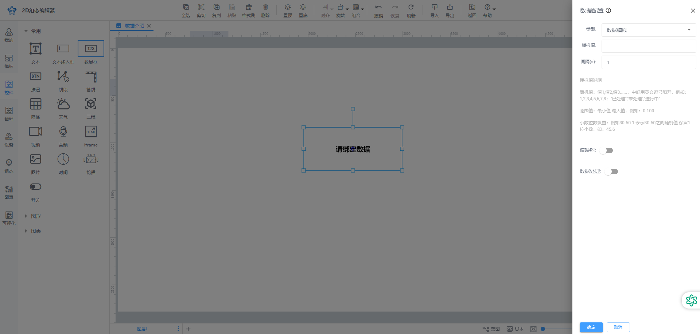
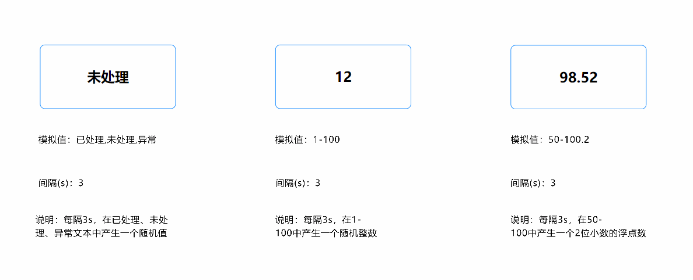

# 模拟数据

当场景暂时未接入数据但需要页面展示动态效果时，模拟数据就显得非常有用。

**模拟值说明：**

+ 随机值：值1,值2,值3......，中间用英文逗号隔开，例如：1,2,3,4,5,6,7,8；"已处理","未处理","进行中"
+ 范围值：最小值-最大值，例如：0-100
+ 小数位数设置：例如30-50.1 表示30-50之间随机值 保留1位小数，如：45.6

**预览效果如下：**

> 更新: 2024-08-15 17:25:00  
> 原文: <https://www.yuque.com/iot-fast/ksh/rvl2qvzxfqh9y13c>