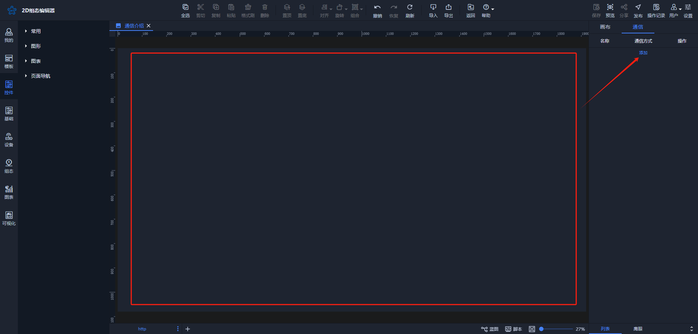
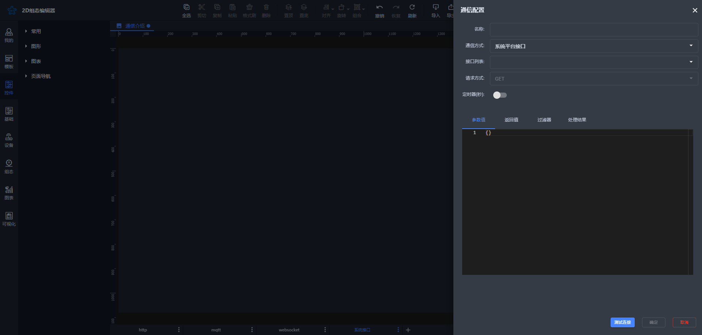
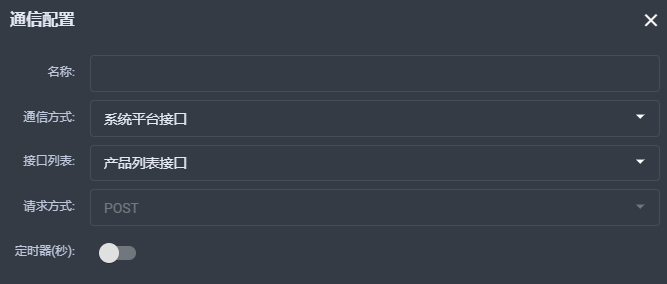
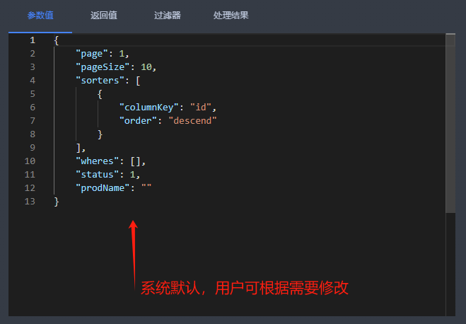
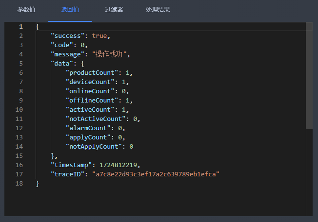
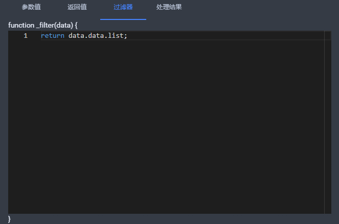
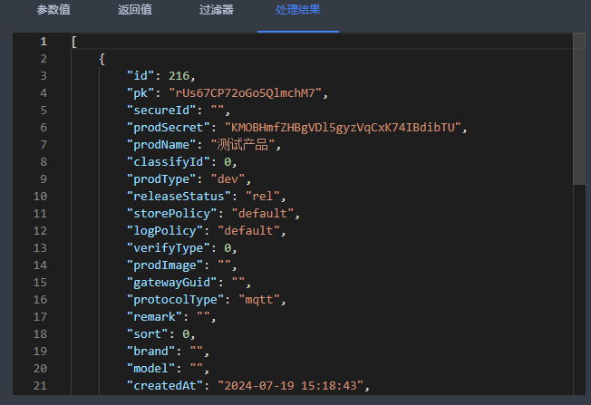

# 系统平台接口

平台提供系统接口，允许用户根据需求连接并调用不同的云平台数据接口。

### 创建系统接口数据
点击画布显示通信属性列，点击“添加”按钮添加通信数据。

以下是配置界面

**名称**：即当前连接名称，用户自定义。

**通信方式**：目前有 HTTP、MQTT、WebSocket、系统平台接口四种方式，当前选择系统平台接口。

**接口列表：**目前提供的接口如下，用户可根据需求进行选择：

+ 产品、设备、告警数量统计接口
+ 产品列表接口
+ 设备列表接口
+ 告警列表接口
+ 告警处理审核接口

**请求方式**：默认且仅有GET。

**定时器**：开启后数据可按照设置的时间间隔传递。

**参数值**：用于传递给接口的参数，用户可根据需要设置。

**返回值**：点击【测试连接】按钮后返回的接口数据，显示接口响应的内容。

**过滤器**：用户可根据需求对返回结果进行整理和过滤输出，提取所需信息。

**处理结果**：即最终处理后的结果，展示经过过滤和整理后的数据。

### 举例说明
| 基础配置 | 参数值 | 返回值 | 过滤器 | 处理结果 |
| --- | --- | --- | --- | --- |
|  |  |  |  |  |

> 更新: 2024-08-28 10:32:43  
> 原文: <https://www.yuque.com/iot-fast/ksh/ig7r4b7gahdgvr8r>