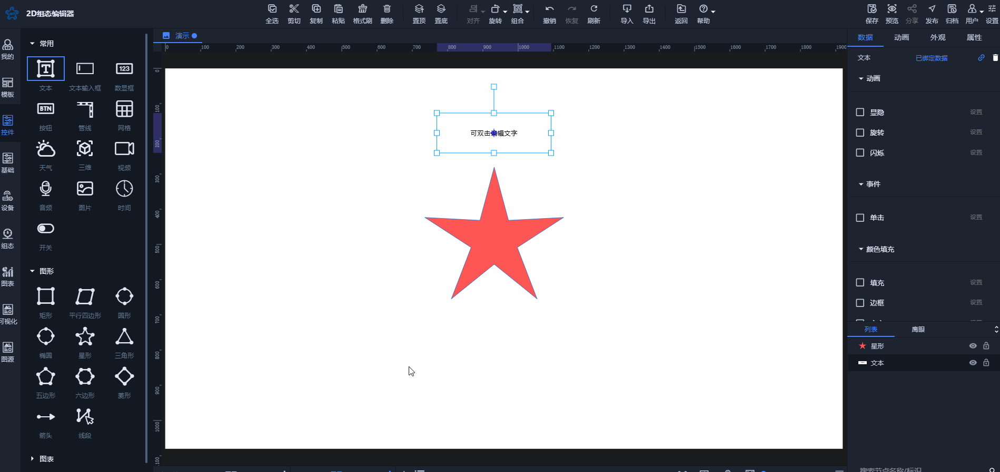

# 常见问题集合

### 一、多个图片根据不同数据值对应显示
1、上传图片到：我的/资源，拖拽图片到场景中


2、框选图片，水平垂直居中后右击选择：组合状态


3、可选择状态的数值类型以及设置每张图片对应的值，最后进行数据绑定就可以了


### 二、通过接口数据、模拟数据实现组件的背景色根据数据切换
目前，一些控件组件支持通过不同变量值填充背景、文字和边框颜色，但无法通过接口数据或模拟数据实现。用户可以通过自定义组件满足需求，以下是参考案例。


### 三、动画的数据驱动没法选择模拟数据或接口数据
目前动画的数据驱动支持设备数据和节点属性数据：


如果用户想使用模拟数据或者是接口数据可通过以下方法实现：

1、先将模拟数据或者接口数据绑定到节点上，例如绑定到文本：


2、再在数据驱动上对文本内容进行判断即可



### 四、控件的图表不支持模拟数据或接口数据绑定
可使用图表下的图表进行模拟数据或接口数据绑定


### 五、表格的行事件使用
点击表格单行想执行某些动作可通过表格的行事件实现，如下示例


以下是上面行事件对应脚本

```json
[
    {
        "callback": "(row,index)=>{app.getObjectById(9404).Visible = true;//设置左侧组合不可见 app.getNodeById(211193).setData({'title':row.name,'status':row.status})} //设置标签属性值",
        "type": "click"
    }
]
```

### 六、节点或控件的锚点如何设置
可通过鼠标直接拖拽锚点设置或者通过属性/锚点设置


### 七、自定义组件属性添加顺序说明
自定义组件这边的数据列表用于添加属性或展示属性：


通常情况下，如果添加的属性已存在，建议直接找到对应数据绑定即可。例如想为上图中的圆形添加背景色，直接找到背景色绑定属性，属性会自动显示在数据绑定列表中，避免二次添加。


如果你是添加一个不存在的属性，例如你添加一个属性：status(状态)，并想通过脚本执行具体逻辑判断等，是需要直接在数据绑定列表去新建属性


### 八、常显功能结合蓝图使用情况说明
#### 情况1：场景中每个图层都有共同标签内容


如上，切换每个图层左侧标签和顶部的内容一致，仅左侧选中的标签颜色不同。在这种情况下，可以将标签和顶部内容放在一个单独的图层中，并设置为常显。


在蓝图配置点击按钮切换图层


每个图层用对应选中的标签同比例大小盖住常显中灰色标签就完成页面切换的显示效果


#### 情况2：场景中多个图层有相同标签内容；部分图层没有标签内容


如上所述，页面1、页面2和页面3都包含左侧按钮标签。而在点击页面3的详情按钮切换到详情页面时，左侧按钮标签被隐藏。在详情页面点击返回按钮时，左侧按钮标签则重新显示。

**编辑器对应配置如下：**

将常显页面节点全部组合


蓝图配置如下：


### 九、单击开关按钮变成相反状态怎么实现？
1. 控件里的开关默认支持点击状态切换


2. 如果有两张状态不同的图片，可通过组合状态实现
3. 如果是用户自定义的组件开关，则需要配置脚本实现：


### 十、更新场景节点数据
请查看文章[《更新数据》](https://www.yuque.com/iot-fast/ksh/pxsi56mz5zam1sof?singleDoc#%20《更新数据》)

### 十一、发送数据到云平台设备或发送数据到接口
请查看文章[《发送数据》](https://www.yuque.com/iot-fast/ksh/ov4kahq9ukq1o7nx?singleDoc#%20《发送数据》)


> 更新: 2025-01-06 14:06:04  
> 原文: <https://www.yuque.com/iot-fast/ksh/bkuz46iggo4io50a>