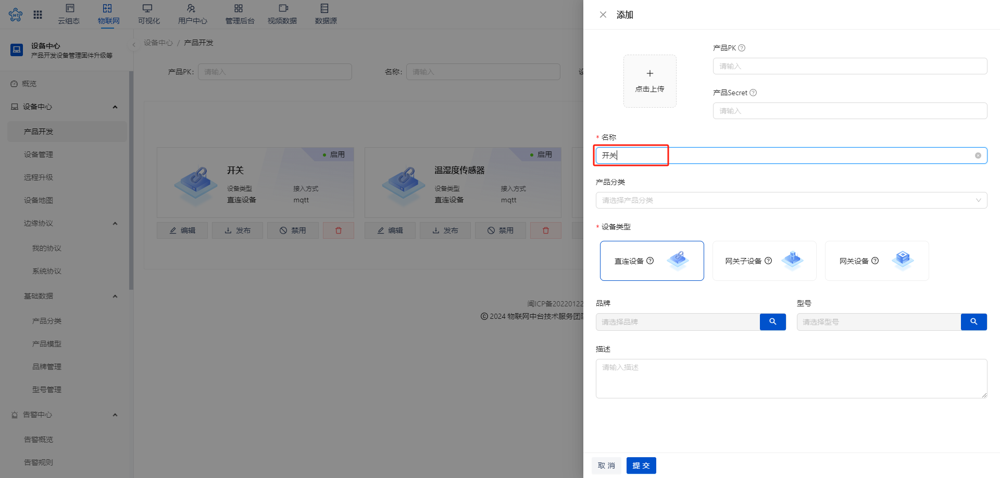
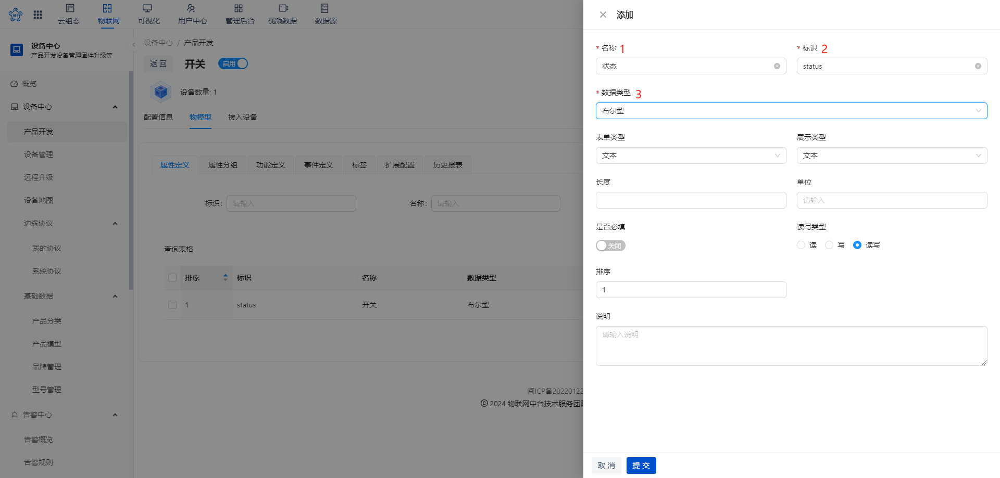
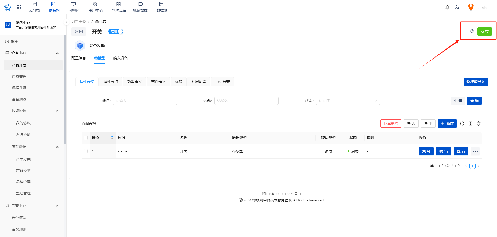
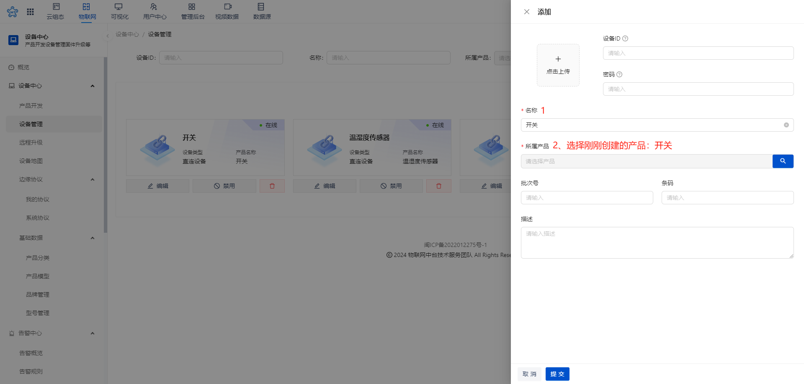
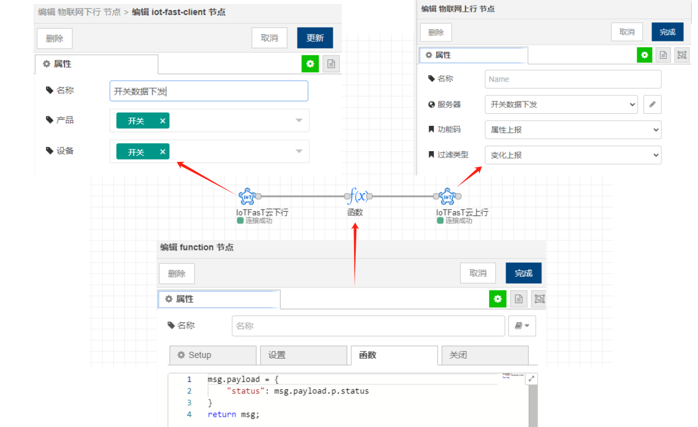
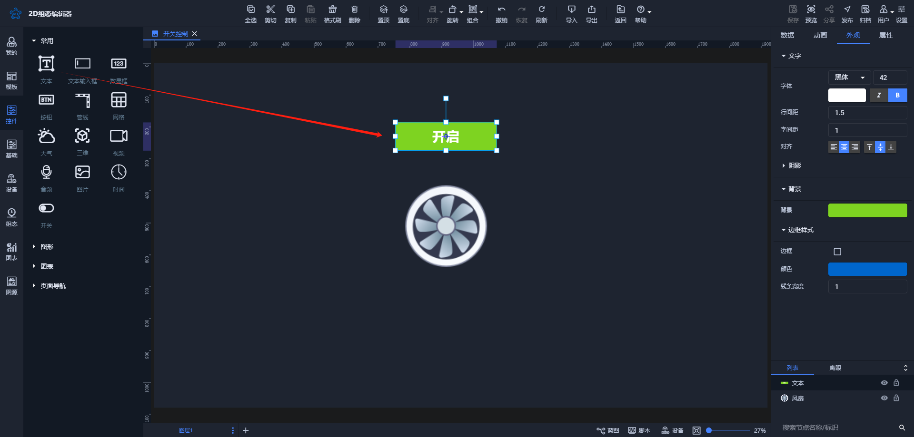
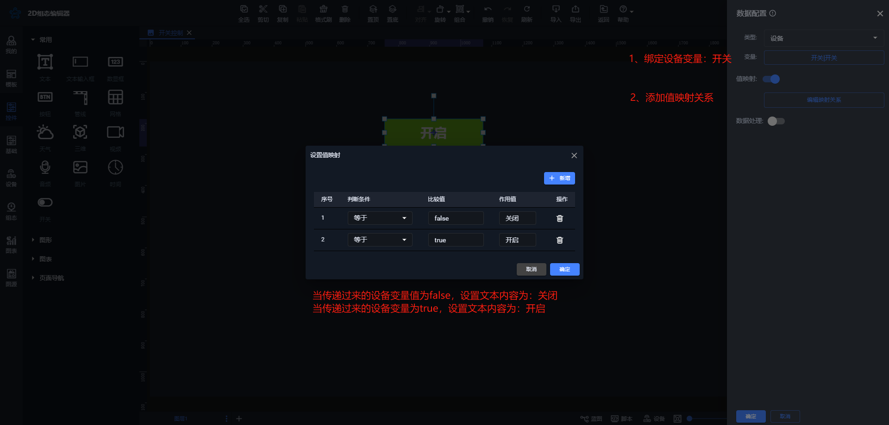
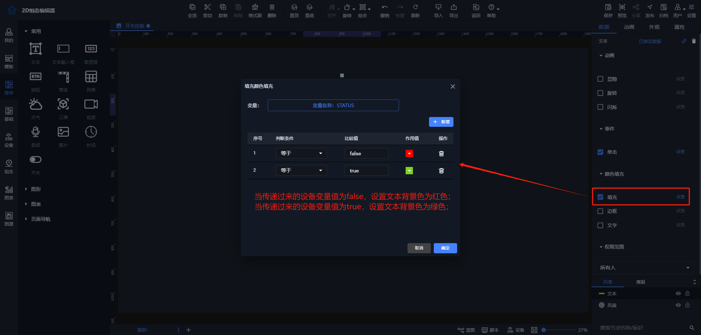
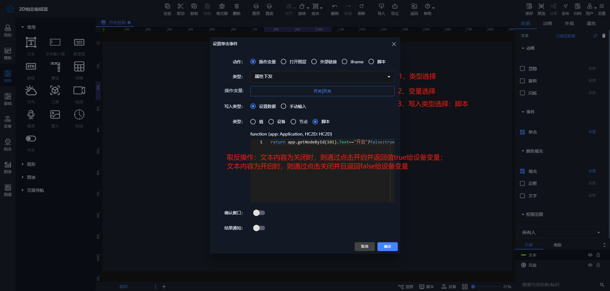
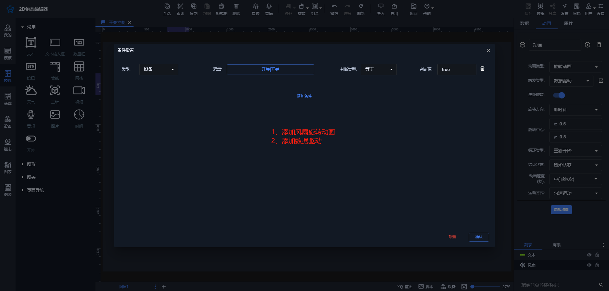

# 模拟开关发送数据

点击按钮后数据将发送至云平台设备，同时按钮状态会切换为开启或关闭，背景色相应变化为蓝色或红色。下方的风扇状态会根据设备变量值进行变换：若值为开启，风扇将开始旋转；若为其他值，风扇将暂停。

[音视频附件: 操作1107.mp4](./attachments/kg-MJS7116gn2ZNy\操作1107.mp4)

### 云平台配置

#### 1.1 产品创建

添加产品开关，其余默认设置即可

添加属性开关，设置为布尔类型

添加属性后，需要点击【发布】按钮生效

#### 1.2 设备创建

### [采控引擎](https://www.yuque.com/iot-fast/ckyq?#%20《采控引擎》)配置

### 可视化面板配置

#### 3.1 按钮配置

说明：按钮是用【控件】里的文本实现的

1、文本绑定设备变量，设置值映射关系：

2、设置文本颜色填充效果

3、设置文本点击事件

#### 3.2 风扇旋转动画设置

以上就是完整的按钮发送虚拟设备数据配置

> 更新: 2025-04-22 15:39:21  
> 原文: <https://www.yuque.com/iot-fast/ksh/vp6sccs6sxyqbcma>