# 组态中实时显示设备状态

# 1.设计控件
## 1.1.新建设计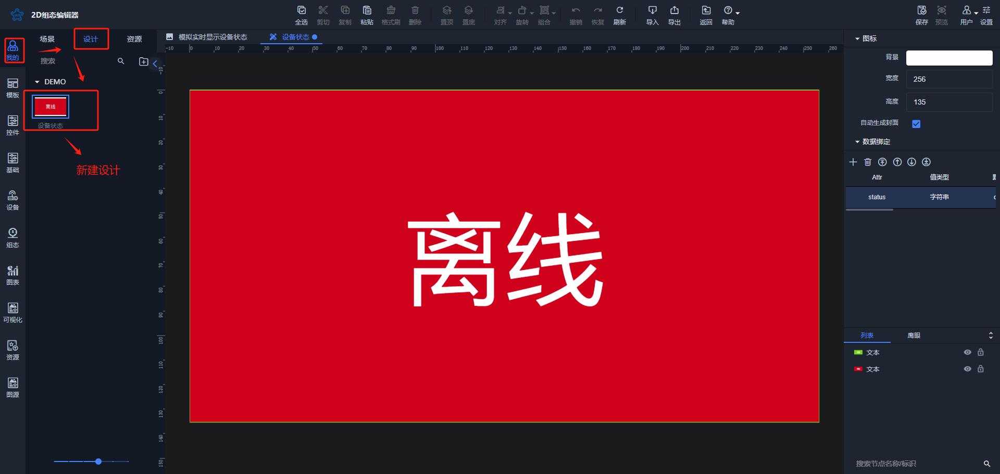
## 1.2.拖拽两个矩形控件到设计；
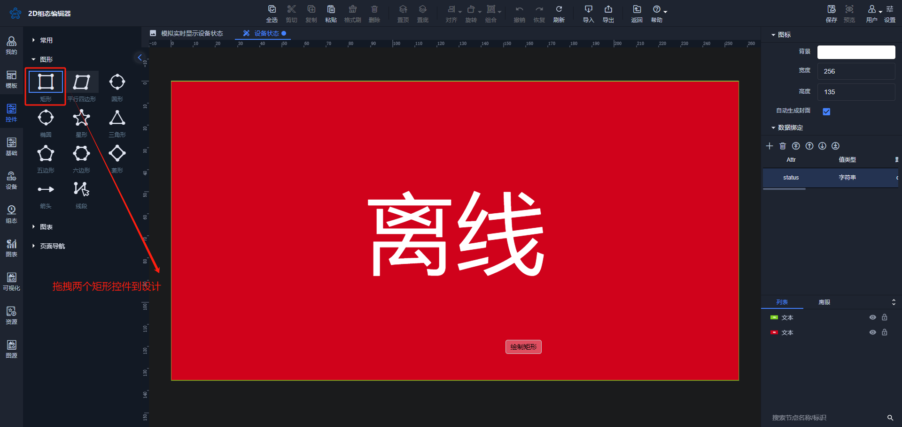

## 1.3.选中控件，设置文字、阴影、背景等外观样式；
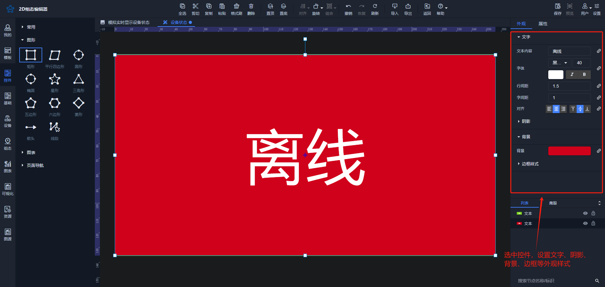

## 1.4.选中设计空白处，添加数据绑定；
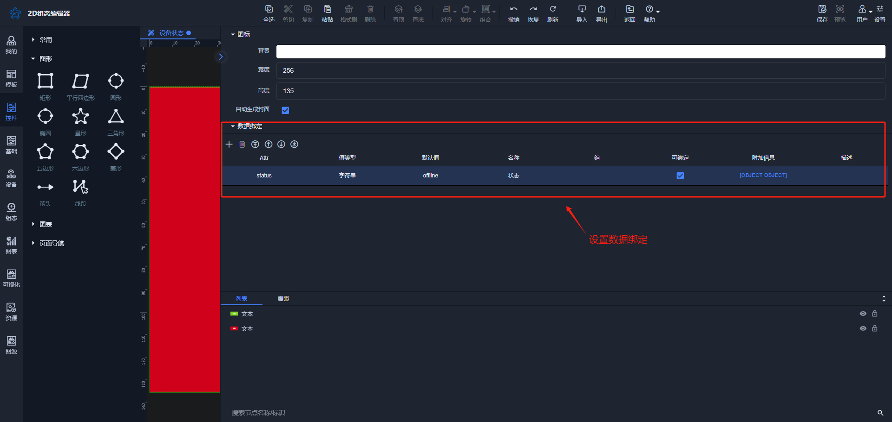

## 1.4.可见控制绑定；
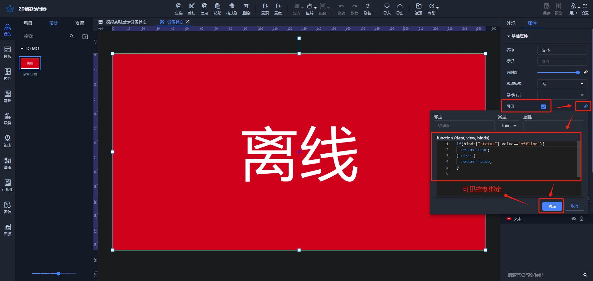

**离线绑定脚本如下：**

```javascript
if(binds["status"].value=="offline"){
  return true;
} else {
  return false;
}
```

**在线绑定脚本如下：**

```javascript
if(binds["status"].value=="online"){
  return true;
} else {
  return false;
}
```

## 1.5.保存数据；
# 2.通信配置
先点击图层空白处，再点击“通信”标签，**<font style="color:#DF2A3F;">通信方式选择“websocket”</font>**，进行如下配置；

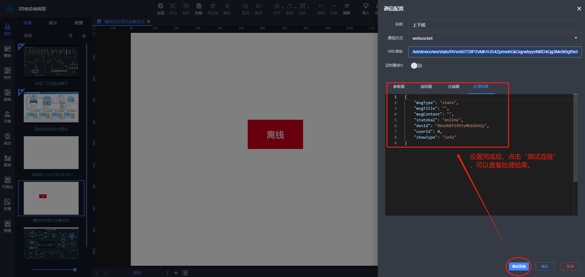

URL地址说明如下：

<u>/iot/device/ws/state/RVsnhDTSfPZvMh1US4Zp/mohGkGqywhyyeNi8D4Qg3Mo9iSgf5nXj</u>

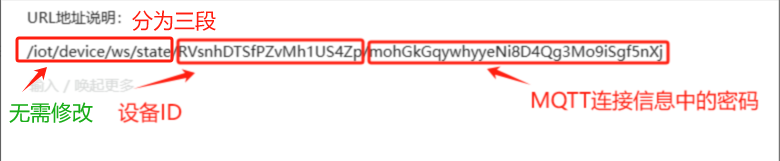

URL相关取值说明如下：

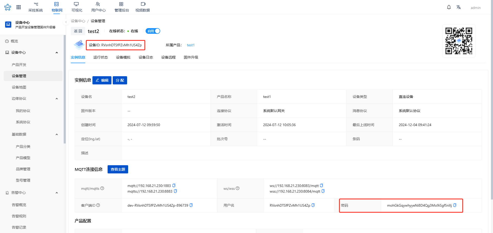

# 3.组态配置
## 3.1.拖拉设计控件到图层
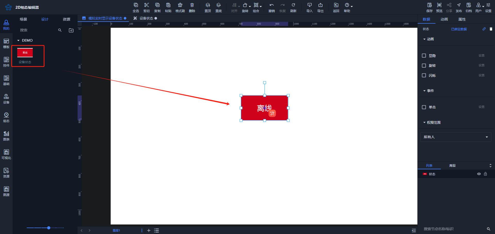

## 3.2.选中控件，打开“数据”标签后，进行数据绑定；
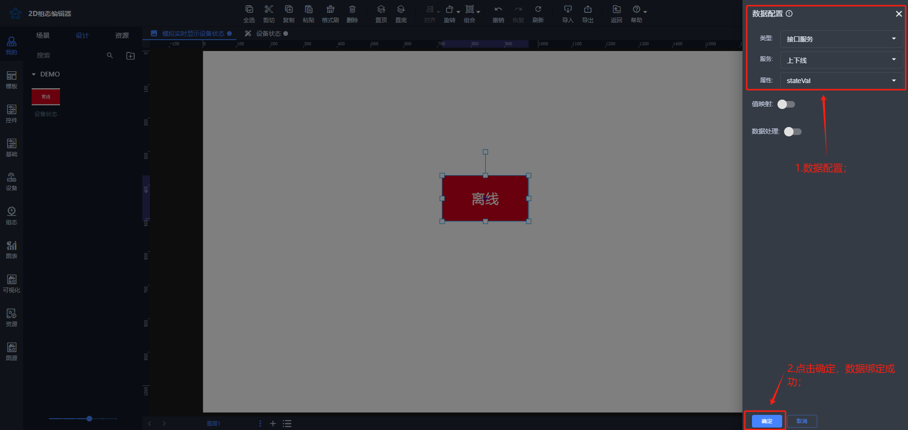

# 4.效果展示
## 4.1.物联网平台模拟设备上下线操作；
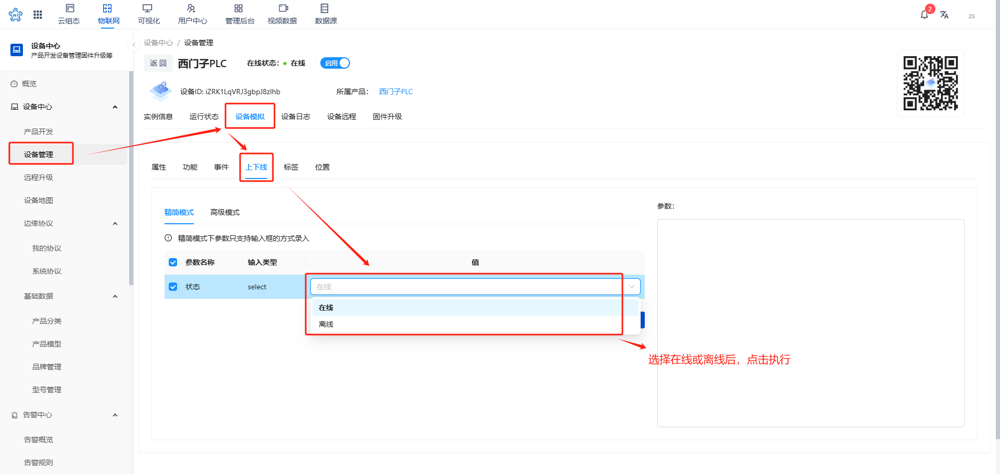

## 4.2.组态预览界面中查看效果；


> 更新: 2024-12-04 16:35:34  
> 原文: <https://www.yuque.com/iot-fast/ksh/sqo6vq1w3b7w4zu5>