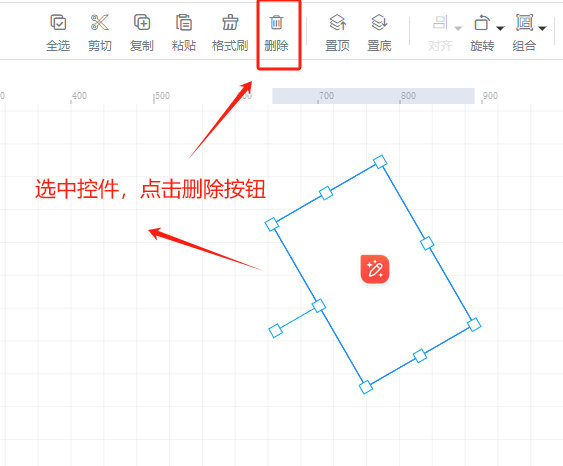
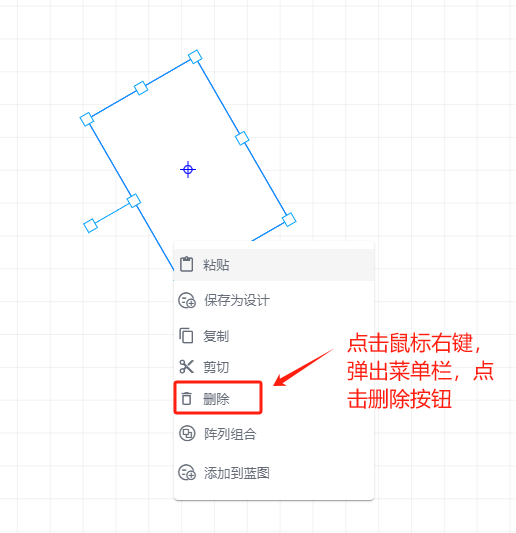

# 删除控件

删除控件的方法有三个：

1、选中要删除的控件，使用键盘快捷键：Delete，选中控件即可删除

2、选中要删除的控件，使用工具栏中的【删除】按钮，即可删除选中控件

3、选中要删除的控件，点击鼠标右键，弹出菜单栏，点击删除按钮，即可删除该控件

> 更新: 2024-07-18 11:31:23  
> 原文: <https://www.yuque.com/iot-fast/ksh/qxwwmyh0r4k7hyfg>