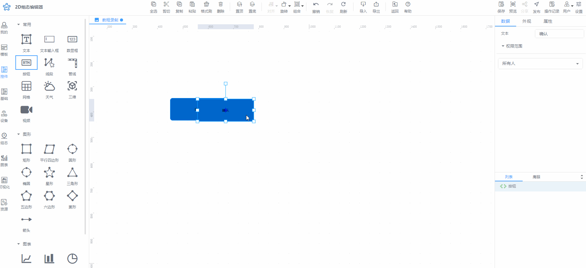
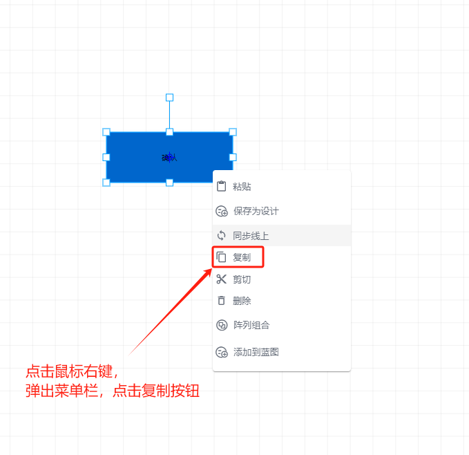
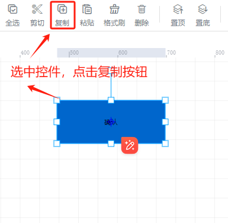

# 复制控件

复制控件有四种方法：

1、选中控件后，按住Alt 键，鼠标按住不动，进行拖动操作，即可快速复制已选中的控件，松开鼠标后，即可在鼠标松开位置复制对应的控件,如此重复操作，可以达到快速复制多个控件

2、选中控件，使用键盘快捷键：Ctrl+C，可将选中控件复制，再使用键盘快捷键：Ctrl+V，可复制该控件

3、选中控件，点击鼠标右键，弹出菜单栏，点击复制按钮，即可复制该控件

4、选中控件，点击工具栏中【复制】按钮，可将选中控件复制

> 更新: 2024-07-18 11:48:07  
> 原文: <https://www.yuque.com/iot-fast/ksh/or63nr2sgkg2ig7e>