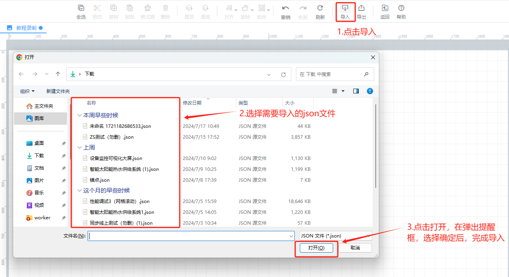
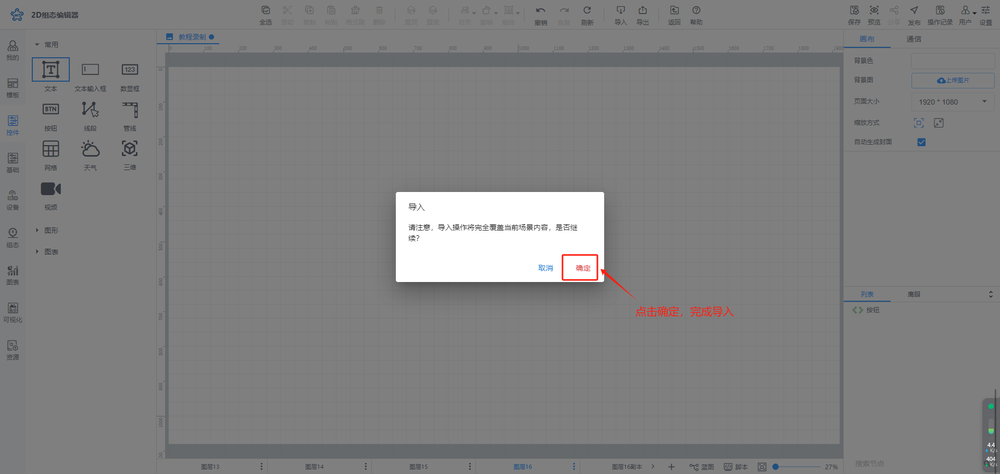

# 导入组态

组态编辑中的导入组态功能可将PC本地的JSON文件导入到组态编辑页面，当在其他项目组态页面中已绘制完成组态页面，在该项目中您还想使用那个组态或者使用组态中的一些控件，您可将已绘制完成的组态导出到PC本地，然后在该项目中组态编辑时进行导入

点击工具栏中导入按钮，弹出导入弹窗

**当前导入会覆盖原数据，具体在弹窗提醒中，点击确定**

点击确定按钮，覆盖原数据，可将当前组态编辑中的所有控件以及蓝图交互进行覆盖

点击取消按钮，取消导入，保留原数据

> 更新: 2024-07-19 10:55:19  
> 原文: <https://www.yuque.com/iot-fast/ksh/ufax82hwmnnpxgoh>