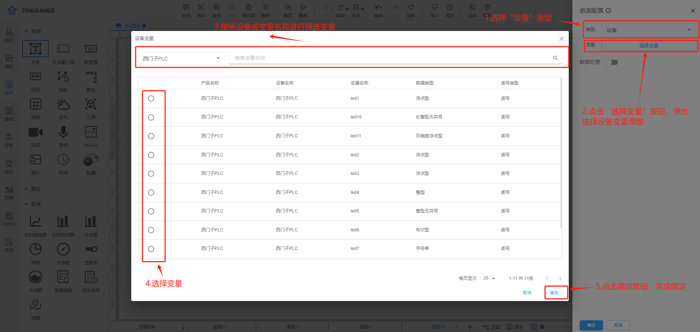
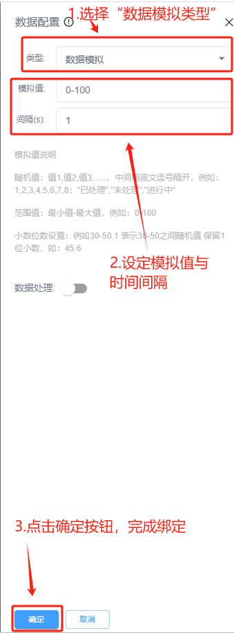
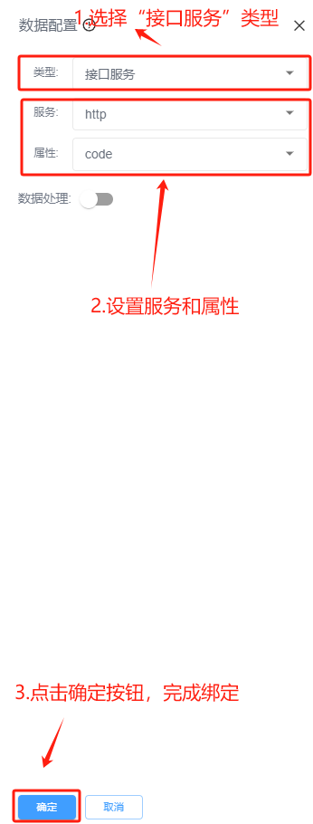
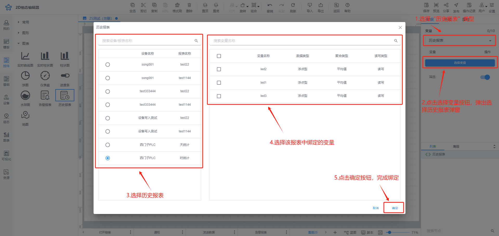

# 控件绑定数据

控件绑定数据，需要选中要绑定数据的控件，可绑定的数据类型包括设备、数据模拟、接口服务和历史报表，不同的控件可绑定的变量数据类型不同

1、设备变量：用于绑定设备中的变量，可实时查看设备变量结果，适用控件包括：【文本】，【文本输入框】，【数显框】，【音频】，【iframe】,【图片】，【轮播】，【实时曲线图】，【实时柱状图】，【柱状图】，【饼图】，【仪表盘】，【进度条】，【水球图】

2、数据模拟：用于在实际系统运行之前，通过模拟控件数据，可以检测和优化系统的性能，适用控件包括：【文本】，【文本输入框】，【数显框】

3、接口服务：用于2D 组态系统能够与外部数据源进行有效的通信和数据交换，接口服务包括http、websocket、mqtt、系统平台接口，适用的控件包括【文本】，【文本输入框】，【数显框】

4、历史报表：用于查看设备的历史报表数据，一个控件只能绑定一个历史报表中的变量数据，适用控件包括：【实时曲线图】，【实时柱状图】，【柱状图】，【历史报表】

控件绑定数据类型操作说明

（1）**绑定设备变量**：数据属性栏中选择“设备”类型，点击【选择变量】按钮，弹出绑定设备弹窗，选择要绑定的变量，点击【确定】按钮，即为控件绑定变量

（2）**通过数据模拟绑定：**在数据属性栏中选择“数据模拟”，设置模拟值与时间间隔后，点击【确定】按钮，即为控件绑定变量

【模拟值说明】

随机值：值1,值2,值3......，中间用英文逗号隔开，例如：1,2,3,4,5,6,7,8；"已处理","未处理","进行中"

范围值：最小值-最大值，例如：0-100

小数位数设置：例如30-50.1 表示30-50之间随机值 保留1位小数，如：45.6

（3）**通过接口服务绑定**：在数据属性栏中选择“接口服务”，设置服务与属性后，点击【确定】按钮，即为控件绑定变量

（4）**绑定历史报表**：在数据属性栏中选择历史报表，点击【选择变量】按钮，弹出绑定历史报表弹窗，选择要绑定的变量，点击【确定】按钮，即为控件绑定变量

> 更新: 2024-07-18 16:58:15  
> 原文: <https://www.yuque.com/iot-fast/ksh/ptqd03ubpib0kgiw>