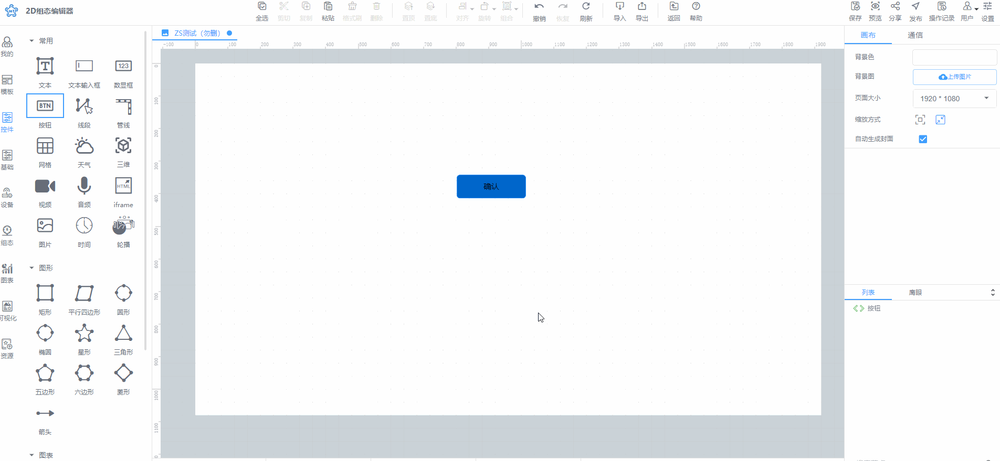
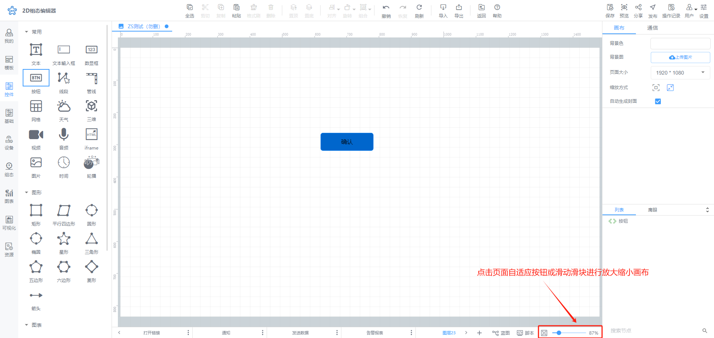

# 放大缩小组态画布

放大缩小组态画布有三种方法：

方法1：按住Ctrl 键 的同时，滑动鼠标的滚轮，即可针对于组态页面中，画布的大小进行缩放操作

方法2：通过滑动鼠标的滚轮，即可针对于组态页面中，画布的大小进行缩放操作

方法3：点击编辑页面底部状态栏中，点击页面自适应或拖动页面大小滑块，进行组态画布缩放的设置

> 更新: 2024-07-18 17:57:52  
> 原文: <https://www.yuque.com/iot-fast/ksh/lvioc595gem58ox1>