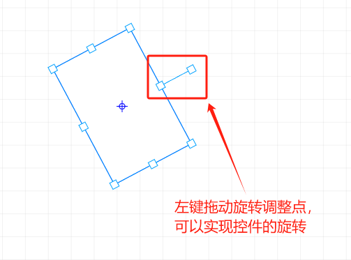
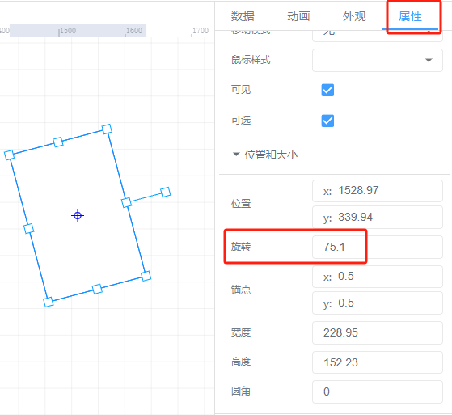
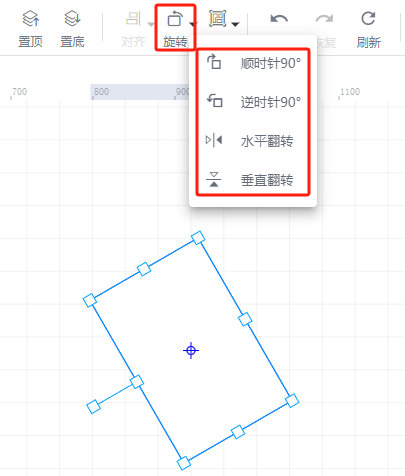

# 旋转控件

旋转控件有三种方法：

1、直接鼠标左键点击要调整的控件，在其周围会出现旋转调整点，鼠标放置到节点上，按住左键进行拖动，就可以任意调整控件的旋转角度。

2、控件属性栏中有【旋转】一栏，可以填入角度来实现控件的旋转。

3、组态工具栏中点击旋转，可进行顺、逆时针进行旋转90°，以及水平、垂直翻转

> 更新: 2024-07-18 11:26:46  
> 原文: <https://www.yuque.com/iot-fast/ksh/gqn4zph6zwezl6gc>