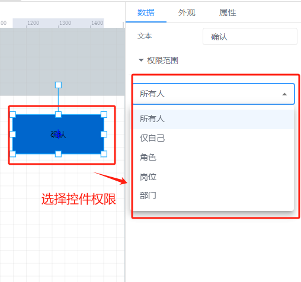
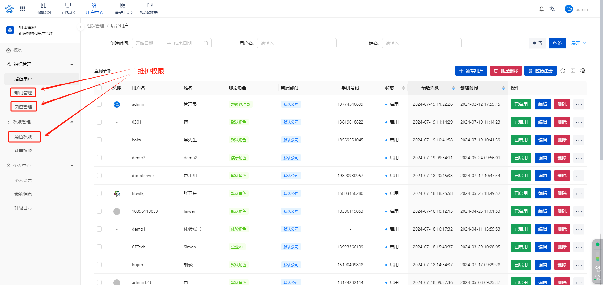
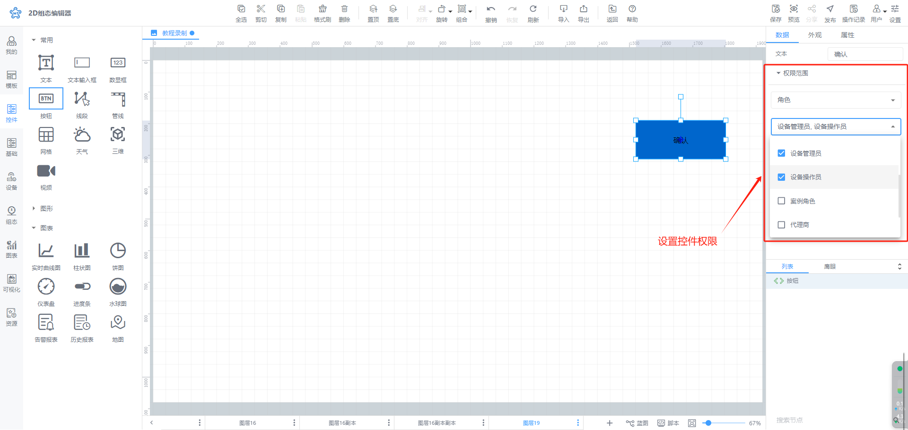
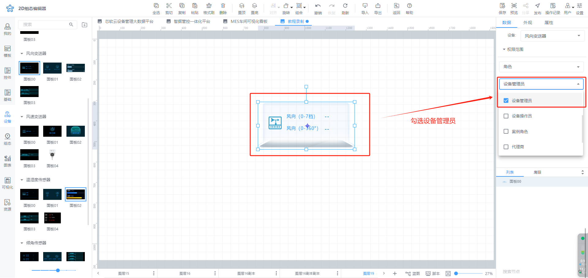
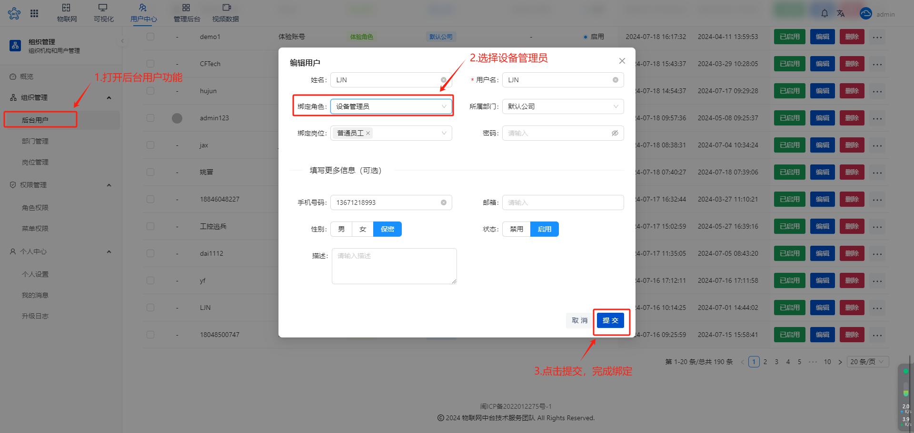

# 权限

## 1. 权限功能说明：
【权限功能】功能用户可以对组态页面中的任何一个控件设置权限，通过权限能够于实现对组态页面中重要控件显示或隐藏的管控，在**分享页面**时，确保只有授权的用户或团队能够访问和操作特定的组态功能。

## 2. 权限功能优势：
1）当前权限功能，一个控件最多可设置权限个数不限，意味着可管控数量不受限制，完全能够满足企业运营管理过程中对多人员的使用需求

2）权限管理用户可自行定义权限名称，比如，可设置为“管理员”，“操作工”等权限名称，直观了然，使用和理解难度大幅降低

3）细化权限管控颗粒度，每个设备，可设置不同的权限，举例，设备1，可设置三个权限，设备2由于管理程度比较高，则可设置4个权限，满足更高层级人员使用需求，同时，设备在授权过程中，也可根据不同的人员，授予不同的权限，方便进行交叉管理

## 3. 权限功能应用场景举例：
应用场景1：

某泵站水泵设备A需要有三个角色共同操作组态画面：

角色1：设备管理员，需要对设备有全面的管理操作，包括查看核心设备运转数据，开启关闭重要开关按钮

角色2：设备操作员，仅支持对设备一些常规开关操作，无法查看重要数据

角色3：普通用户，仅可查看设备运行情况，没有其他权限

解决方案：

使用新版的组态权限功能，可对于组态控件进行权限划分，举例：

1. 核心数据图表控件，组态权限中，可勾选设备管理员角色，

2. 核心开关控件，组态权限中，可勾选设备管理员和设备操作员角色；在设备授权中，将对应用户授权给设备管理员角色设备操作员角色

3. 常规的水泵运转状态控件，组态权限中可勾选设备管理员，设备操作员和普通用户，在设备授权中，将对应用户授权给设备操作员角色

组态设置好权限后，可在iotfast平台>>用户中心中，给对应的用户授权

1）比如企业负责人，可在权限中选择：设备管理员角色

2）车间负责人，可在权限中选择：设备操作员

3）车间工人，可在权限中选择：普通用户

通过上述组态权限+授权管理功能，则可实现企业负责人可查看重要图标，控制核心开关等操作，车间负责人仅支持设置常规开关操作，车间工人，仅可查看设备运行情况的场景

## 4. 实际操作说明：
### 4.1 控件选择权限
点击某一个控件后，在右侧的属性栏目中，可设置该控件对应的权限，比如可选择设备操作员和设备管理员

### 4.2 权限管理
用户可自行定义权限， 举例：比如现在有3个权限，分别为：普通用户，设备管理员，设备操作员，如果希望增加一个新的权限，则可以到用户中心，增加新的角色权限，比如可增加为“企业管理员”

### 4.3  用户权限授权
组态控件的权限设置好后，可针对于不同的用户进行授权操作，在授权过程中，设置用户的组态“权限”，对不同用户设置不同的权限，保证授权的用户的可见性。

**下面以一个例子来演示具体的使用方法：**

某泵站水泵设备A需要有三个角色共同操作组态画面：

用户1：设备管理员，需要对设备有全面的管理操作，包括查看核心设备运转数据，开启关闭重要开关按钮

用户2：设备操作员，仅支持对设备一些常规开关操作，不支持查看报警记录

**操作过程**

1）选择控件，点击数据栏中权限范围设置，操作，设置设备管理员，设备操作员两个权限

2)针对于控件，权限管理人员中，仅勾选设备管理员,代表设备管理员可以查看该控件，设备操作员，无法查看该控件

3）设置授权， 从iotfast平台>>用户中心>> 后台用户功能中，选择用户，点击【编辑】菜单按钮，进行角色绑定操作

4）权限设置完毕后，分别登录两个账号，可以看到，由于两个账号不同的权限，每个人只能看到自己有权限的控件

A 用户为 设备管理员，分享页面可以看到控件

B用户为设备操作员，分享页面无法查看控件

### 4.4用户访问组态分享页面
1）未登录： 直接访问分享页面，只能查看设置“所有人”权限的节点；

2）登录后访问：先登录系统后，再访问组态分享页面，即可访问有权限的节点；

> 更新: 2024-07-31 14:31:04  
> 原文: <https://www.yuque.com/iot-fast/ksh/lw25ah5ogaozb0y2>