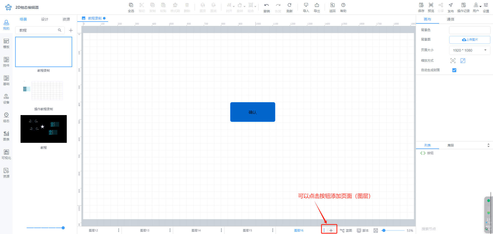
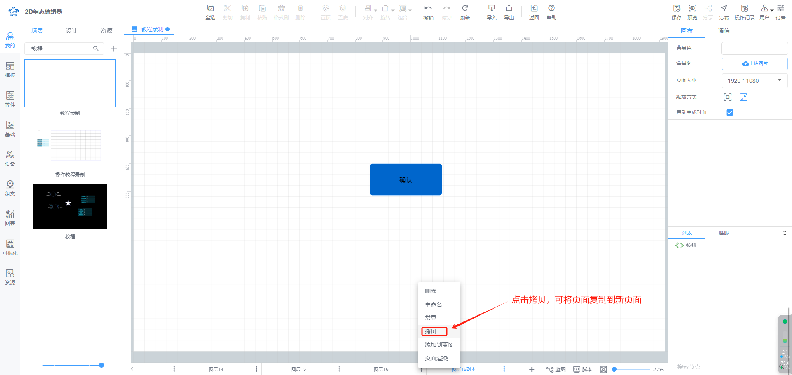

# 添加页面（图层）

组态中可添加多个组态页面，可以在组态编辑中进行添加

在组态编辑页面中可点击状态栏中增加页面按钮进行添加页面操作

对于添加页面，也可通过拷贝已存在的页面进行添加复制页面操作，复制的页面包括原页面中所有的元素，包括背景和绑定的变量

> 更新: 2024-07-19 09:37:56  
> 原文: <https://www.yuque.com/iot-fast/ksh/lyzp4ebwvzscwuux>