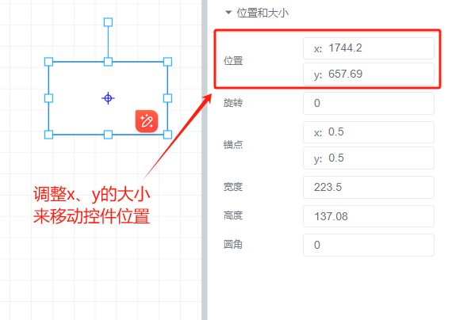

# 移动控件

移动控件有五种方法：

（1）鼠标按住并拖动控件

选中单个控件后，在画布中拖动该控件，可调整该控件的位置

（2）精确调整位置

选中控件后，敲击键盘的 “上下左右方向键”可针对于控件进行位置的调整，每按一次键位，调整1个像素的距离

（3）更改控件外观属性栏中位置与尺寸的x和y的大小来移动控件位置

> 更新: 2024-07-17 16:15:28  
> 原文: <https://www.yuque.com/iot-fast/ksh/mvle59mlh671rtl4>