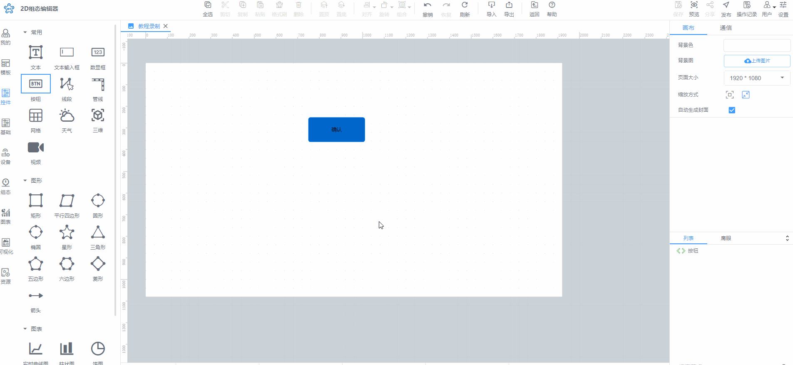

# 移动画布位置

有两种方法进行移动画布位置操作：

方法1、键盘+鼠标：按住 Shift 的同时，按住鼠标左键进行拖拽操作，即可移动画布位置

方法2、鼠标：按住鼠标滚轮键进行拖拽操作，即可移动画布位置，效果同上图

> 更新: 2024-07-18 17:47:37  
> 原文: <https://www.yuque.com/iot-fast/ksh/fo3y7pxpsihd0shz>