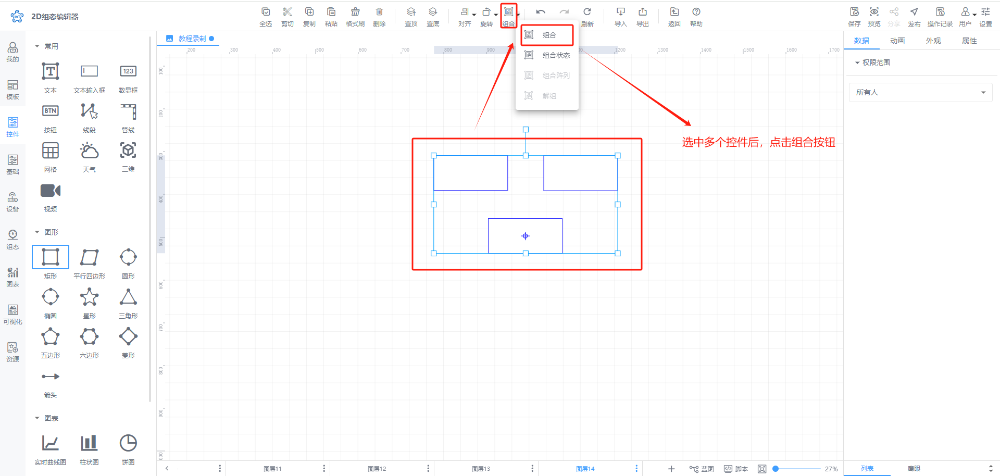
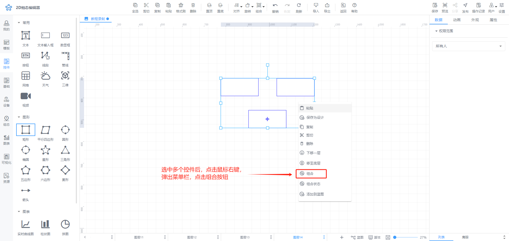
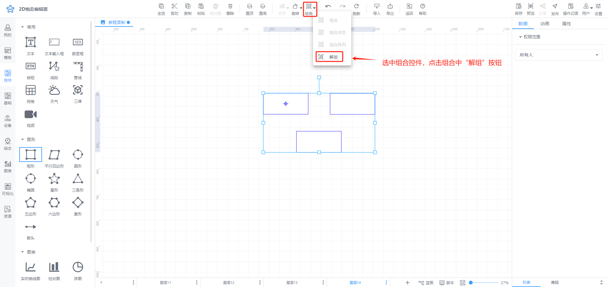
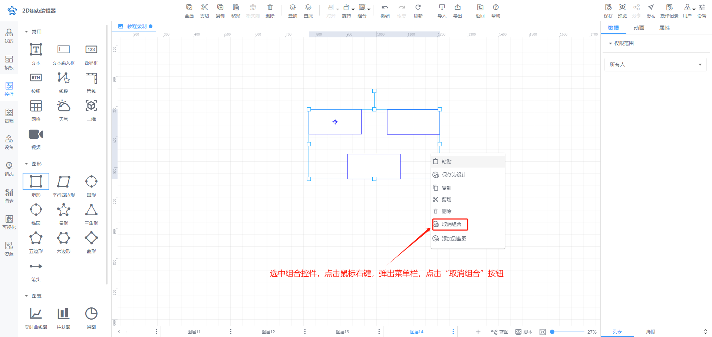
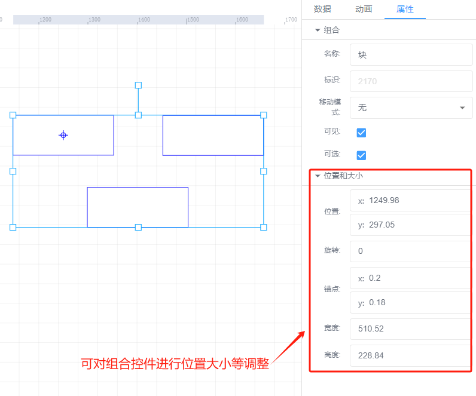
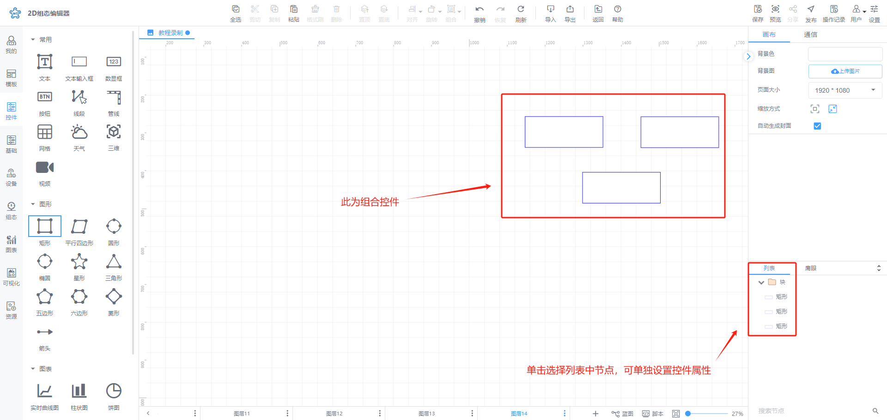

# 组合控件

## 一、组合控件方法
选择多个多个控件后

1、点击工具栏中”组合”按钮

2、鼠标右键点击“组合”按钮

## 二、取消组合控件方法
点击组合控件后

1、点击工具栏：“解组”按钮，

2、鼠标右键点击“取消组合”按钮

## 三、组合控件调整样式
组合控件支持对组合内所有子控件进行大小，旋转角度的调整，也支持对所有子控件填充边框颜色文字样式的调整，设置后将覆盖原子控件样式

单击组合控件中列表的子控件，可单独设置子控件的属性，如图，单个矩形为组合控件，单击矩形控件，可以在属性栏中单独设置矩形控件的属性

> 更新: 2024-07-18 11:13:56  
> 原文: <https://www.yuque.com/iot-fast/ksh/ht3bpfsx0sedltsv>