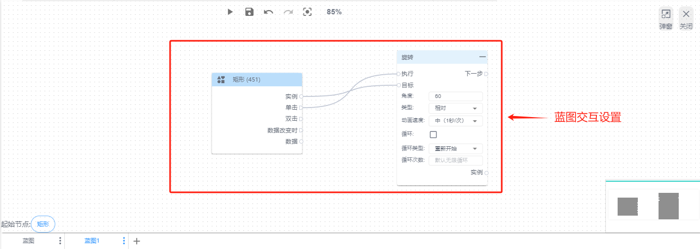
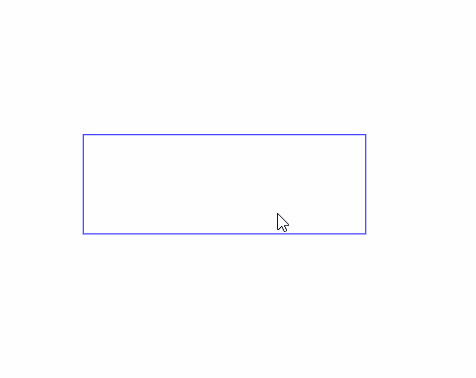
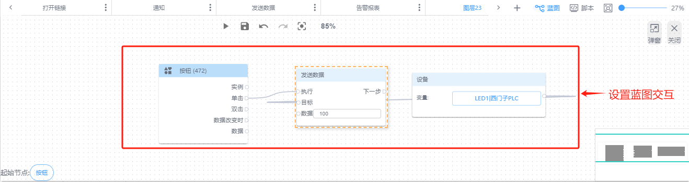
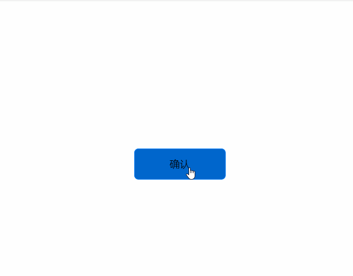
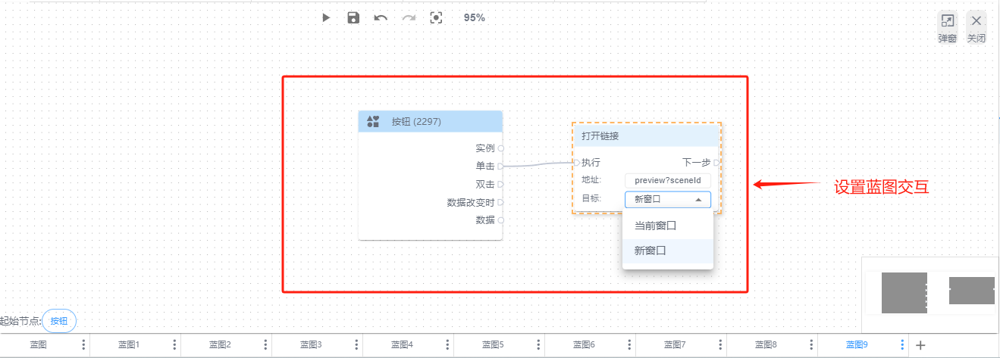
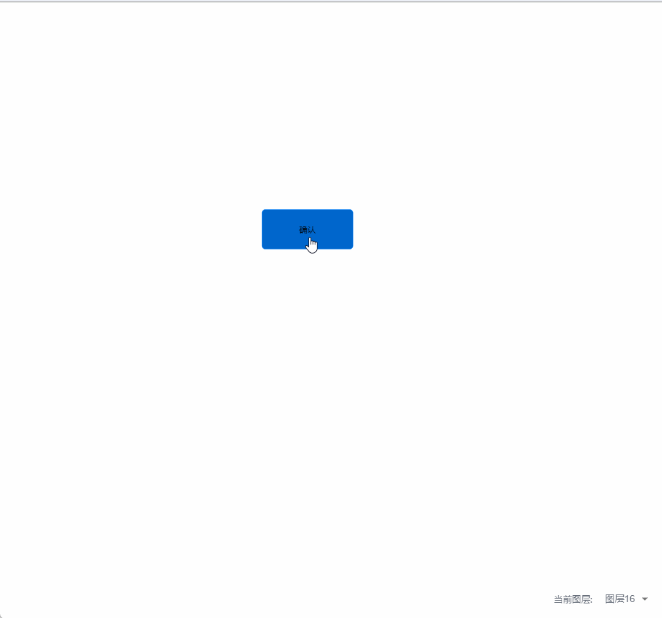

# 设置点击事件

单击事件功能是指通过点击控件实现远程操控，进行页面跳转等操作

常见单击事件的控件有：【文字】、【数显框】、【按钮】、【图片】等

选中控件，通过鼠标右键，点击“添加到蓝图”，在蓝图中，从【单击】事件节点引出连线，连接到你想要执行的具体操作节点，可进行单击事件的动作设置。

单击事件可实现操作动作、数据、逻辑、提示和打开链接等操作功能

**1.操作动作：绑定动作，比如操控旋转动作，蓝图交互设置如图**

**效果展示**

**2.绑定数据，绑定数据，比如操控发送数据，蓝图交互设置如图**

**效果展示**

**3.组态页面跳转：**设置指定同项目的其他组态页面，实现页面跳转。跳转模式可设置为在当前窗口、新窗口展示。蓝图交互设置如图

**效果展示**

****

> 更新: 2024-07-18 17:37:53  
> 原文: <https://www.yuque.com/iot-fast/ksh/rbbevu5auzcrn4ye>