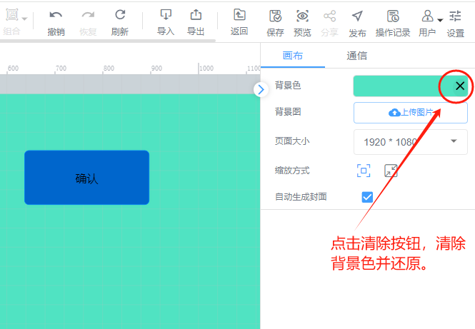

# 设置页面背景

页面背景可设置颜色和图片

## 1、设置页面背景
页面背景可以画布属性栏中进行设置，唤出画布属性栏的方法：鼠标定位到画布空白处

背景色：点击背景色，弹出调色板，在调色板上点击颜色或者通过更改RGBA和颜色代码来选择颜色，更改完成页面背景色即可作出相应调整

背景图片：点击背景图片，背景图片可在本地或者图库中选择，图片填充方式可选择原始大小、铺满和重复铺满

## 2、清除页面背景
对于已经设置了页面背景色的，可进行清除背景色操作，点击清除背景色按钮，即可清除背景色并还原；

对于已经设置了页面背景图的，可进行清除背景图操作，点击删除背景图按钮，即可删除背景图；

> 更新: 2024-07-19 10:29:41  
> 原文: <https://www.yuque.com/iot-fast/ksh/sc44z7smroxg9gpt>