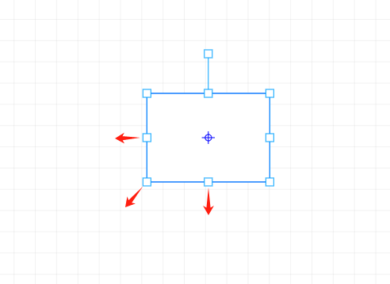
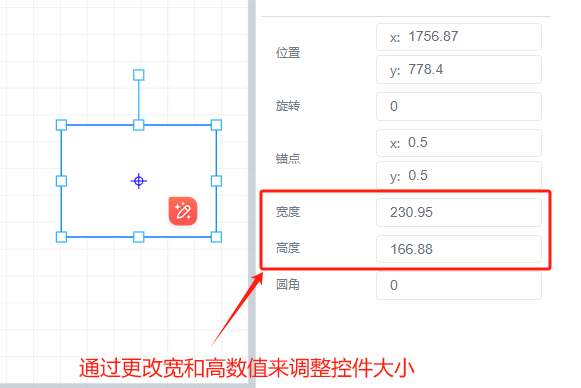

# 调整控件大小

调整控件大小有两种方法：

1、自由拖拽，调整大小

选中控件后，使用鼠标拖拽选中控件的任何一个定位点，均可按照拖拽的距离，调整控件的大小

2、更改控件外观属性栏中位置与尺寸中的宽和高调整控件大小

> 更新: 2024-07-17 16:21:12  
> 原文: <https://www.yuque.com/iot-fast/ksh/nb45ld7x4psqkgi6>