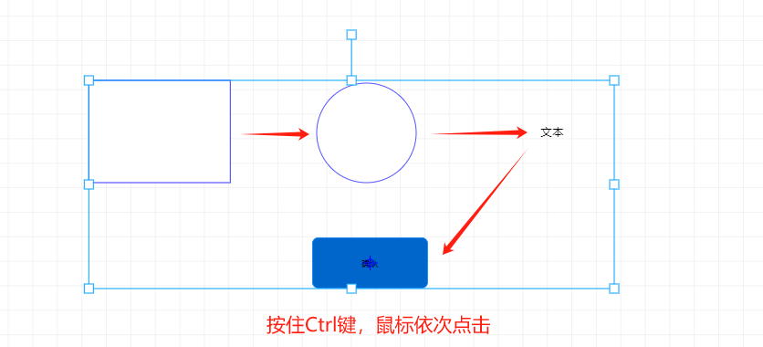
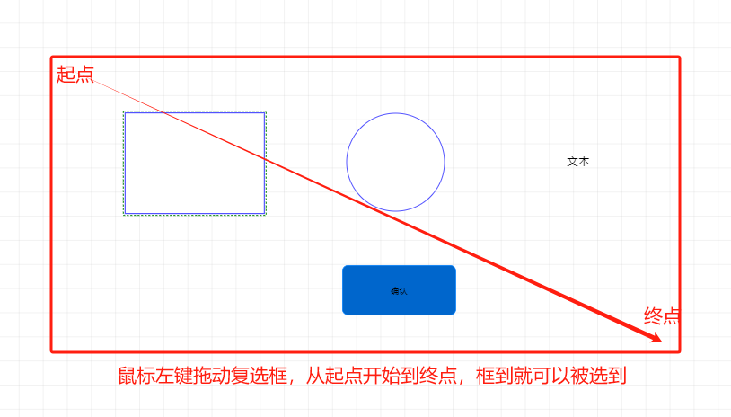
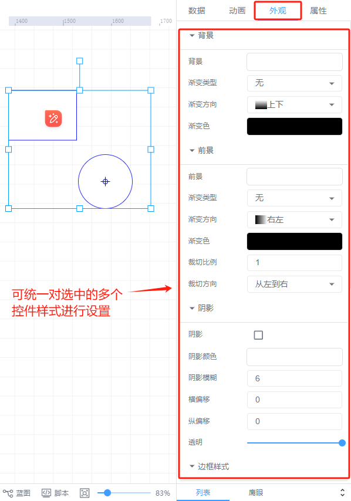

# 选中多个控件

同时选中多个控件的方法：

1、使用Ctrl 键+鼠标左键

按住Ctrl 键，使用鼠标点击未选择的控件，则可将多个控件进行同时选中

按住Ctrl键，使用鼠标点击已选中的控件，则将已选择的控件进行取消选中

2、按住鼠标左键，在画布中进行拖拽选择

按住鼠标左键，在画布中进行拖动选择，则可将多个控件进行同时选中

同时选中多个控件后，可批量针对多个控件的共同属性部分进行设置，包括数据栏、外观栏、属性栏

> 更新: 2024-07-18 10:44:48  
> 原文: <https://www.yuque.com/iot-fast/ksh/hgw7grt43w6kz5qx>