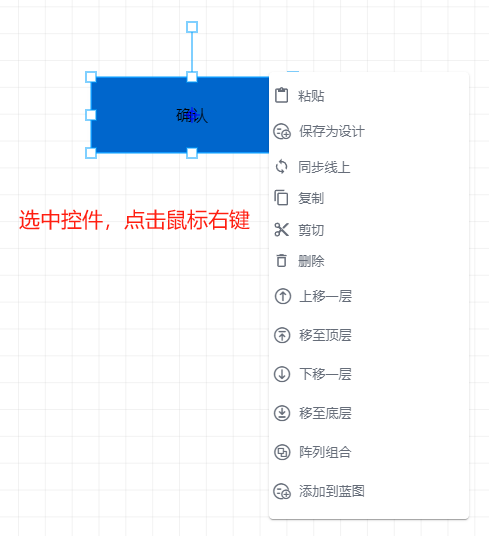

# 单个控件右键菜单

针对于单个控件，进行鼠标右键操作，会弹出对应菜单显示对应的菜单选项

菜单栏中支持的功能为：复制、剪切、粘贴、删除、保存为设计、同步线上、上移一层、移至顶层、下移一层、移至底层、阵列组合、添加到蓝图（三维控件不支持蓝图操作）

1. 复制：点击复制按钮，可将当前选中控件复制

2. 剪切：点击剪切按钮，可将当前选中控件剪切下来

3. 粘贴：点击粘贴按钮，之前复制或剪切的内容可粘贴到此位置

4. 删除：点击删除按钮，可将当前控件删除

5. 保存为设计：将控件保存到个人设计目录，可以进行自定义

6.同步线上：

7.上移一层：此功能将所选的图形元素或对象在当前的层叠顺序中向上移动一个层次。例如，如果有三个重叠的元素，分别是 A、B、C（从下到上的顺序），当对 B 执行“上移一层”操作时，层叠顺序将变为 A、C、B。

8.移至顶层：使用该功能可以将所选元素直接移动到所有元素的最上方。继续以上面的例子，如果对 B 执行“移至顶层”操作，层叠顺序将立即变为 B、A、C。

9.下移一层：与“上移一层”相反，它使所选元素在层叠顺序中向下移动一个层次。比如对于上述例子中的 C 执行“下移一层”，层叠顺序会变成 A、B、C。

10.移至底层：这一功能会把所选元素直接放置在所有元素的最下方。若对 C 执行“移至底层”操作，层叠顺序将变为 C、A、B。

11.阵列组合：点击“阵列组合”按钮，可以将图形元素或对象按照一定的规律进行排列组合，默认2*2。

12.添加到蓝图：点击“添加到蓝图”按钮，将组件作为节点添加到“蓝图”中，用于进行蓝图交互设计。

> 更新: 2024-07-25 10:32:45  
> 原文: <https://www.yuque.com/iot-fast/ksh/lg5c1hdg4rf9sz3e>