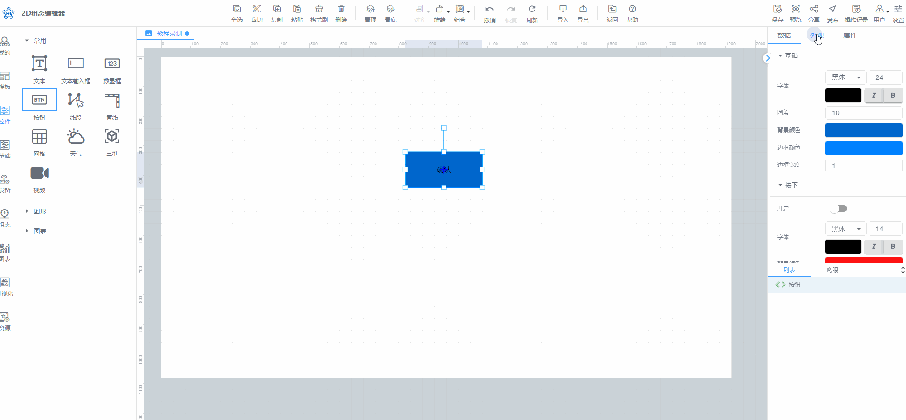
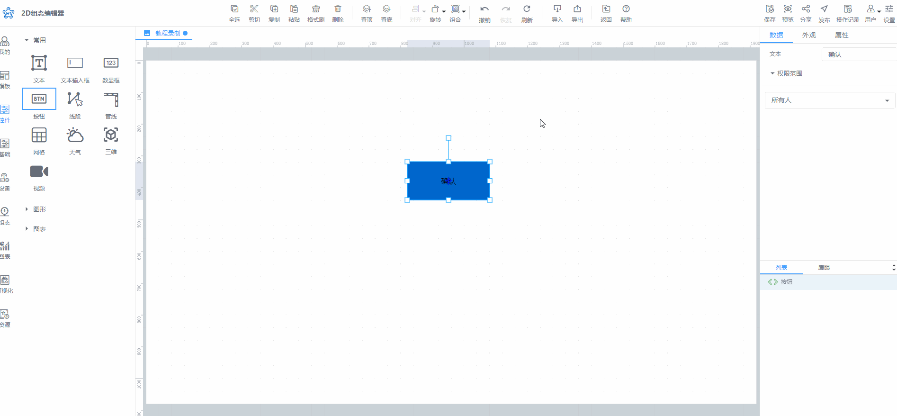

# 单击

## 1、单击控件
在编辑组态的过程中，点击控件，可针对于控件进行选中操作，选中控件后，可针对于控件进行属性设置和调整操作

点击背景区域，则取消选中已选择的控件

此操作对于所有的控件均有效

## 2、单击画布/背景
单击工作区域的画布或背景，则可针对于组态背景进行属性设置和调整操作

## 3、单击工作区除画布的空白处
单击工作区中除画布之外的空白处，可将属性栏中页面属性唤出，进行页面背景等设置

## 4、单击工具栏
针对于符合条件并支持进行点击的工具栏菜单，进行单击操作，则表示可选中对应的工具，执行要对应的动作

举例：点击工具栏中全选按钮，则可选择当前页面的全部控件

> 更新: 2024-07-19 15:52:49  
> 原文: <https://www.yuque.com/iot-fast/ksh/larcl860r5sn73g5>