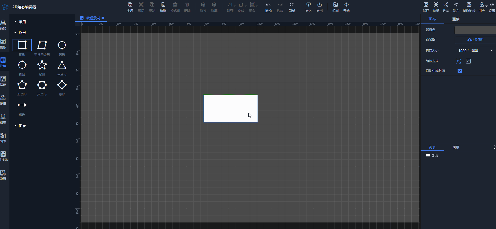
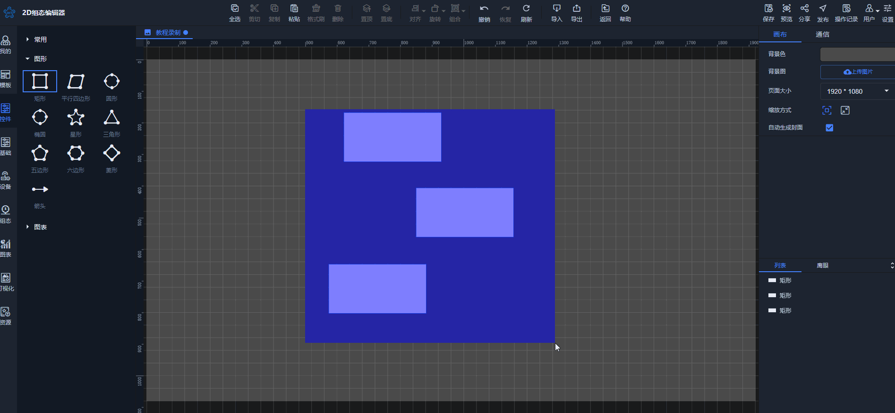
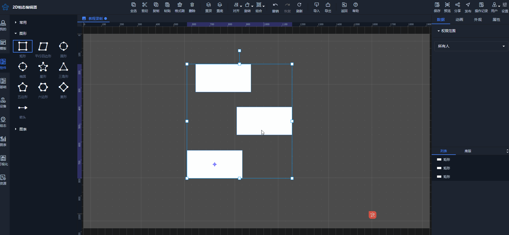

# 取消选择

## 1.单个控件取消选择
当某一个控件处于选中状态，点击画布的空白处，或点击其他控件，则当前控件状态变为未选中状态

## 2.多个控件取消选择
当多个控件处于选中状态，点击画布的空白处，或点击其他控件，则当前选中所有的控件状态变为未选中状态

## 3. 在多个选中控件中，单独取消某一个控件选中
当多个控件处于选中状态，Ctrl+鼠标左键点击某一个已选中的控件，则该控件变为未选中状态

> 更新: 2024-07-31 16:44:07  
> 原文: <https://www.yuque.com/iot-fast/ksh/bm1mc7gdwaw7wsx6>