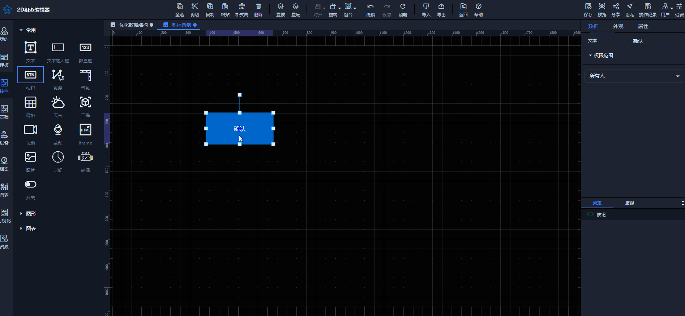

# 快速复制控件

复制控件有很多种方法，此处为您介绍一个快速复制控件的方法

选中控件后，按住Alt 键，鼠标按住不动，进行拖动操作，即可快速复制已选中的控件

松开鼠标后，即可在鼠标松开位置处复制对应的控件

快速复制控件，不仅复制控件样式，同时将控件对应的变量、事件或绑定的数据一起复制

> 更新: 2024-07-30 18:31:52  
> 原文: <https://www.yuque.com/iot-fast/ksh/pz4t15ephn9l3ewe>