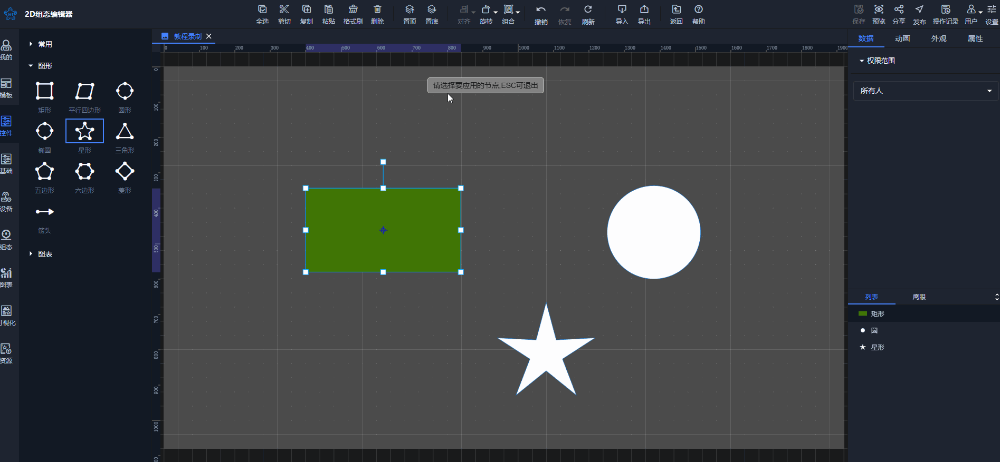

# 格式刷

格式刷功能可快速的将一个控件的样式复制到其他控件上，避免为多个相同样式的控件重复进行设置，使绘制组态更加便捷

1、格式刷使用方法

点击任意一个控件，单击格式刷按钮，进入格式刷功能，点击其他控件进行样式复制（支持对多个控件进行样式复制）

2、取消格式刷

进入格式刷功能后，取消格式刷方法：

（1）鼠标右键点击画布空白处或其他控件，则取消格式刷状态

（2）点击其他菜单功能按钮，取消格式刷状态

注意：格式刷只复制样式，并不复制绑定数据

> 更新: 2024-07-31 17:53:44  
> 原文: <https://www.yuque.com/iot-fast/ksh/fn3ygktwd8ag4n0w>