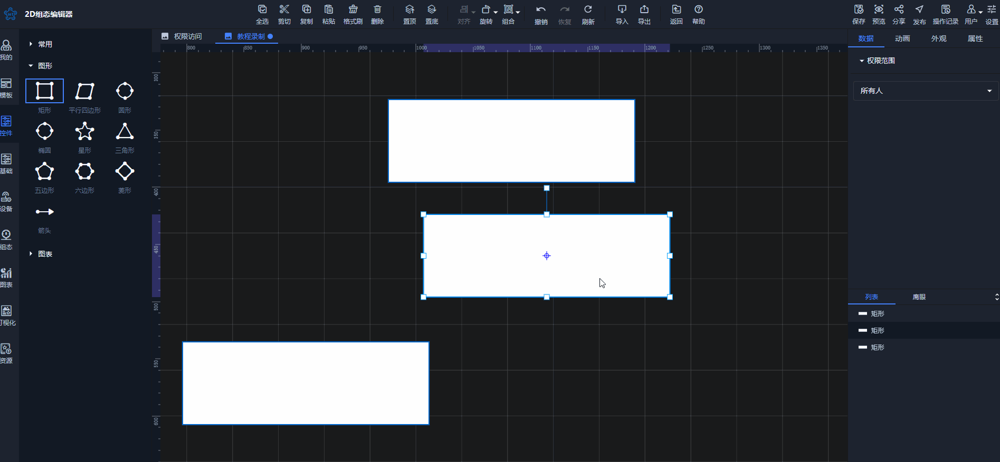
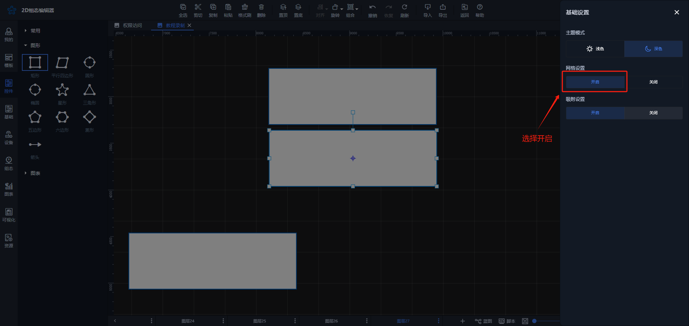

# 磁力线对齐自动吸附

## 1、自动吸附使用方法
       磁力线对齐自动吸附功能可以快速的调整控件对不齐的情况。当画布中有多个控件时，拖动某一个控件到其他控件附近后，会自动出现与其他控件X轴或Y轴对齐的磁力线，具备磁力效应，松开鼠标后，该控件会自动吸附到磁力线位置，与其他控件对齐

## 2、开启自动吸附
如果您在组态编辑移动控件时没有出现磁力效应，您可以在组态编辑页面右上角设置中将该功能进行开启

> 更新: 2024-07-31 15:27:36  
> 原文: <https://www.yuque.com/iot-fast/ksh/hvm5281dqtmlbq41>