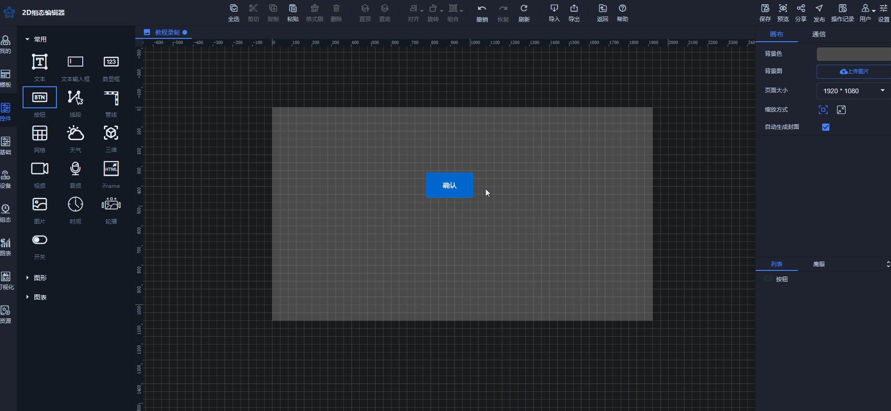
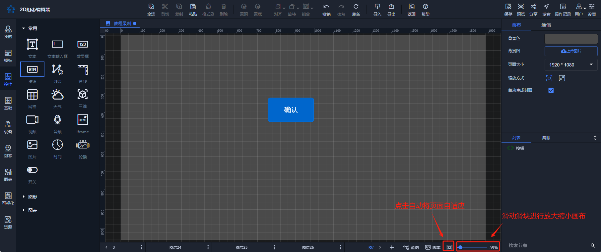

# 组态画布放大缩小

组态画布进行放大缩小功能可以在组态编辑过程中缩小进行总览组态，放大进行精确控件位置

将组态画布进行放大缩小有两种方法：

方法1（**推荐**）：滑动鼠标的滚轮，即可针对于组态页面中，画布的大小进行缩放操作

方法2：点击编辑页面中，底部状态栏的页面大小，或拖动页面大小滑块，进行组态画布的的大小的设置

> 更新: 2024-07-31 17:10:27  
> 原文: <https://www.yuque.com/iot-fast/ksh/ggz85r2541ggd1vw>