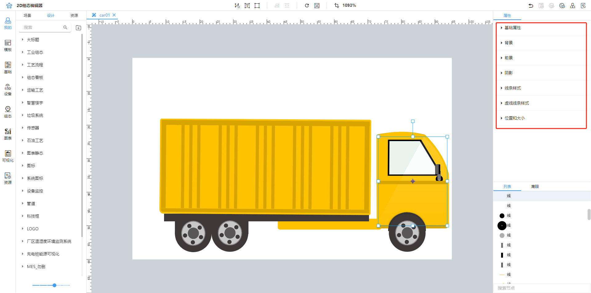

# 自定义组件

## 1 整体介绍

### 设计

用户新增目录列表以及自定义组件列表

### 当前标签页

当前打开的组件标签

### 组件画布区域

绘画区，主要工作区。可以将系统组件、用户设计以及资源拖拽到画布进行编辑。

### 组件面板

属性面板分2种不同类型属性面板。

点击画布空白区，进入画布属性面板；

点击单个节点，进入单个节点属性面板

### 组件数据绑定列表

用于添加参数绑定节点属性。

1. \*\*Attr：\*\*即数据绑定参数标签，用于绑定节点属性或通过绑定方法进行判定，目前支持中英文加数字格式，例如：name、title1、姓名、姓名1；建议使用英文加数字格式。
2. \*\*值类型：\*\*即当期绑定参数的类型，目前支持：字符串、布尔、复选、数字、颜色、对象、数组、颜色数组、图片、字体样式、字体名、水平对齐、垂直对齐等
3. \*\*默认值：\*\*即拖拽到场景中使用的初始值，会根据值类型约束。
4. \*\*名称：\*\*场景中使用时显示的名称，如下：

5. \*\*组：\*\*即绑定参数的分类标签，勾选可绑定的数据绑定参数都是显示在数据列，无组的的概念，只有未勾选的数据绑定参数设置组才有效果。如下：

6. 可绑定：即勾选后，在场景页面显示在数据列且可进行数据绑定（模拟数据、设备数据、API服务、数据表等数据源绑定）
7. 附加信息：即用于限定数据绑定参数值的下拉选项内容，其规范为：

| **配置** | **效果** |
| --- | --- |
|  |  |
|  |  |

7. 描述，即用户添加备注用于说明改数据绑定参数。

说明：数据参数绑定属性有两种方式：

方式一：直接绑定参数

方式二：函数绑定，通过方法判断

### 组件节点展示列表

构成当前组件的所有节点展示区域，可单选或多选节点进行操作。

### 鹰眼(缩略图)

## 2 操作步骤

[音视频附件: 灯的效果.mp4](./attachments/UvqsNmS-vnZvKFV2\灯的效果.mp4)

如上，通过点击组件灯的数据属性"状态"可切换开、关效果，同时用户可通过设置开、关颜色来呈现不同的开关颜色效果。接下来，以此为例进行组件封装步骤说明。

### 2.1 新建组件"灯"

在我的/设计，鼠标悬浮目录新建组件"灯"。

### 2.2 进行组件设计

拖拽基本图形到画布，设置形状为圆形，设置宽高各100。

设置背景和线条样式

拖拽基础图形到画布，更改名称为关，设置形状为圆形，设置宽高各73。

设置背景和线条样式，并且上下位置居中对齐矩形。

复制节点"关"，更改名称及其背景色，设置宽高各73。

再复制一个圆，更改名称、背景色；取消边框，设置宽高63.

以上操作后，组件灯的雏形就出来了。

### 2.3 进行数据绑定

添加数据绑定字段status，类型布尔，用于灯开启关闭条件判断。

添加数据绑定字段close，类型颜色，用于绑定关闭颜色属性。

添加数据绑定字段open，类型颜色，用于绑定开启颜色属性。

数据绑定字段全部勾选"可绑定",勾选后，，在场景中使用组件，字段会显示在数据列。

将数据绑定字段绑定到属性上，进行一一对应，对可见属性进行方法判定：

以上配置后，组件灯完成配置，保存后可直接拖拽到场景中使用。

以下是操作视频：

[音视频附件: 组件设计.mp4](./attachments/UvqsNmS-vnZvKFV2\组件设计.mp4)

> 更新: 2025-04-23 11:16:21  
> 原文: <https://www.yuque.com/iot-fast/ksh/qe1tiywa2154172a>