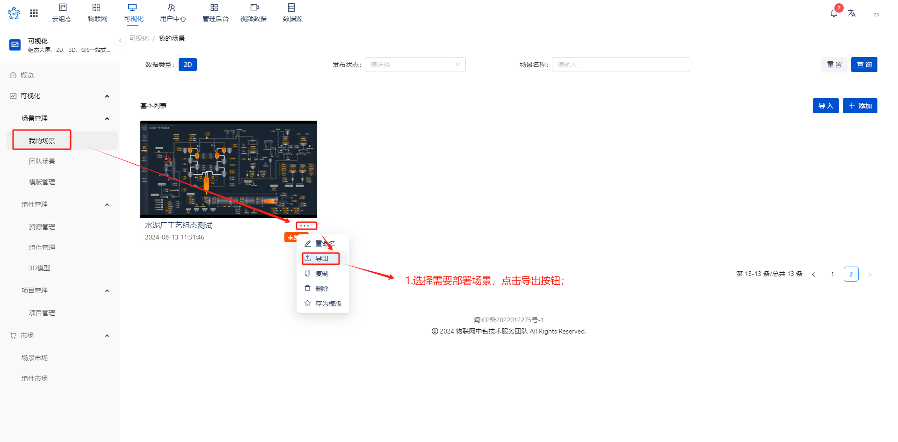
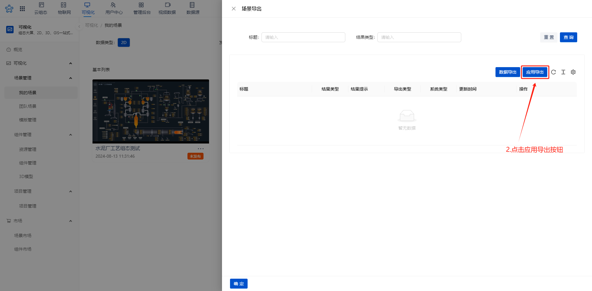
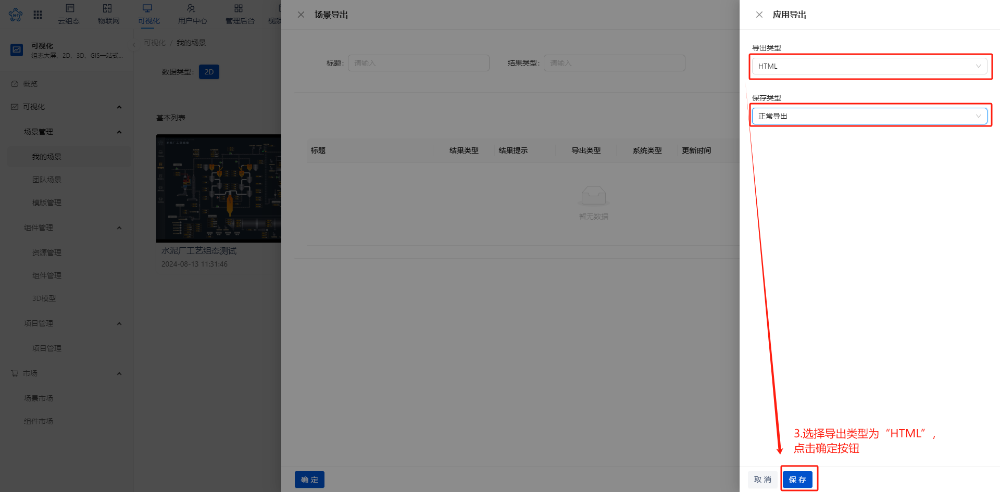
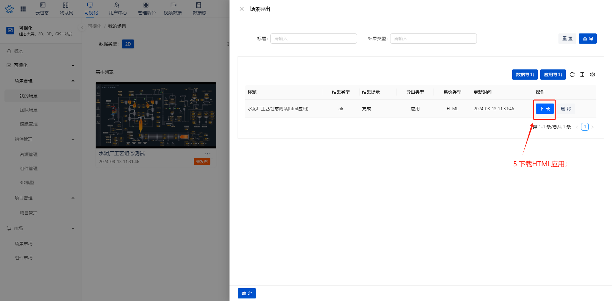
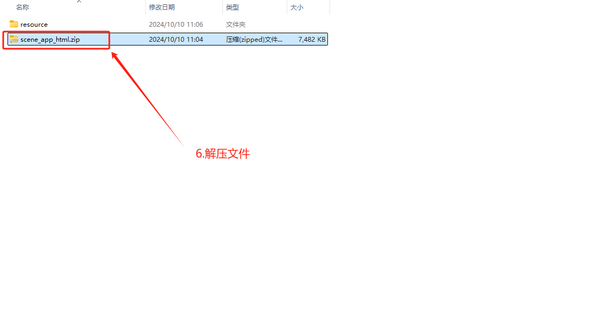
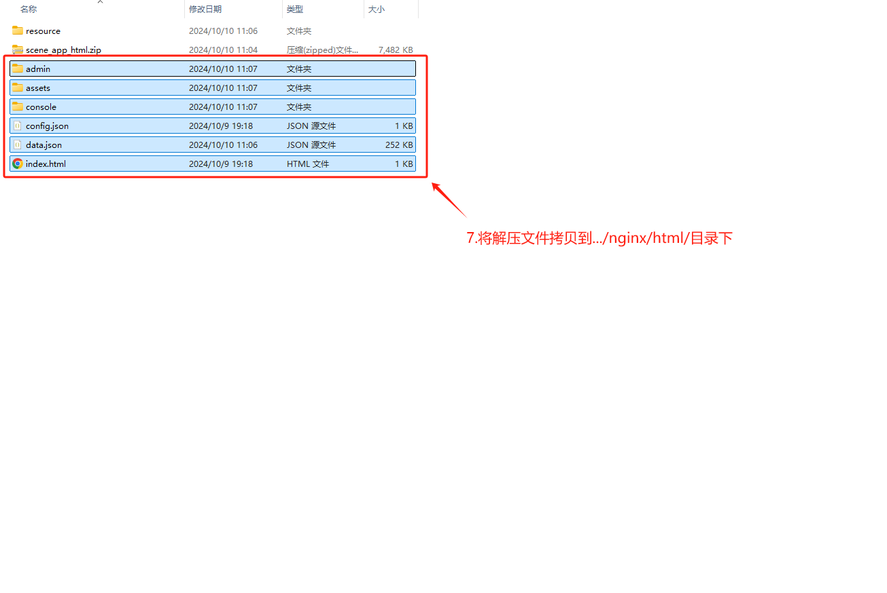
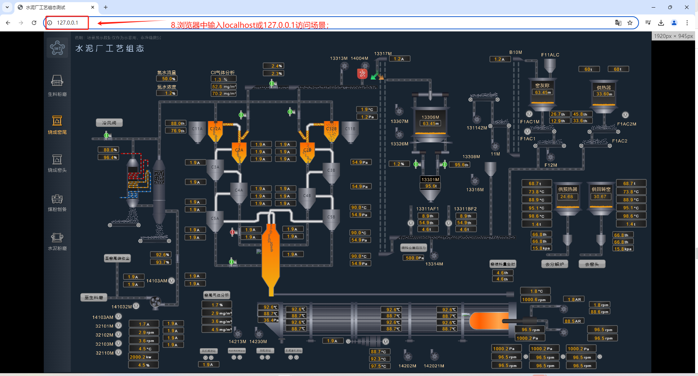

# HTML私有化部署

# 一、windows系统上搭建Nginx的步骤
**（备注：Linux部署自行百度）**

## 1.下载 Nginx
1.1.打开浏览器，访问 Nginx 官方下载页面：[http://nginx.org/en/download.html](http://nginx.org/en/download.html)。

1.2.在该页面中找到 “Windows” 部分，选择稳定版本的 Nginx 进行下载。下载的文件通常是一个压缩包（如 `nginx-VERSION.zip`）。

## 2.解压文件
1. 将下载的压缩包解压到一个合适的目录，例如 `C:\nginx`。

## 3.启动 Nginx
1. 打开命令提示符窗口，切换到 Nginx 安装目录（例如 `C:\nginx`）。
2. 执行以下命令启动 Nginx：
    - 直接运行可执行文件：`nginx.exe`。

如果启动成功，你可以在浏览器中输入 `http://localhost`，如果看到 Nginx 的默认欢迎页面，则说明安装成功。

## 四、常用操作
1. 停止 Nginx：
    - 快速停止：在命令提示符窗口中执行 `nginx.exe -s stop`。
    - 优雅停止（等待当前连接处理完毕后停止）：`nginx.exe -s quit`。
2. 重新加载配置：`nginx.exe -s reload`。

## 五、配置文件说明
在 Nginx 安装目录下的 `conf` 文件夹中有一个 `nginx.conf` 文件，这是 Nginx 的主要配置文件。你可以根据需要修改其中的参数，例如监听的端口、虚拟主机的设置、反向代理的配置等。

注意：在 Windows 系统上运行 Nginx 时，确保以管理员权限运行命令提示符窗口，以便能够成功启动、停止和重新加载 Nginx。同时，如果你的系统上安装了防火墙等安全软件，可能需要配置允许 Nginx 监听的端口通过。

# 二、HTML私有化部署与访问
## 1.导出场景

## 2.部署

## 3.访问

> 更新: 2024-10-10 11:13:45  
> 原文: <https://www.yuque.com/iot-fast/ksh/xmominn8uuznztg0>