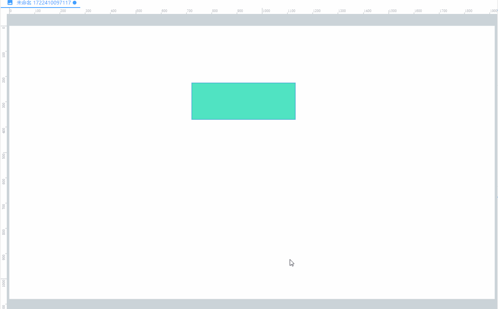
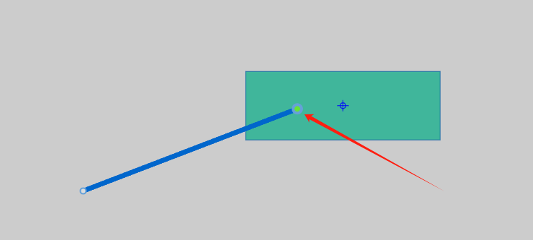
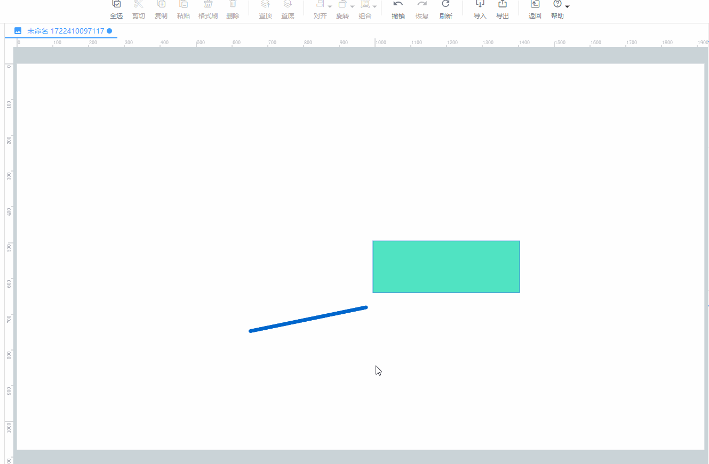

# 快捷键

| **快捷键** | **描述** |
| --- | --- |
| 鼠标中间键按住拖拽 | 移动画布 |
| shift + 左键移动 | |
| 鼠标中间键滚动 | 缩放画布 |
| 鼠标左键按住移动 | 框选节点 |
| Ctrl + A | 全选 |
| Ctrl + C | 复制 |
| Ctrl + X | 剪切 |
| Ctrl + V | 粘贴 |
| Ctrl + Z | 撤销 |
| Ctrl + Y  | 重做 |
| Escape | 完成画线或退出其他模式 |
| 方向键 | 移动选中图节点 |
| Alt + 鼠标左键 | 复制 |
| Alt + 鼠标右键 | 线的点吸附到其他节点上，跟随节点进行运动 |
| Delete （或 Backspace） | 删除选中节点 |
| Shift + 拖拽节点四个角 | 等比缩放节点 |

**📚****说明：**

1. **Alt + 鼠标左键：复制**

选中节点，然后按住Alt键，再然后移动鼠标左键进行快捷复制，效果如下：

2. **Alt + 鼠标右键：吸附**

双击线进行编辑，选中点，按住Alt键，移动点到其他节点上，点吸附成功后会变成绿色：

双击画布空白处，停止编辑线，然后移动被吸附的节点，线上的点会同步进行运动，效果如下：

> 更新: 2024-08-02 17:01:22  
> 原文: <https://www.yuque.com/iot-fast/ksh/whog0zdlr76zgrug>