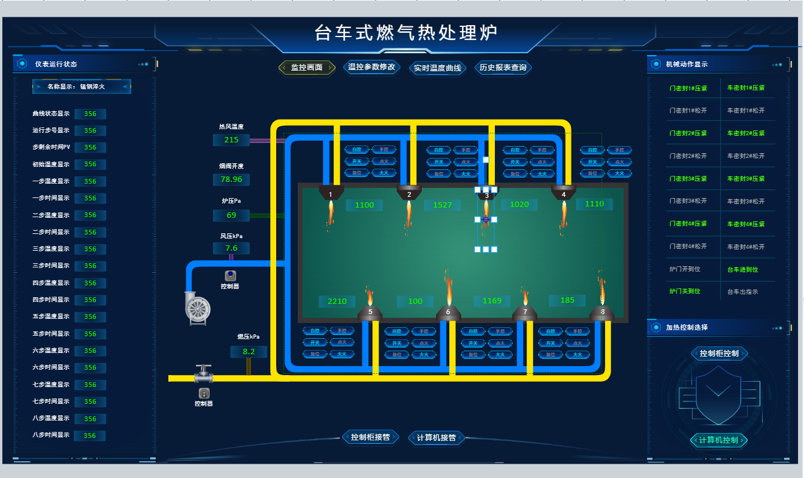

# 快速入门

iot-fast 2D可视化组态软件

# 一、在线使用
[https://cloud.iot-fast.com/console/2d/editor](https://cloud.iot-fast.com/console/2d/editor)

# 二、步骤
本教程将带领你快速体验2D可视化编辑器的全流程开发。

## 1.创建图纸
进入2d编辑器主界面后，主界面最中心为图纸面板，默认为空图纸，在界面左侧为组件（图元）列表，你可以访问系统提供的众多的组件库，或者你也可以上传自己的资源，只需要在我的资源中进行上传即可。或者在我的组件库自定义组件。主界面右侧为属性面板，用于与组件或图纸的相关数据功能提供配置界面。

### 1.1. 画布
绘画区，主要工作区。可以将图形拖拽到画布进行编辑，绘制大屏、Web组态、SCADA、拓扑图、流程图、脑图等。

### 1.2. 菜单栏
全局菜单和常用功能操作区

### 1.3. 图形库
各种图元存放区

### 1.4. 属性面板
属性面板分2种不同类型属性面板。

点击画布空白区，进入画布属性面板；点击图元，将选中图元，并进入图元属性面板

#### 1.4.1. 画布属性面板

画布属性面板主要用于画布和图纸的全局属性设置。

#### 1.4.2. 图元属性面板

图元属性面板主要针对当前选中图元的属性设置。

### 1.5.创建图纸操作步骤
介绍完界面后，首先我们进行创建图纸的操作，具体操作如下：

#### 1.5.1.新建空图纸
#### 1.5.2.拖拽编辑
搜索或选择系统组件/上传自己的组件/创建组件，拖拽放置到画布

#### 1.5.3.属性设置
每个图元支持：基础属性、背景、前景、阴影、边框样式、边框样式（虚线）、位置和大小等基础属性，不同的场景支持配置不同的属性行为，满足各种交互场景。

#### 1.5.4.交互事件（蓝图）
每个图元支持：场景、动作、逻辑、数据变化等事件，不同的事件支持配置不同的事件行为，满足各种交互场景。

#### 1.5.5.条件触发器
蓝图条件

配合事件一起使用，在“蓝图”-“逻辑”里面配置。主要用于仅当满足业务条件时，才触发事件交互。

动画条件

配合单个动画一起使用，在“动画”-触发类型选择“数据触发”时进行配置。主要用于仅当满足业务条件时，才触发动画效果。

#### 1.5.6.动画
可用于满足各种大屏报警显示、组态告警、轨迹运动、水流等展示。支持通过自定义编辑图元动画。

#### 1.5.7.数据
可用于数据监控和实时数据显示等场景。可以通过以下2步完成：

1. 给图元绑定数据
2. 在“图元属性面板”-“数据”配置。

#### 1.5.8.保存图纸
#### 
## 2.预览/分享/发布
       在创作完图之后，我们需要通过预览功能来查看图纸工作是否正常，通过分享来将图纸分享给他人，通过发布将图纸上线到云端，让全球各地都能浏览到。2D编辑器提供了一站式的分享发布机制，让你很轻松的就能将创作后的图纸展现出来，同时可以自由的分享给他人，打通创作的整条链路，击破创作的最后一道关卡。

### 2.1. 预览
       预览功能主要是用来让作者检测图纸运行是否符合预期的，只需要点击编辑器菜单栏的 “预览” 按钮，即可进入到预览视图中。

### 2.2.分享
分享功能用于将图纸分享给他人，对方能基于你的图纸进行二次创作。只需要点击菜单栏的分享按钮即可。

其他用户就可以通过进入你分享的链接看到你的图纸啦。

## 3.私有部署集成
       对于某些企业，需要将图纸项目与自身业务结合，需要进行私有化部署与集成，2D编辑器也提供了私有化部署的方式，你可以通过文件菜单下的 “导出” 选项将其下载到本地，整个过程较为简单方便。

# 三、总结
通过iotfast 2D可视化编辑器，可以快速简单0代码实现大屏可视化、Web组态、SCADA等场景，主要步骤：

1. 拖拽；
2. 属性设置；
3. 配置交互事件和条件触发器；
4. 配置动画和数据；
5. 集成预览；

更多详细教程，可查看组态教程。

> 更新: 2024-04-11 17:08:30  
> 原文: <https://www.yuque.com/iot-fast/ksh/gu6dkk7tyke2ue3d>