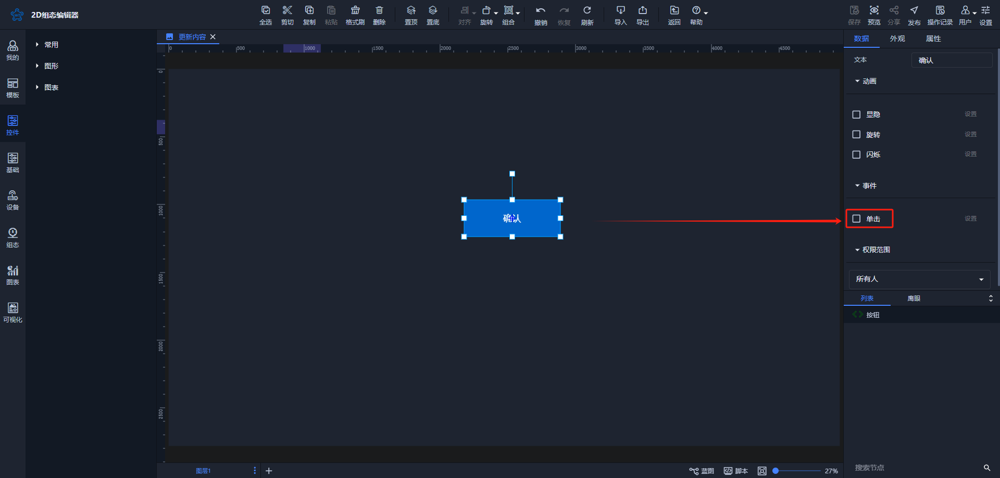
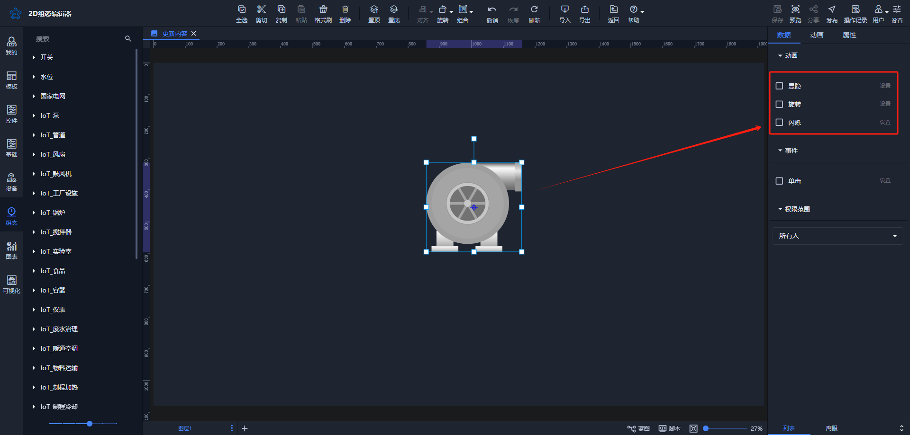
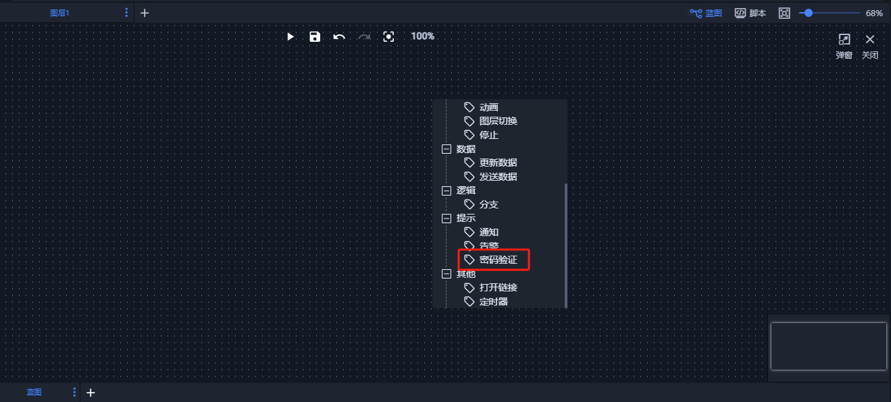
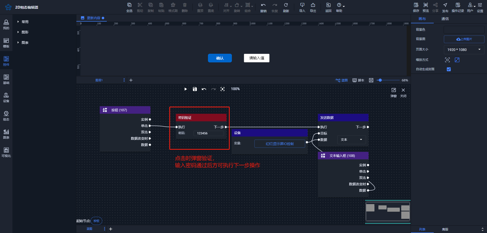
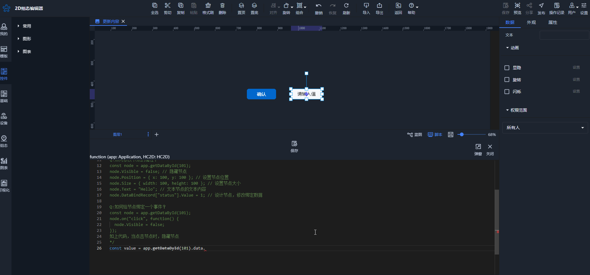
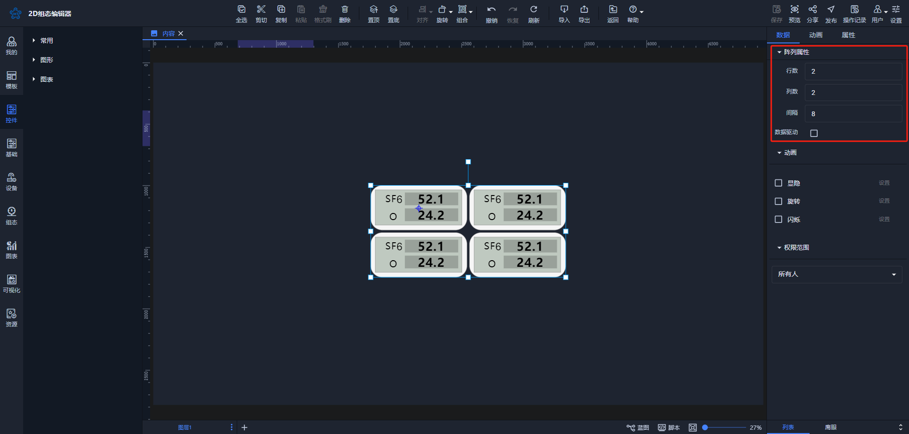

# 2024-08-02 V1.0.33

本次升级内容如下：

### 新增
1. 节点单击事件（包含所有系统组件、自定义组件、控件仅文本、数显框、按钮支持）

**备注：**

+ 单击事件支持打开当前场景的任意图层、外部链接以及iframe
+ 支持通过当前窗口、新窗口以及弹出小窗口打开

2. 节点动画

**备注：**

+ 动画位于数据列下，通过设备变量或节点数据判断生效，方便用户操作
+ 所有节点均支持显隐、旋转、闪烁动画

3. 蓝图密码验证功能

**备注：**

密码验证功能通常用于在更新设备数据时进行安全验证，结合权限功能能进一步提升看板操作的安全性。同一控件在第一次弹窗验证后不再重复验证。

4. 双击复制属性参数功能

目前，编辑器的大部分属性都支持快速复制粘贴，方便用户在编辑脚本时使用这些属性。

### 优化
1. 保存数据精简 

保存数据精简后，场景内存更小，加载更快。

2. 加密的分享页面优化

| PC | 移动端 |
| --- | --- |
|  |  |

3. 阵列属性位置调整

由原来的【属性】调整到【数据】处

4. 部分控件样式优化
5. 权限控制逻辑优化
6. 移动端渲染优化

### 修复
1、上传gif图片导致的问题

2、节点复制后绑定变量，变量丢失的问题

3、基本图形使用渐变色问题修复

4、文本控件数值显示问题修复

> 更新: 2024-08-06 15:16:38  
> 原文: <https://www.yuque.com/iot-fast/ksh/rsygprgvr01ryyk1>