# 2024-08-09 V1.0.34

本次升级内容如下：

### 新增
1. 场景画布背景功能优化

背景支持颜色和图片选择

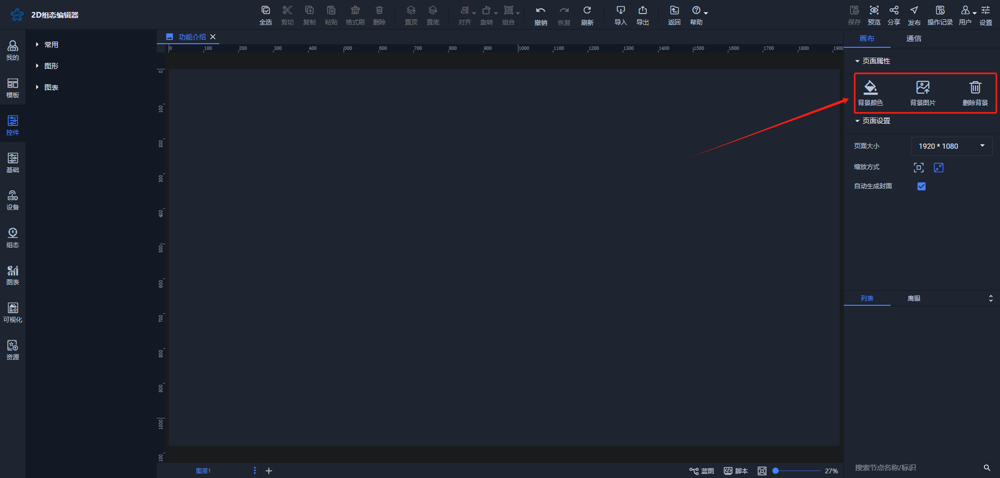

支持一键删除背景颜色和背景图片，也可以根据需要分别删除背景色或背景图片。

**备注：**

目前，背景图片仅支持最大8MB的文件大小。

2. 控件图片支持选择本地和线上资源

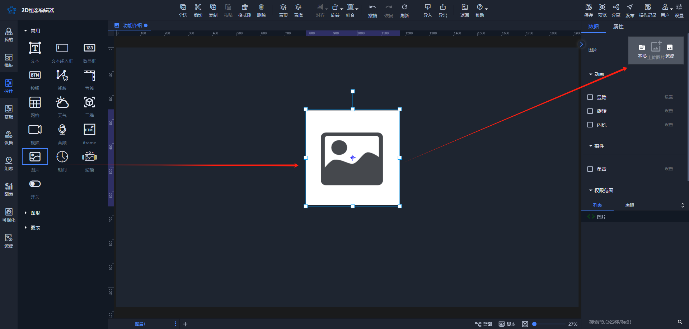

3. 实时曲线图、实时柱状图和历史报表支持跨设备选择数据

以历史报表为例：

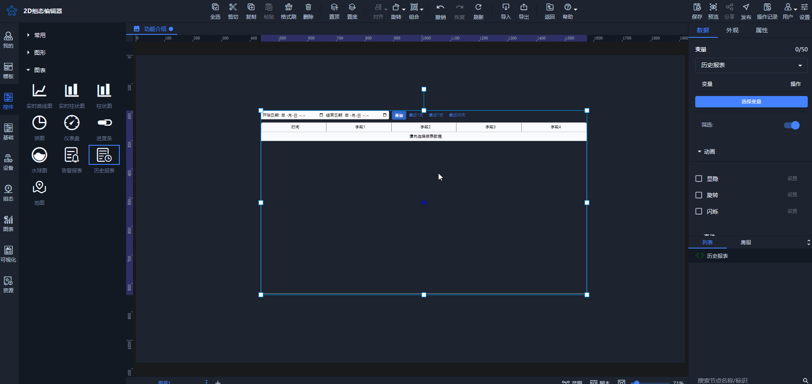

4. 控件文本、数显框、按钮添加颜色填充动画

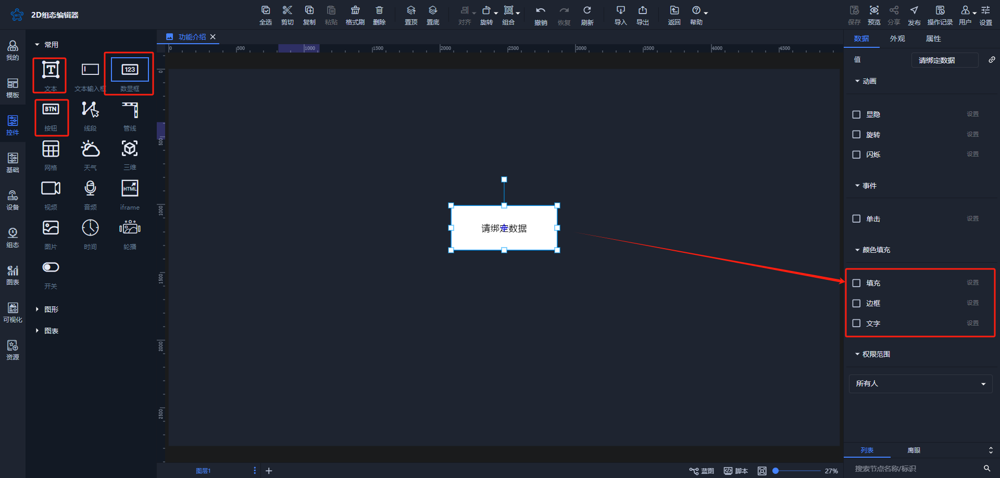

用户可以快速绑定变量并设置对应动画，例如，数显框绑定变量后，背景色对应发生变化：

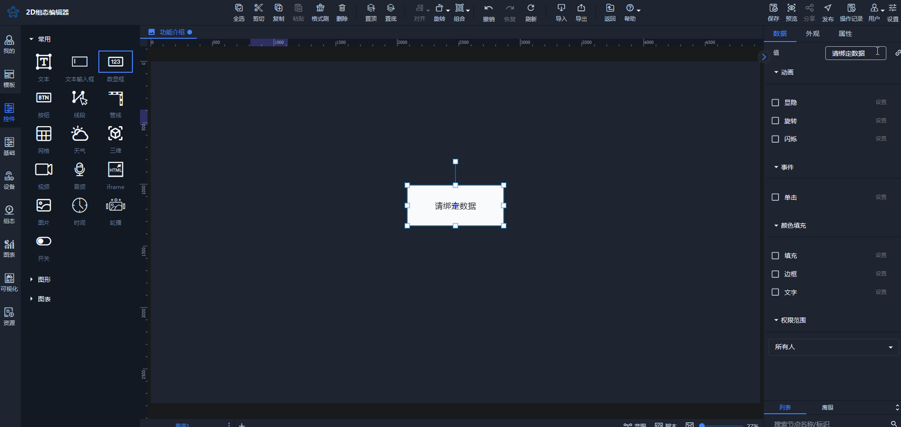

5. 数据绑定添加值映射关系

如果绑定的值不是预期结果，用户可以通过值映射进行处理。例如，对于布尔类型的绑定，可以将其转换为所需的结果：

**绑定**

**处理**

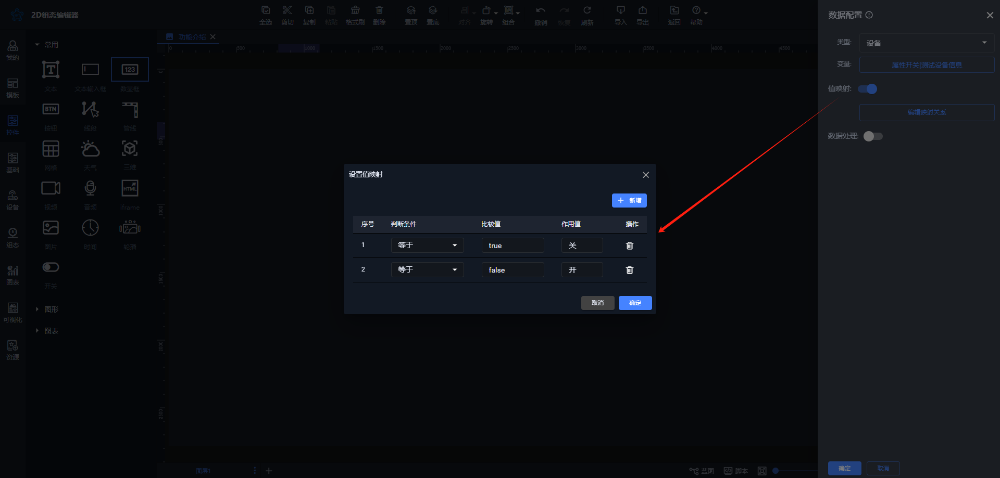

**预览效果**

6. 蓝图和脚本新增启用和禁用选项

目前，添加多个蓝图或脚本时，很难展示每个蓝图或脚本的具体运行效果。因此，我们增加了启用和禁用功能，以便用户可以方便地测试单个蓝图或脚本的效果。

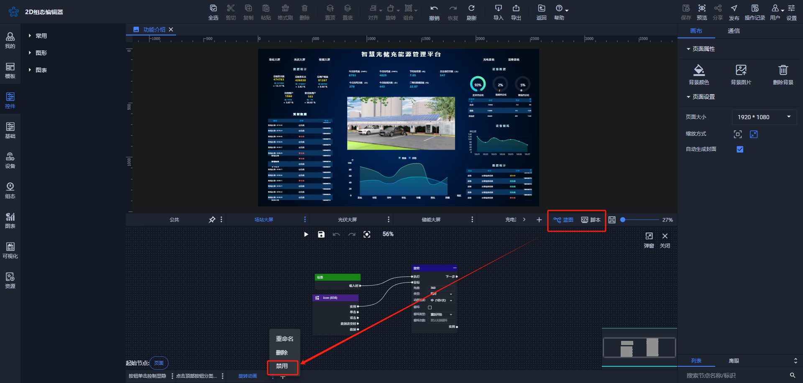

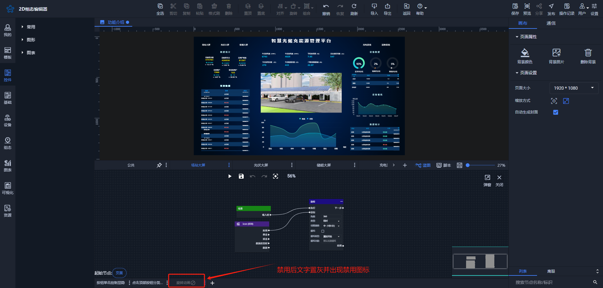

**备注：**

蓝图或者脚本默认都是启用状态。

7. 蓝图添加数据脚本功能

用户可以在数据脚本中处理数据逻辑判断，以用于赋值或返回值等操作。

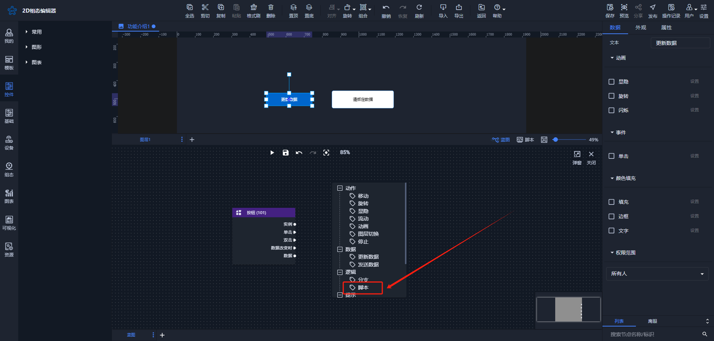

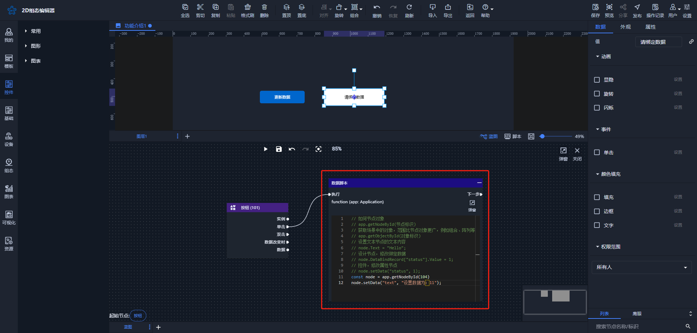

8. 发送数据目标为设备时，增加"功能"选项

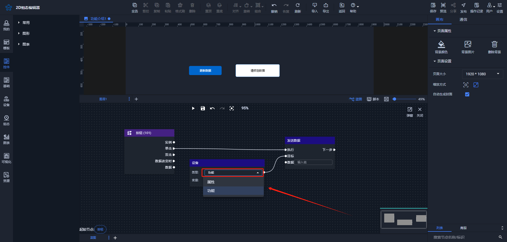

该功能用于解决用户需要批量发送数据的情况，以下举例说明：

+ 在物联网创建产品的功能，并添加对应功能的属性

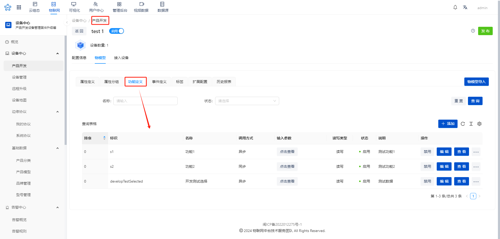

+ 添加设备，查看功能并复制对应的功能数据对象

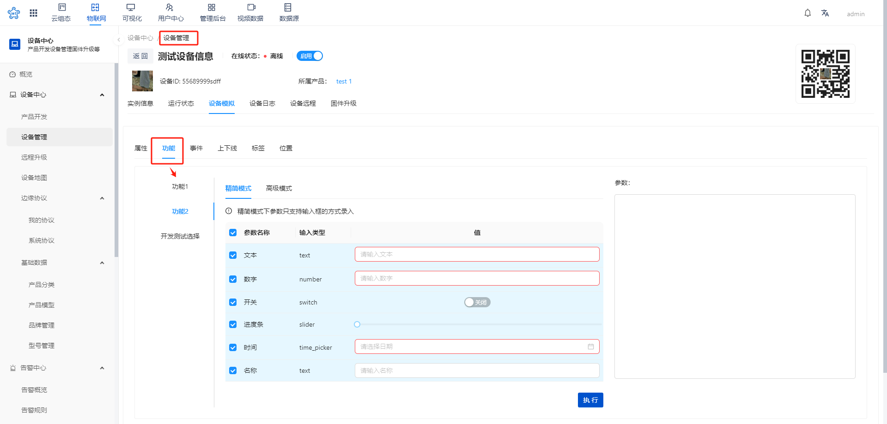

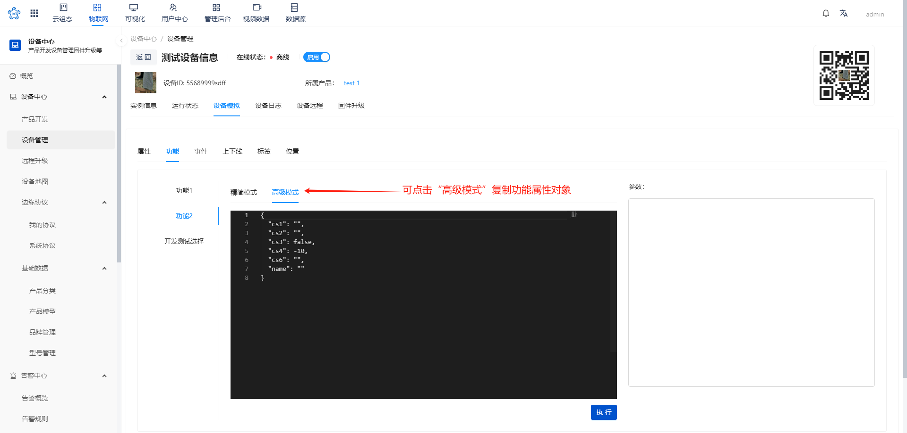

+ 将复制的数据对象填入数据脚本中，通过一系列处理后返回：

### 优化
1. 告警弹窗样式优化

> 更新: 2024-08-09 17:38:00  
> 原文: <https://www.yuque.com/iot-fast/ksh/xkqcznx75ktonlqz>