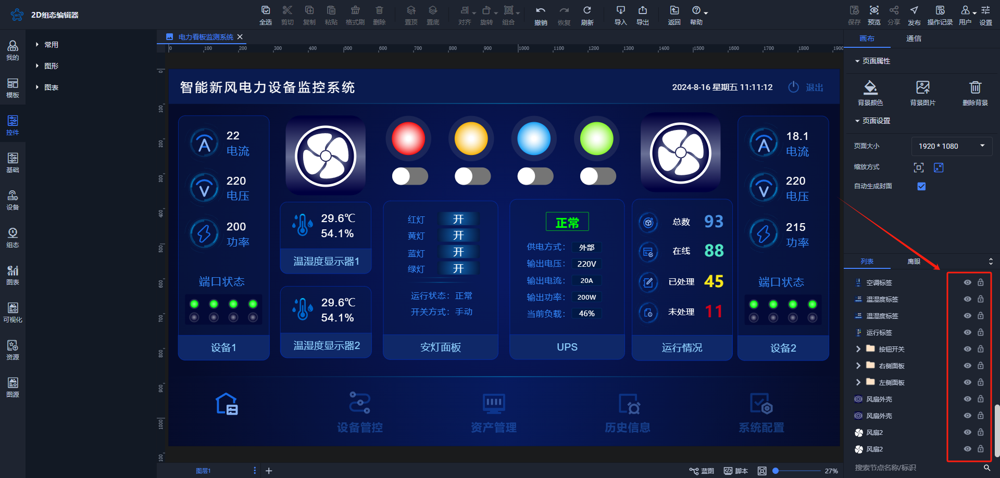
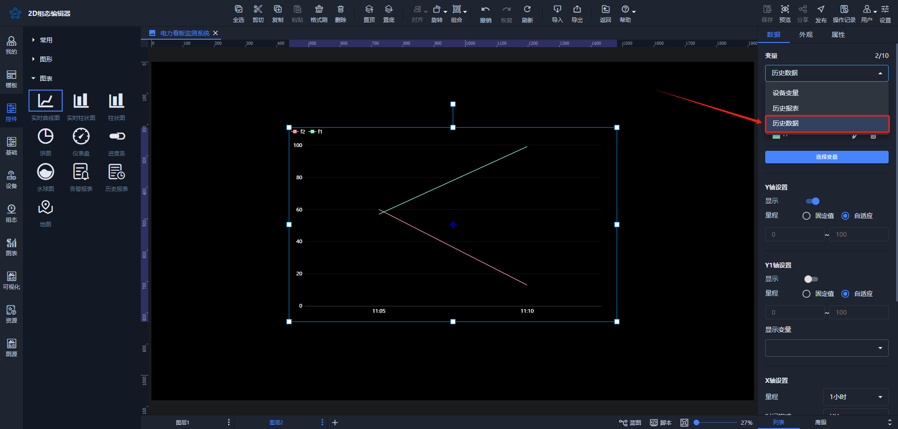
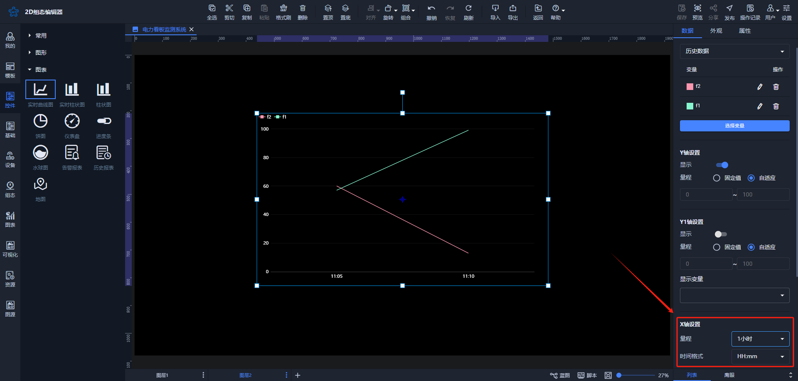
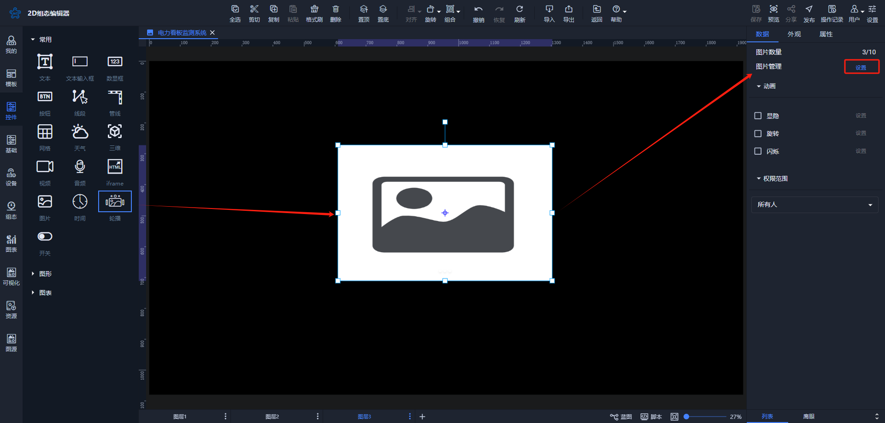
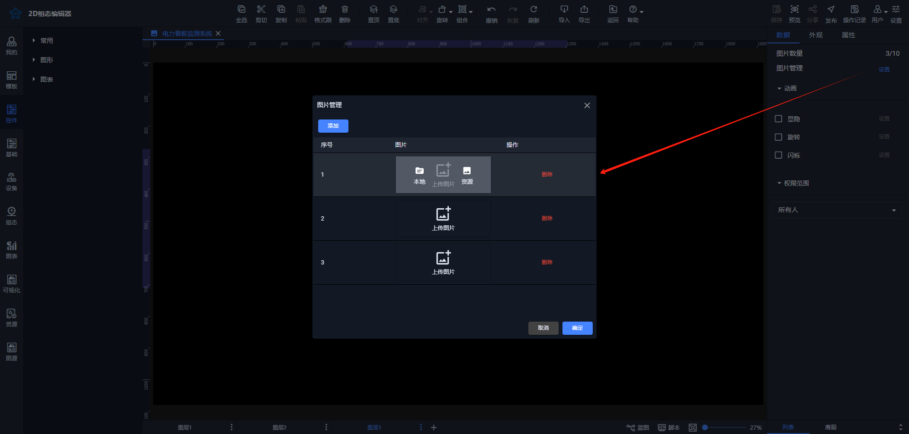
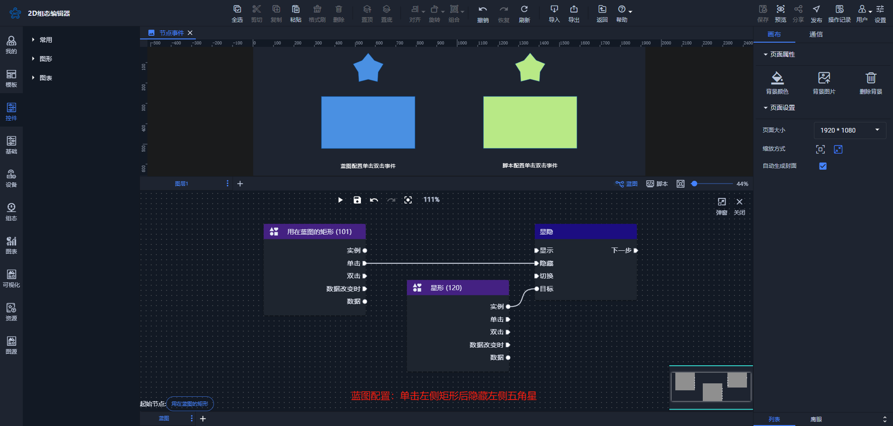
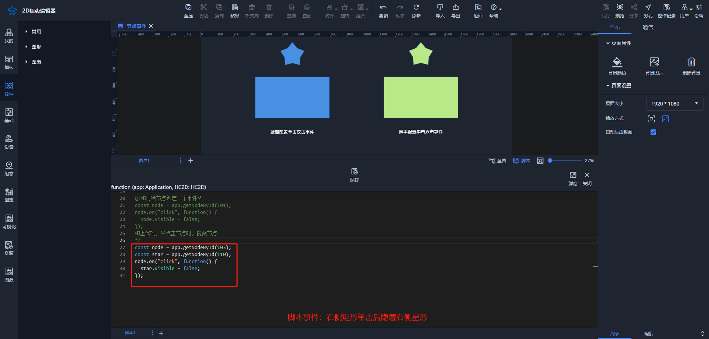
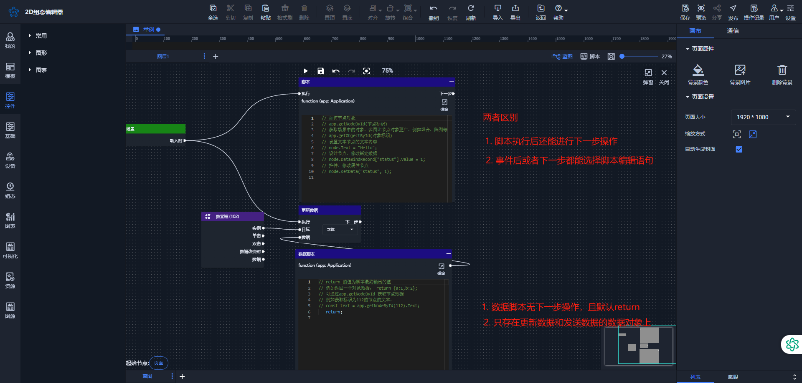
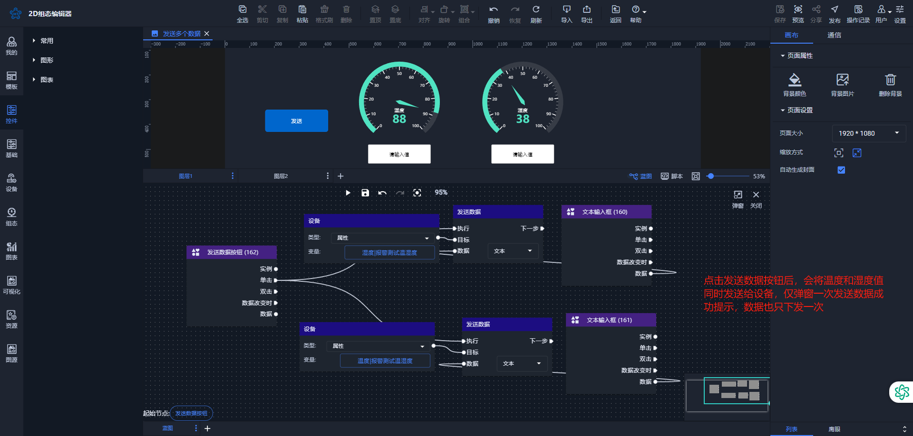
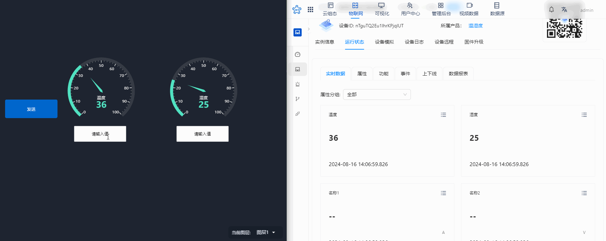

# 2024-08-16 V1.0.35

本次升级内容如下：

### 新增
1. 列表节点、组合添加可选、可见功能

方便用户进行单个节点或组合的可选可见功能操作。

2. 实时曲线图、实时柱状图添加历史数据功能

用户可以通过设置X轴的量程来筛选查看数据时间范围，并通过调整时间格式来指定X轴上的时间显示样式。

备注：

设备变量的X轴设置用于筛选新数据的时间范围，而历史报表和历史数据则用于筛选查看旧数据的时间范围。

3. 轮播图添加本地和线上图片选择

4. 预览界面单个节点事件配置的鼠标指针效果

配置单个节点的单击和双击事件后，在预览界面，鼠标悬停在节点上时会变成抓手指针。

| 交互设置 | 效果 |
| --- | --- |
|  |   |
|  | |

### 优化
1. 蓝图脚本功能优化

2. 蓝图发送数据优化

之前，如果一次性发送N条数据到设备，会弹出N次发送成功的提示，并且WebSocket会执行N次请求。现在优化后，对于同一设备发送多条数据，将只发送一次请求。

效果如下：

3. 部分控件UI优化

> 更新: 2024-08-16 14:42:02  
> 原文: <https://www.yuque.com/iot-fast/ksh/qo0h3g5sgon31y2x>