# 2024-09-13 V1.0.37

本次升级内容如下：

### 新增
1. 单击事件添加操作变量功能

绑定可读写设备变量，可选择固定值操控模式或可设值操控模式。操作变量的最终效果与蓝图的发送数据完全相同，如下图所示：

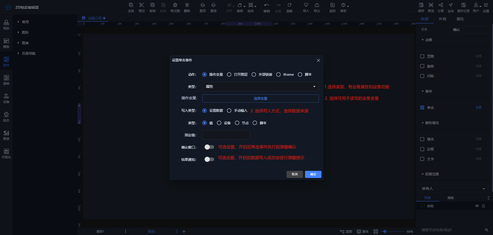

| 操作变量弹窗设置 | 预览页面效果 |
| --- | --- |
| 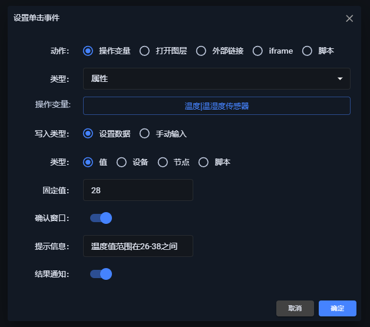 | 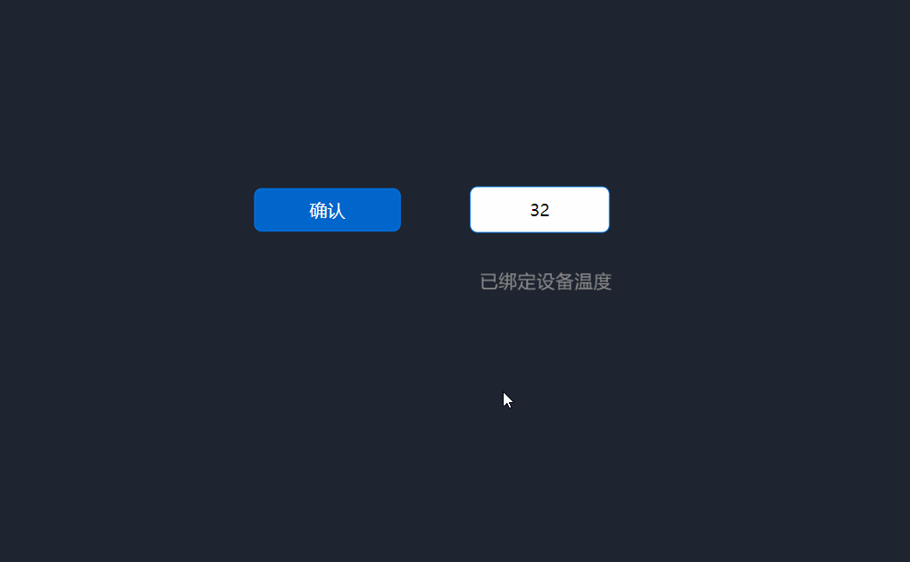 |
| 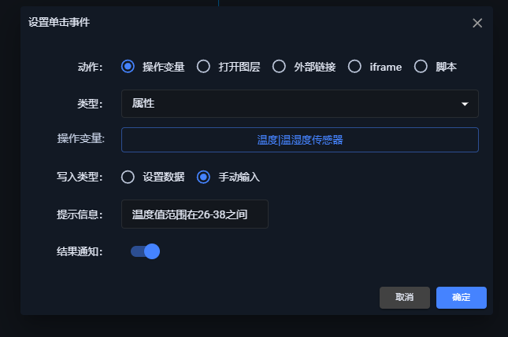 |  |

2. 单击事件添加脚本窗口

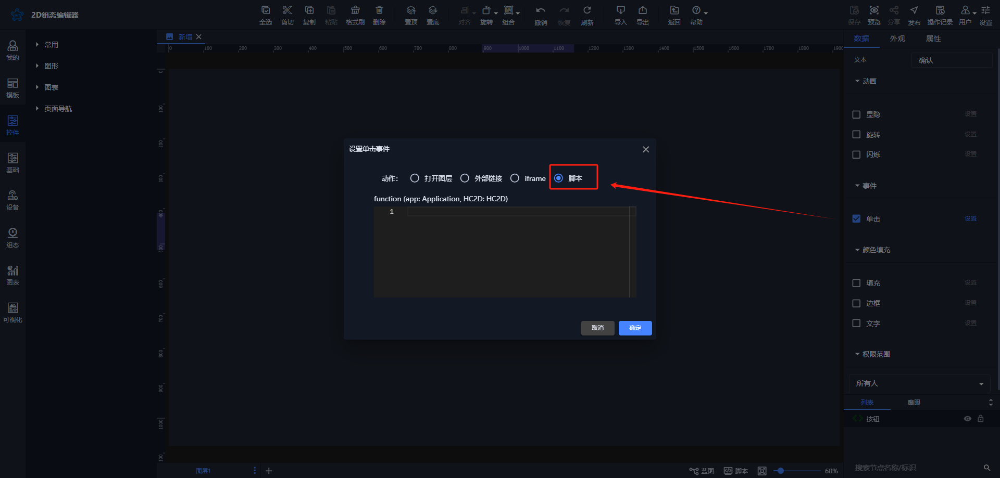

如果配置无法满足需求，可以通过脚本窗口进行代码编辑。

3. 【控件】历史报表添加滚动功能

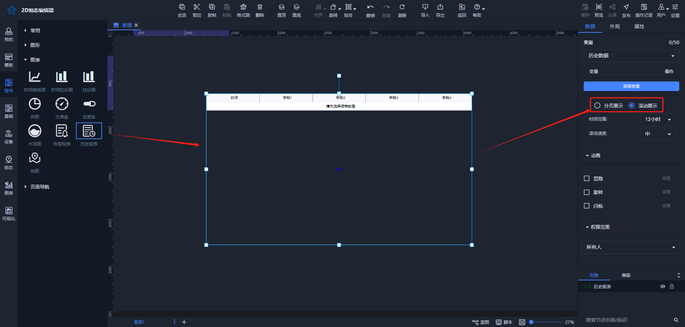

4. 【控件】实时历史报表添加历史数据选项

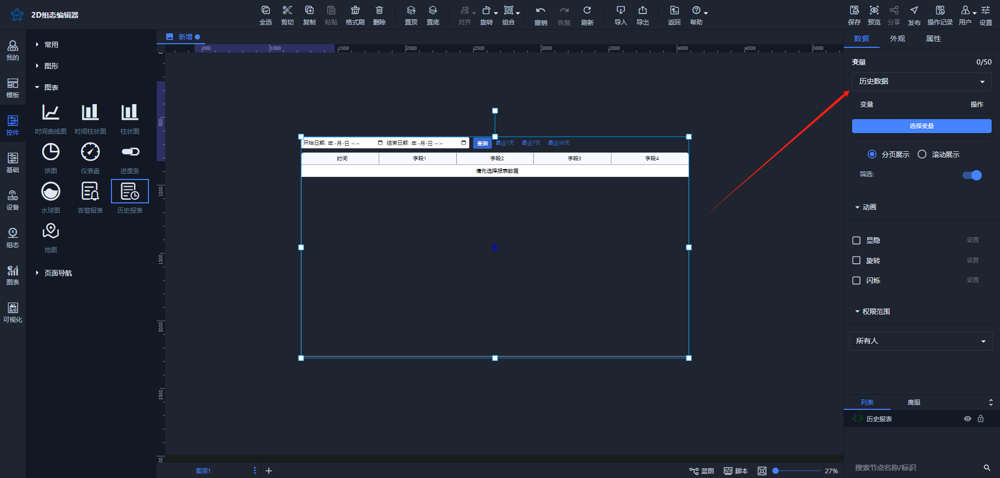

5. 【控件】图形添加颜色填充动画

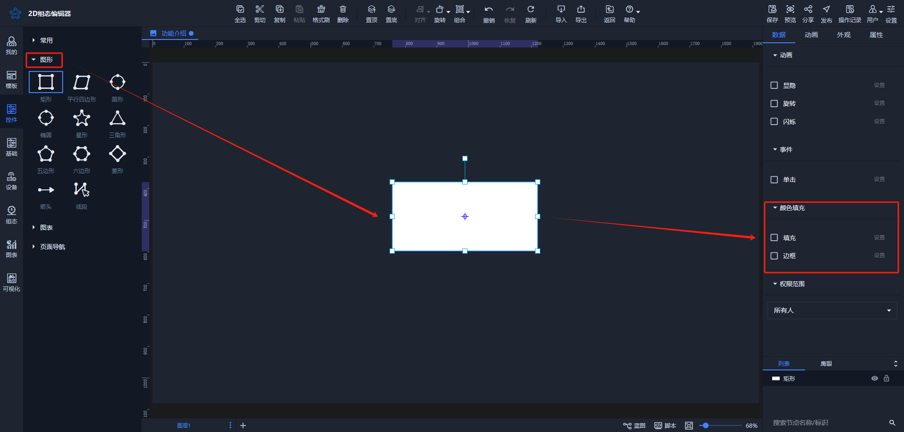

6. 【控件】文本添加背景、边框样式；添加边框、填充动画

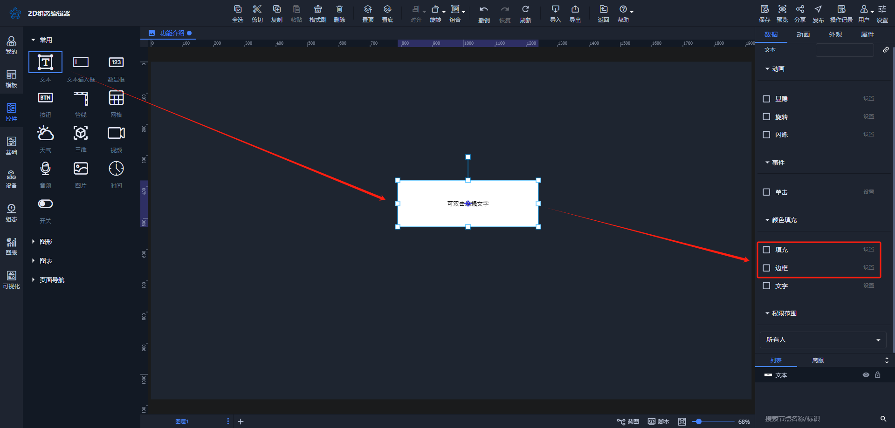

7. 【控件】添加图文控件

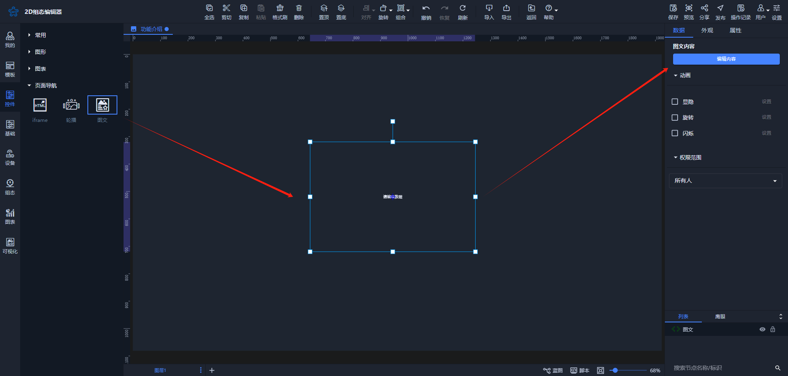

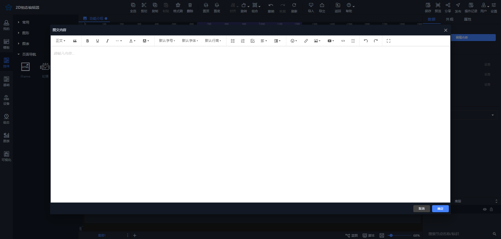

8. 添加版本号

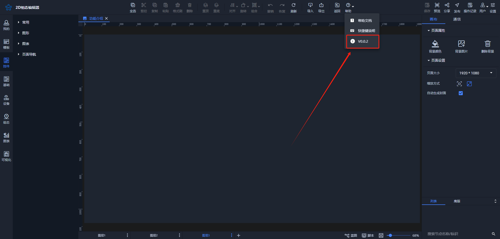

点击版本号可跳转更新日志页面

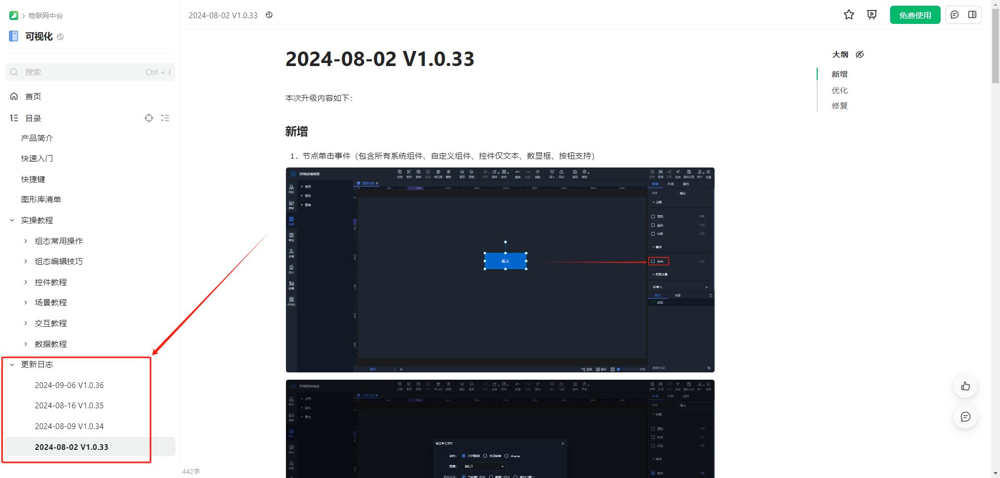

### 优化
1. 【蓝图】发送数据功能优化

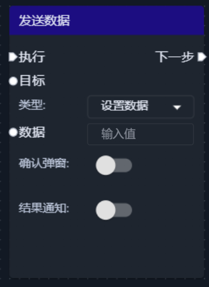

发送数据窗口添加类型、确认弹窗、结果通知三个属性

**类型：**设置数据（默认）、手动填写。

+ 设置数据：当类型为设置数据时，使用方法和之前一致。

| **静态数据：在输入框输入值即可** | **其他数据：鼠标拖拽，出现弹窗，点击选择** |
| --- | --- |
| 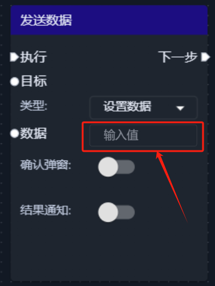 | 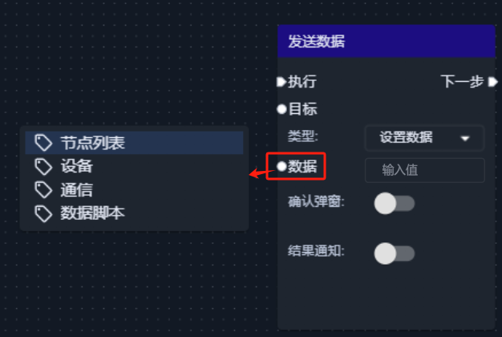 |

+ 手动填写：默认会弹出窗口，用户可以在窗口中输入自定义数值。

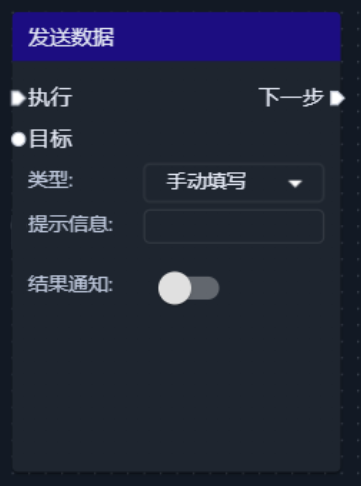

**确认弹窗：**开启后，可写入提示信息，在发送数据前会弹出确认窗口，点击窗口上的“确定”按钮后才会真正发送数据。

**结果通知：**数据发送后进行弹窗提示

|  | 蓝图配置 | 预览弹窗效果 |
| --- | --- | --- |
| 设置 数据 | 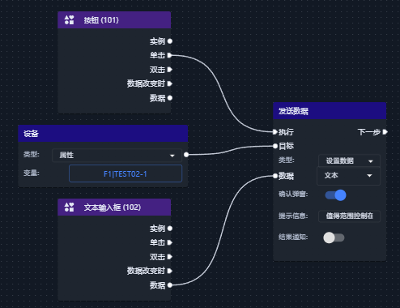 |  |
| 手动 填写 | 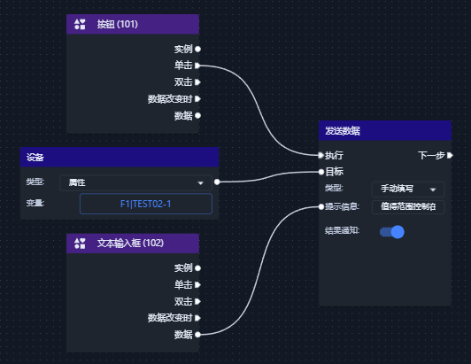 | 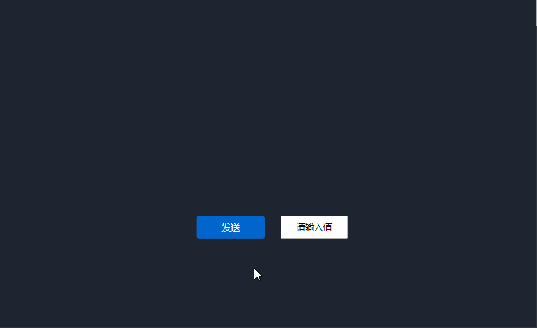 |

2. 【控件】水球图数值显示优化

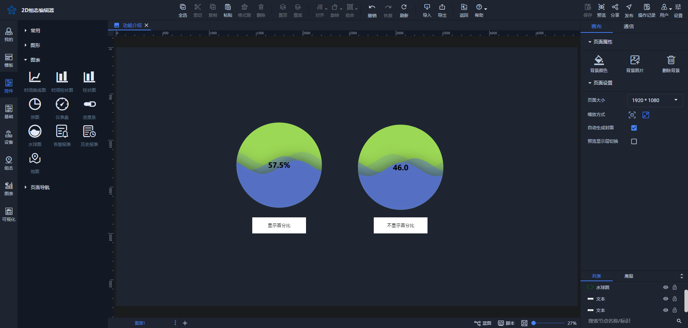

如上图中，两个水球图绑定了相同的变量：

+ **显示百分比**：显示该变量的占比。
+ **不显示百分比**：显示该变量的实际值。

无论是显示百分比还是实际值，背后的水波高度都是按照百分比计算的。

3. 视频控件优化

原先需要选择视频流类型（FLV或HLS），现在只需填写视频流地址即可，简化了用户操作。

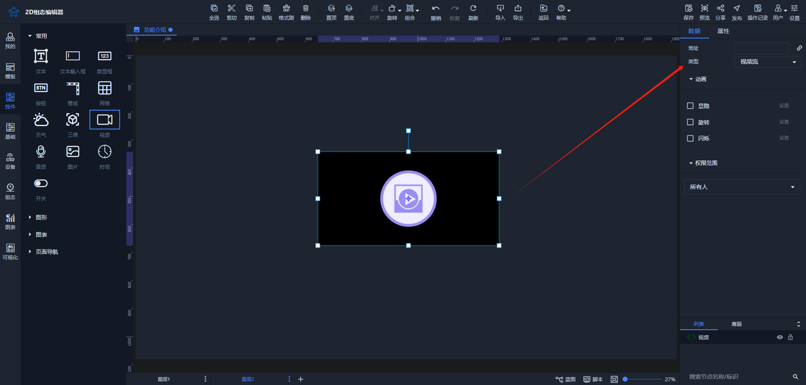

4. 批量设置优化

在多选控件中，具有相同【外观】或【属性】的选项都可以批量设置。

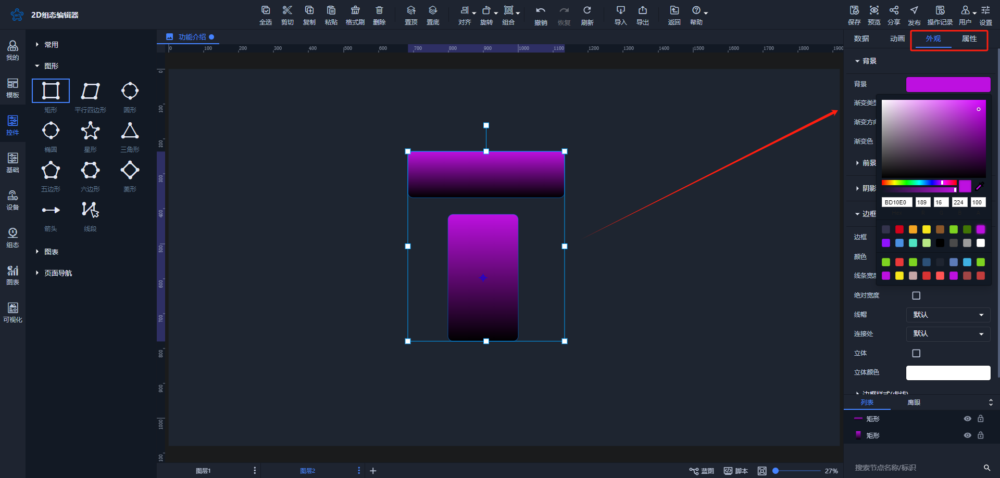

5. 单个动画开启循环时，保留结束状态属性。

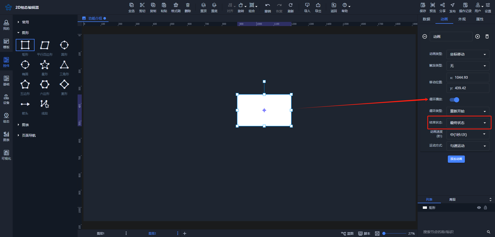

丰富动画结束的状态效果，例如进度填充动画，在循环动画停止时用户可能想保留动画最最终状态效果，而旋转动画，用户可能更喜欢循环动画停止时恢复到初始状态。

6. PC端预览场景时，页面文字显示优化

之前在PC端预览页面上，文字存在模糊的问题。此次已对其进行了优化。

7. 控件样式优化
+ 警报表和历史报表样式优化；告警报表字段筛选和状态别名弹窗改进
+ 文本背景色优化

8. 操作日志功能优化

原有的操作日志系统记录最近的20条操作记录，但这也引发了一些问题。现在，我们将操作日志调整为仅记录当前操作的数据。用户保存的数据仍会保留，但如果用户点击顶部的刷新工具或使用浏览器的刷新功能，则所有操作记录将被清空。这一改动有助于减轻数据存储负担，减少不必要的问题。

### 修复
1. 解决【历史报表】和【历史数据】全选功能问题。
2. 修复【列表】节点名称过长导致可选、可见操作图标被遮盖的问题。
3. 优化目录过长时的滚动问题。
4. 修复曲线XY轴无数据显示的问题。
5. 解决三维模型导入失败的问题。
6. 优化同类型节点的数据存储。
7. 修复【历史报表】滚动和分页切换未触发保存的问题。
8. 修复复制和删除操作图标后的目录定位问题。
9. 修复变量类型为历史报表时使用全选功能的问题。
10. 修复【模板管理】中添加模板时报错的问题。
11. 解决用户自定义设计尺寸的问题。
12. 修复网格单元格合并后无法调整边框的问题。
13. 修复告警报表字段筛选中无法取消选中项的问题。

> 更新: 2024-09-13 09:42:22  
> 原文: <https://www.yuque.com/iot-fast/ksh/lvwlxmbvf88918vx>