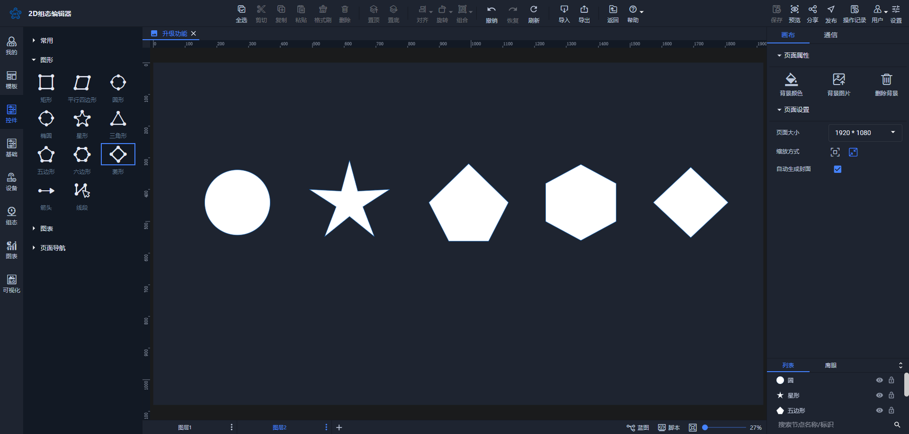
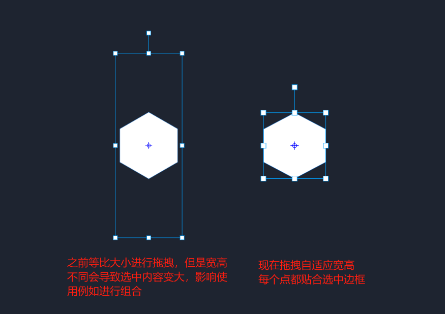

# 2024-09-29 V1.0.38

本次升级内容如下：

### 优化
1. 部分基础图形使用进行调整和优化

圆形、五角星拖拽等比放大；五边形、六边形、菱形自适应拖拽且不产生多余选中内容。

2. 编辑器UI优化，包括蓝图界面、发送数据样式和图表控件
3. 选中组合后，支持通过键盘的上下左右键移动组合
4. 刷新功能进行优化

点击刷新按钮后，将清空操作记录列表以及撤销恢复列表。这意味着所有先前的操作记录和可以撤销的更改将被重置，用户将无法恢复到之前的状态。请确保在点击刷新之前保存任何重要信息。

### 修复
1. 修复历史报表和历史数据选择同产品不同设备时，预览页面显示同一设备数据的问题。
2. 修复阵列和本地编辑中，修改图标尺寸未对其他阵列节点生效的问题。
3. 修复星形复制粘贴后形状变形的问题。
4. 修复网格控件操作时，导致绑定数据丢失的问题。
5. 修复组合状态切换类型的问题。
6. 修复阵列隐藏后底下节点未隐藏的问题。
7. 修复单个动画执行时的问题。
8. 修复列表下节点显示问题。
9. 修复蓝图组合使用中的问题。
10. 修复单击事件不被复制的问题。
11. 修复开关控件在移动端点击切换失效的问题。

> 更新: 2024-09-29 17:07:18  
> 原文: <https://www.yuque.com/iot-fast/ksh/or8pvxv4fg4syovy>