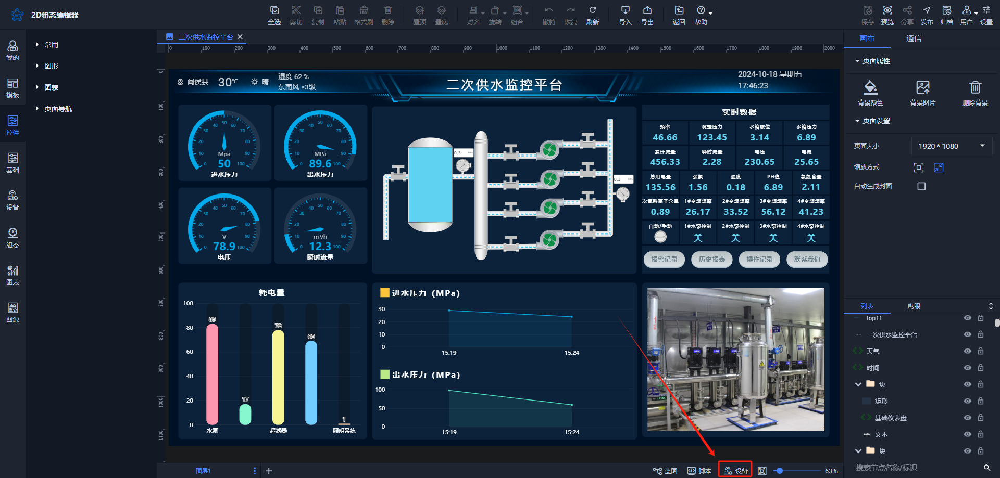

# 2024-10-18 V1.0.39

本次升级内容如下：

### 新增
1、场景归档功能

场景归档功能用于备份所需的场景内容，以防丢失，并在需要时可以还原到特定版本。以下是内容介绍：

点击新建归档，弹窗后用户可填写简短的归档描述，用于区分每个版本。

每个归档版本都能删除或者还原至归档场景状态。

**按钮说明：**

+ 取消：取消归档并关闭弹窗。
+ 保存并还原：当前页面内容被保存，还原版本后，点击保存按钮则还原版本成功；不点击保存按钮，点击刷新，能回到保存时的场景。
+ 直接还原：还原版本后，点击保存按钮则还原版本成功；不点击保存按钮，点击刷新，之前做的未保存的就没有了。

点击还原版本后，点击【刷新】按钮回到原有保存后的场景状态；点击【保存】按钮，还原场景成功。

点击“还原版本”后，若要成功还原场景，还需要点击“保存”按钮；若想取消归档，点击“刷新”按钮即可。

2. 场景设备变量统计功能

用于统计场景的设备总数和变量总数。用户可以单击测试连接或通过批量勾选，点击测试链接、取消测试，快速了解设备变量状态及场景设备使用情况。

3. 加载页面添加logo加载

3. 【基础】列添加时间线、日期分布控件

### 修复
【基础】多选控件的选中与未选中状态存在问题

【基础】树形控件优化

【基础】复选框组件数据改变时仅触发一次

【控件】管线数据驱动出现的问题

【控件】水球图在页面放置一段时间后不再显示的问题

【蓝图】编辑时切换到其他页面再返回，总是跳转到第一个蓝图页面的问题

【页面渲染】影响节点层级的相关问题

【组合】组合隐藏后，子节点未隐藏的问题

不同图层之间的数据传递问题

> 更新: 2024-10-18 17:54:11  
> 原文: <https://www.yuque.com/iot-fast/ksh/zeh2kqf7nc4i82cf>