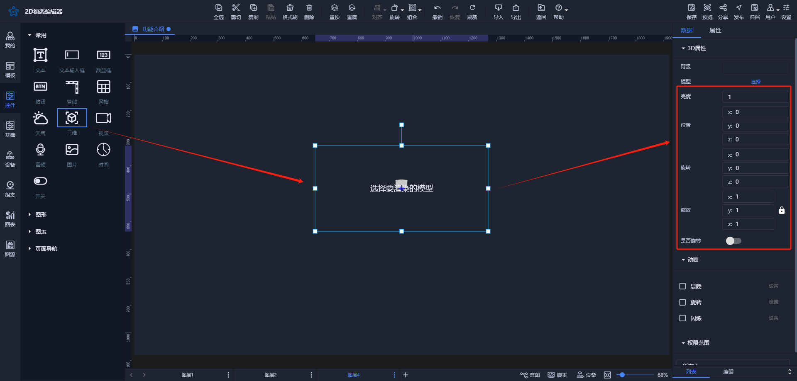
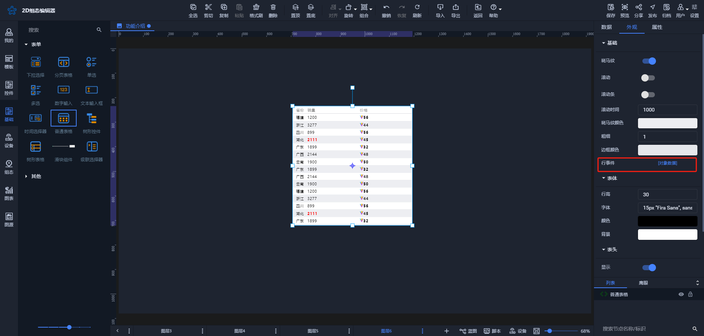

# 2024-11-11 V1.0.42

本次升级内容如下：

### 优化
1. 【控件】【三维】属性添加

2. 【基础】【普通表格】添加行事件

### 修复
1. 修复【基础】【数字输入框】步进增加出错的问题。
2. 修复【控件】【阵列】勾选时数据驱动时节点数据属性还显示的问题。
3. 修复设置【数据】【单击】事件操作变量无效的问题。
4. 修复选择自定义页面大小时场景宽高设置的问题。
5. 修复将【组合】及以下节点复制到其他层时组合丢失的问题。
6. 修复【单击】【操作变量】未选中操作变量也能保存的问题。

> 更新: 2024-11-11 14:15:07  
> 原文: <https://www.yuque.com/iot-fast/ksh/xcpfx74u42790xnt>