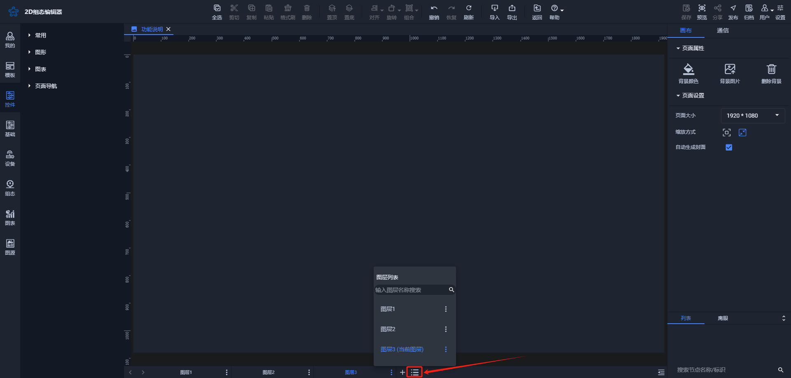
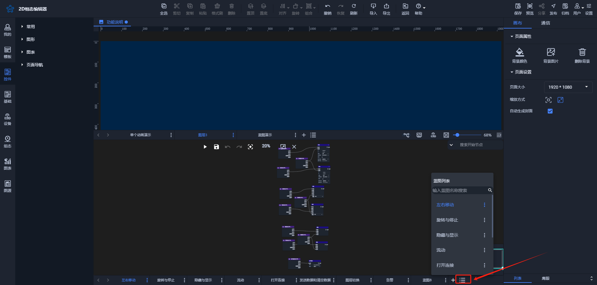
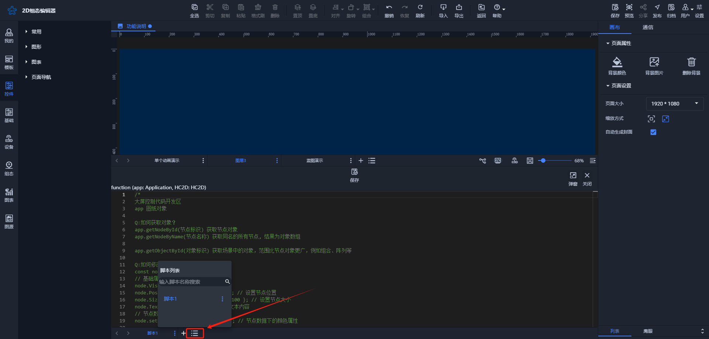
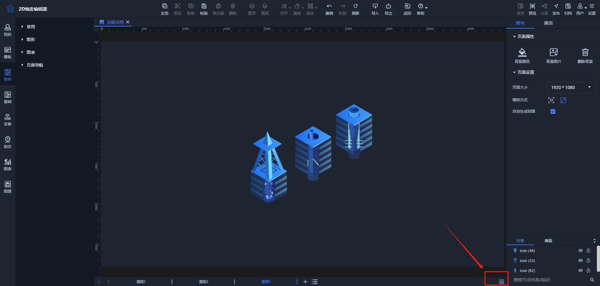
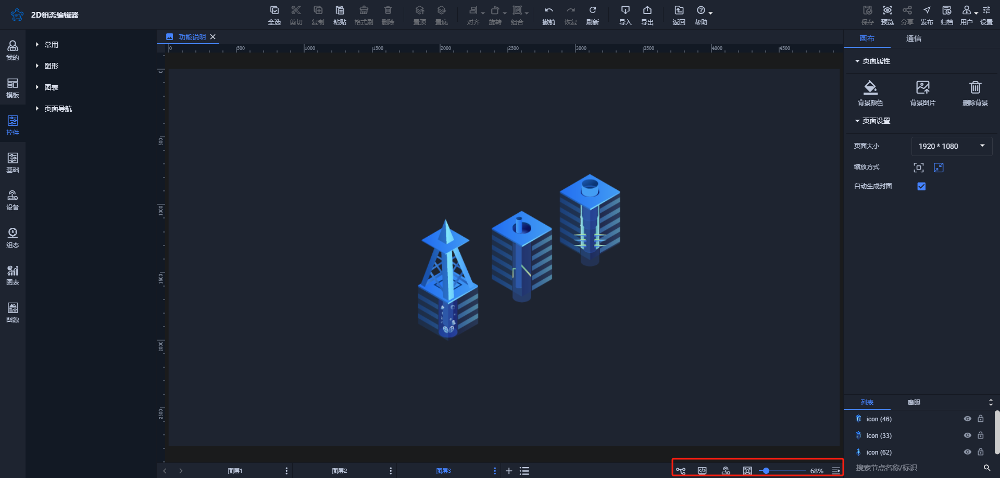
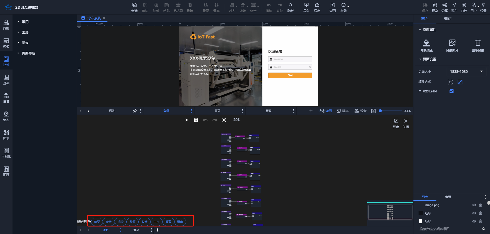
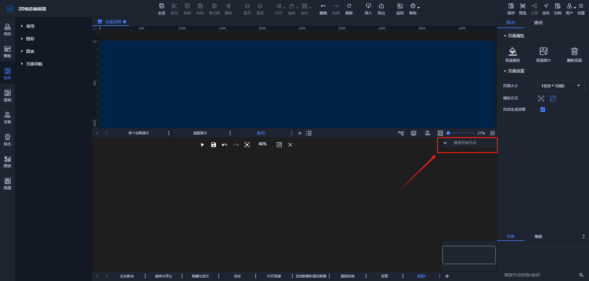
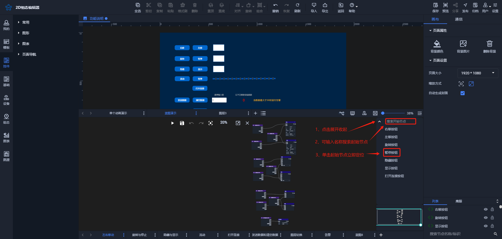
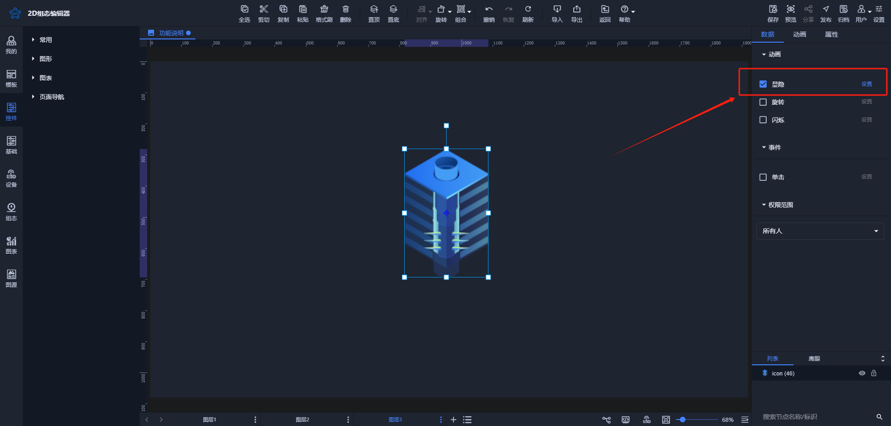
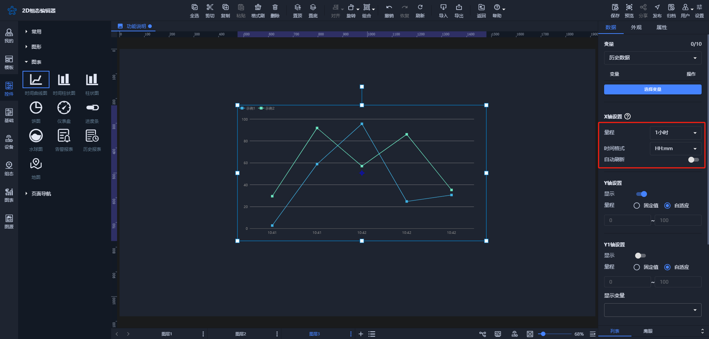

# 2024-12-23 V1.0.58

本次升级内容如下：

### 新增
1. 图表数据数据绑定功能优化（仅支持通信）

目前【图表】列图表数据绑定优化

|  |  |  |
| --- | --- | --- |

用户可以在图层、蓝图和脚本列表中搜索对应节点页面，并点击以切换到相应页面。这在页面数量较多时，有效解决了切换和操作指定页面的问题。

### 优化
1. 优化图层右侧功能节点的显示

页面右下角的蓝图、脚本、设备和自适应功能整合在一起，用户可以点击以展开或收起这些功能，从而在图层数量较多时保持界面的整洁。

2. 优化蓝图起始节点展示与操作效果

在使用蓝图时，可以通过点击起始节点按钮来定位到蓝图中的某个交互的起始节点位置。当起始节点较多时，页面可能显得拥挤。为了解决这一问题，我们调整了起始节点的位置，使其可以展开或收起，从而保持页面整洁。同时，增加了搜索功能，以便在起始节点较多时能更方便地进行定位。

旧版起始节点按钮位置：

新版起始节点按钮位置：

|  |  |
| --- | --- |

3. 优化数据列的显隐动画

4. 时间曲线图数据展示限制

为了更好地展示数据并保持页面稳定性，特作如下限制：

+ 数据量限制：当前最多支持显示1万条数据。例如，若选择的时间范围为7天（以11月20日为当前日期）：

如果前7天的数据未超过1万条，X轴将显示为11月14日至11月20日。

如果11月20日的数据超过1万条，X轴将仅显示到当前日期，以确保总数据量不超过1万条。

+ 更新频率限制：在【自动刷新】未开启时，仅加载一次数据；开启后将默认每10分钟更新一次数据。

### 修复
1. 修复使用【视频】控件时隐藏或切换图层视频流或在线视频未终止的问题
2. 解决【控件】【三维模型】使用过程中的问题
3. 修复【单个动画】渐显动画无效的问题
4. 解决组合节点旋转动画相关的问题
5. 修复设备列表在点击节点定位时无法从根节点定位到子节点的问题
6. 修复【开关】开启禁用后，在预览界面也可以进行操作的问题
7. 设计页面【自动生成封面】勾选不生效的问题

> 更新: 2024-12-23 11:39:28  
> 原文: <https://www.yuque.com/iot-fast/ksh/ve1qk3hocqoutn7w>