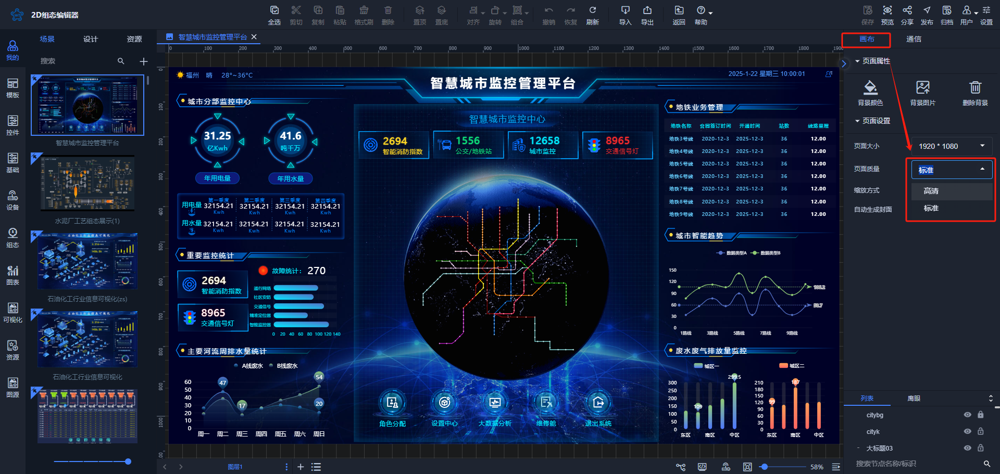
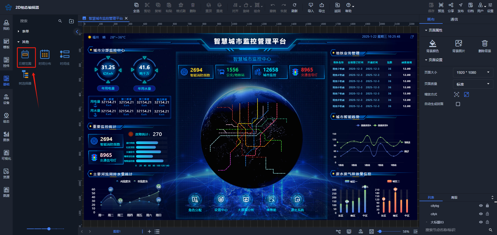
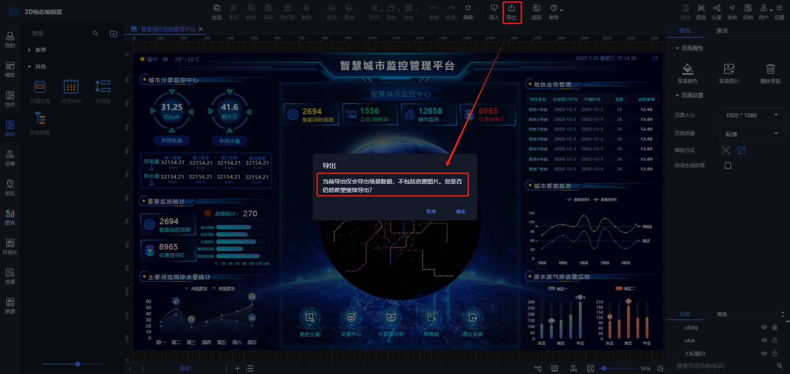

# 2025-01-22 V1.0.62

本次升级内容如下：

### 新增
1. 画布设置：添加页面质量设置，包含（标准、高清），默认为标准；

2. 基础控件：添加“日期范围”控件，如下图；

3. 场景导出功能：增加导出提示，如下图；

### 优化
1. 通信设置：当通信方式为ws类型时隐藏定时器；
2. 数据绑定：数据处理脚本优化；

### 修复
1.  预览功能：加载第三方库时预览自适应问题修复；
2. 自定义控件：编辑器中数据格式不对弹窗不关闭；
3. 脚本：用户脚本出错，添加异常信息提醒；
4. 折线图：数据展示问题修复；
5. 告警报表：操作列显示以及字段筛选问题修复；
6. 地图控件：点击进入设备问题修复；
7.  单击事件：打开图层设置问题修复；

> 更新: 2025-01-23 11:15:39  
> 原文: <https://www.yuque.com/iot-fast/ksh/xo7mnaancg4oc6f7>