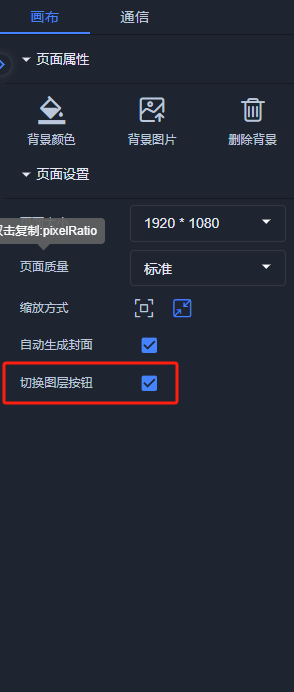

# 2025-02-07 V1.0.65

本次升级内容如下：

### 新增
1. 单击事件：设置弹出窗口添加全屏按钮；
2. 脚本：添加根据名称设置图层的方法、通过名称获取场景对象，实例如下：

//根据节点名称获取所有基础对象

const objects = app.getObjectByName("列表节点名称");

//根据名称设置图层

app.Database.LayerTable.setActiveLayerByName("图层名称");

3. 画布属性：添加“切换图层按钮”显示配置，默认勾选，在预览分享、单击事件中设置打开新窗口时可以显示切换图层；

### 优化
1. 通信配置：参数值和请求头可以通过编写脚本获取（支持async/await写法）；

### 修复
1.  图表编辑器：轴线拖拽问题修复；

> 更新: 2025-02-07 18:28:24  
> 原文: <https://www.yuque.com/iot-fast/ksh/kpohnun00gmygv53>