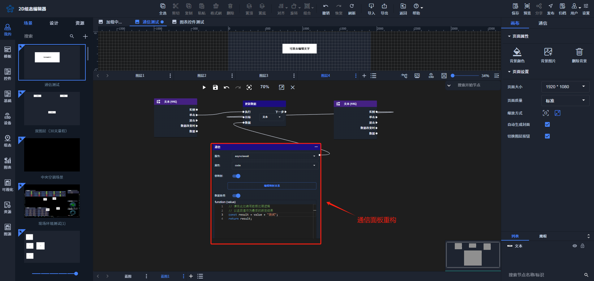

# 2025-02-13 V1.0.66

本次升级内容如下：

### 新增
本次暂无新增；

### 优化
1. 蓝图：通信表单配置重构，修改成节点数据配置时，绑定接口服务的面板一致，重构如下图所示；

（说明：节点数据配置绑定接口服务与蓝图中通信配置，二者是互相独立）

### 修复
1.蓝图：修复通信请求中“参数值和请求头”与通信配置中不一致的问题；

> 更新: 2025-02-13 17:45:55  
> 原文: <https://www.yuque.com/iot-fast/ksh/rpg75lzhcu2gzivb>