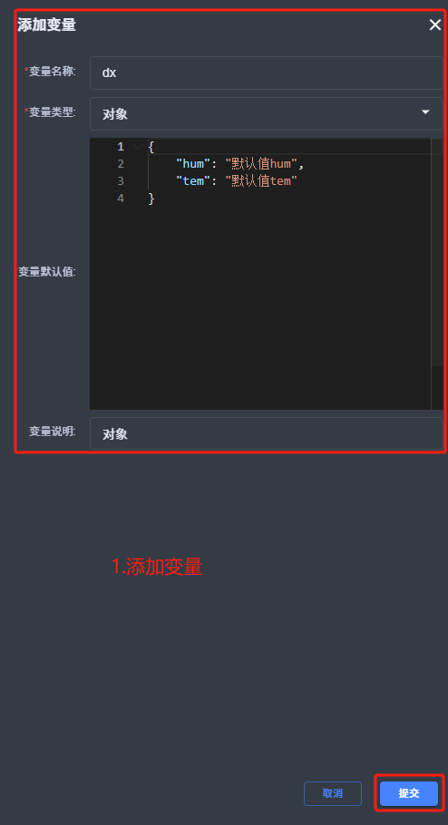
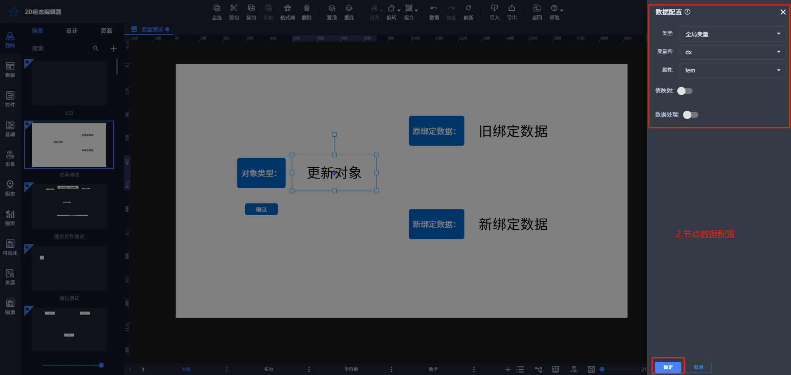
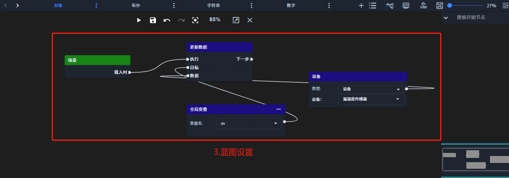

# 2025-02-26 V1.0.67

本次升级内容如下：

### 新增
画布属性：增加全局变量（应用场景：用于解决设备更换时，可以通过在蓝图中配置更新数据对全局变量值（可以对设备或单个变量）进行更新）

### 修复
1.数据配置与蓝图两个地方，针对“数据处理”返回值不一致的问题；

> 更新: 2025-02-26 17:24:39  
> 原文: <https://www.yuque.com/iot-fast/ksh/sh4lycqeiuq25cav>