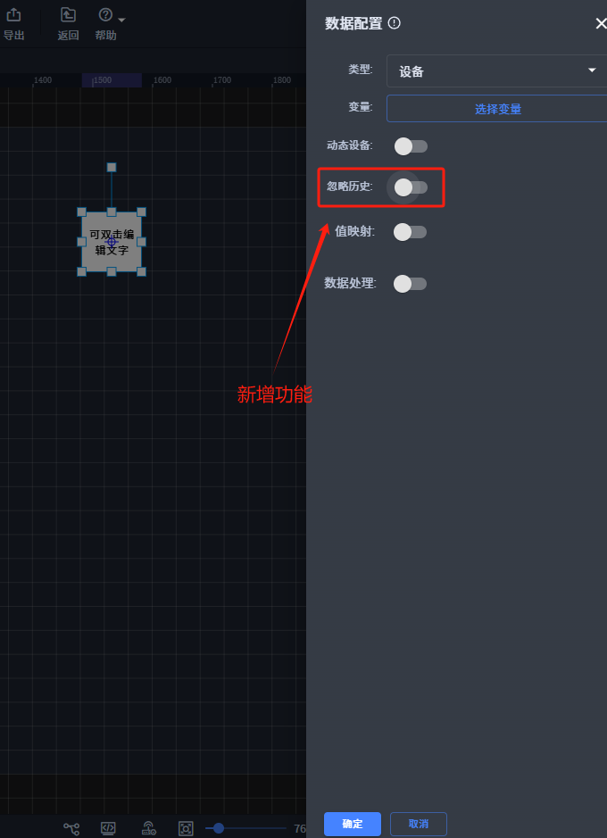
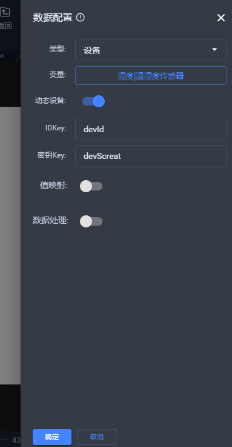
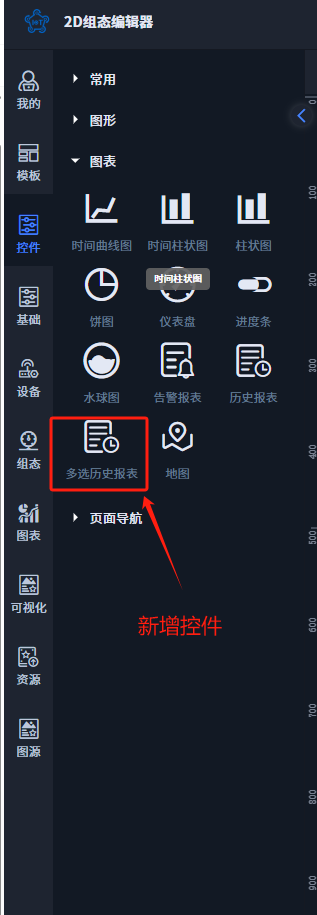

# 2025-04-09 V1.0.68

本次升级内容如下：

### 新增
1、设备绑定配置添加忽略历史（应用场景：未选中时，默认显示该变量最近的一条数据；选中时，只有当该变量有数据时，才会进行推送）；

2、设备绑定添加动态设备配置，操作如下：

2.1、绑定数据添加动态设备信息配置

2.2、地址栏传递实际设备信息

单台设备：

[https://v2-test.gkiiot.com/console/2d/preview?sceneId=bqmxd8k5b3vmtgexueb4&devId=oPetFFwr61m3jlpn19wc&devScreat=NHGnJWeZ1LNP1S3TwmqeujYlSznm5L57](https://v2-test.gkiiot.com/console/2d/preview?sceneId=bqmxd8k5b3vmtgexueb4&devId=oPetFFwr61m3jlpn19wc&devScreat=NHGnJWeZ1LNP1S3TwmqeujYlSznm5L57)

多台设备：

[https://v2-test.gkiiot.com/console/2d/preview?sceneId=bqmxd8k5b3vmtgexueb4&dev1=zzjcltiubcJP2Eutk1ib&scr1=lSlpUhOCgu2XhSS9BxDW02nEp3N8d3gk&dev2=oPetFFwr61m3jlpn19wc&scr2=NHGnJWeZ1LNP1S3TwmqeujYlSznm5L57](https://v2-test.gkiiot.com/console/2d/preview?sceneId=bqmxd8k5b3vmtgexueb4&dev1=zzjcltiubcJP2Eutk1ib&scr1=lSlpUhOCgu2XhSS9BxDW02nEp3N8d3gk&dev2=oPetFFwr61m3jlpn19wc&scr2=NHGnJWeZ1LNP1S3TwmqeujYlSznm5L57)

3、新增多选历史报表；

### 优化
1、历史报表（多选历史报表）/添加最近几天按钮选中状态；

2、动画/图片添加离屏缓存（性能优化）；

### 修复
1、节点复制或图层拷贝后，单击事件数据覆盖问题修复；

2、蓝图/发送数据，切换类型失效问题修复；

3、蓝图/更新数据，通信返回数据问题修复；

4、脚本/修复脚本标签快速切换时会导致数据覆盖的问题；

> 更新: 2025-04-09 17:51:30  
> 原文: <https://www.yuque.com/iot-fast/ksh/iqdpoucqbgze774u>