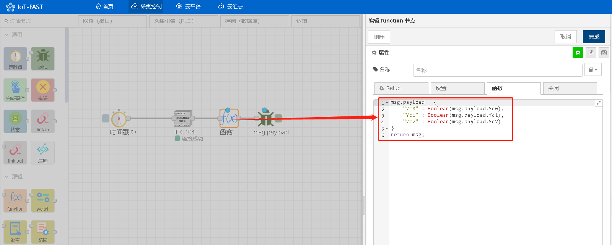
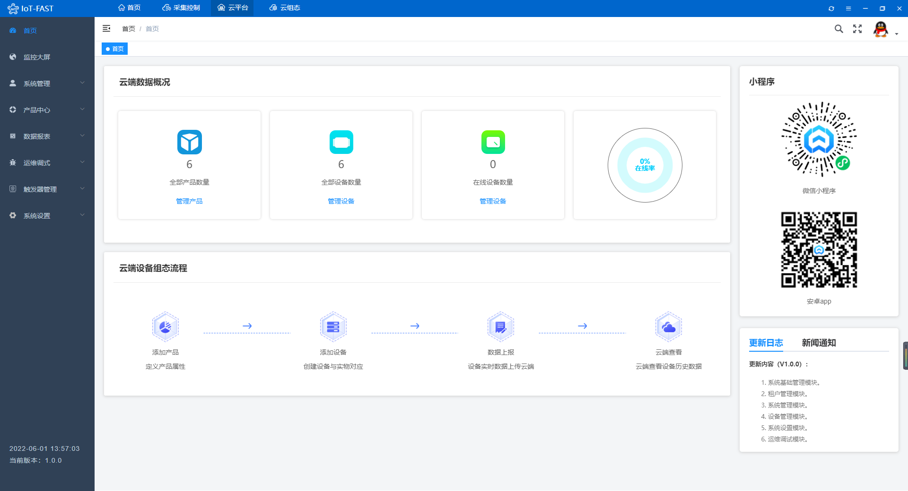

# IEC 104规约设备的数据采集

本文分享一篇通过IoT-Fast软件完成IEC 104规约设备的数据采集案例。文章主要共分为五个部分：

+ 前期准备

> IEC 104规约设备网络通信部署，获取采集点位。
>

+ **IoT-Fast**-采集控制系统

> 对底层设备进行数据读取、写入的配置界面，还可以进行数据处理。
>

+ **IoT-Fast**-云平台

> 将采集控制系统收集的数据进行分类展示、告警阈值设置、历史数据查询等功能。
>

+ **IoT-Fast**-云组态

> 进行2D组态，组态元素绑定云平台上展示的数据，来进行动作的执行或是数据展示。
>

+ **IoT-Fast**-微信小程序/App

> 通过微信小程序或者手机app进行远程数据的查看，以及动作的执行。
>

## 一 前期准备
### 1.1 通信
将IEC 104规约设备与电脑设置同一网段，接入同一个交换机保证网络可互相通信（也可采用串口的通讯方式）。

### 1.2 获取数据地址说明
获取IEC 104规约设备通信协议以及数据地址说明，取遥信的Yc0、Yc1、Yc2三个点位为例。

### 1.3 **IoT-Fast**采集软件
**IoT-Fast**是一款集合了数据采集、上报云端、图形组态为一体的软件。

通过部署**采集控制**定时读取IEC 104规约设备设备点位数据，将采集到的信息上传至IoT-Fast**云平台**。

## 二 IoT-Fast-采集控制系统部署
打开IoT-Fast的**采集控制**系统，在左侧采集引擎节点区找到**IEC 104**，按住鼠标左键拖入到中间的配置区。

再从左侧通用节点区拉出**定时器**和**调试**控件，与**IEC 104**控件节点连起来，以完成网络中信息的发送接收和转发。（定时器用于定时或手动触发采集控件采集信息，调试是为了采集控件采集到的数据展示至右侧数据窗口。)

双击**IEC 104**控件配置IEC 104规约设备的连接地址以及采集的数据字典（数据地址）。

根据在准备阶段设置的IEC 104规约设备地址，点击服务器地址配置项，按要求将设备地址以及端口填入服务器配置信息。

点击数据字典**添加**按钮，添加Yc0、Yc1、Yc2三条采集数据点位。

双击**定时器**自定义设置定时器采集时间。然后点击右上角的**部署**按钮，部署完成后**IEC 104**显示已连接，右侧的界面调到**调试窗口**显示Yc0、Yc1、Yc2三条数据。

但是数据是buffer类型，查看不够直观，我们需要转换成布尔值，即需添加一个function函数，解析代码如下：

重新点击**部署**按钮，获取采集的数据如下：

数据读取到之后，就可以将数据传到**云平台**显示，然后再进行**云组态**。

## 三 IoT-Fast-云平台
### 3.1 创建产品
点击云平台按钮进入**云平台**首页。

点击左侧**产品中心**-**产品开发**，新增一个产品。

查看创建的产品，在**功能定义**-**自定义参数**中新增属性。

创建配置如下，**标识符**与**采集控制**上的**标识符**值对应，同一个产品中不能有重复的**标识符**。

  

接着在**功能定义**-**分组**中创建一个上报分组，类型选择上报，将左边的点位全选，点击右箭头，加入到当前分组中。

如此下文中添加的设备是关联该产品的情况下，自动附带以上上报分组的属性，方便批量设备增加的过程。

### 3.2 添加设备
点击**产品中心**-**设备管理**，在该产品下增加一个设备。设备ID按需填写，也可不填将会自动生成ID。

然后就是云平台和采集控制中的属性进行绑定，我们需要回到**采集控制**系统，从左侧云平台中拉出**微联云上行**控件，用于将采集的数据上报**云平台**。

双击控件选择将数据上报到**云平台**的IEC 104产品、设备和分组中。

### 3.3 查看数据
回到**云平台**，查看设备的**运行状态**，可以看到数据已经上传上来了。

这样便配置好了**采集控制**和**云平台**的联动，接着可以去**云组态**进行2D组态，用图形展示数据。

## 四 IoT-Fast-云组态
### 4.1 添加应用图纸
点击云组态按钮进入**云组态**首页。

先新建一个项目，填写项目名称，保存，进入项目。

点击**应用**-**我的应用**，点击图示位置新增一张图纸，来构建组态。

填写图纸名称后就可以开始画组态图了。

### 4.2 组态绘制基础部分

由上面划分，我们可以在**设计**中设计自己需要的组件。设计完成的个性化组件可以直接拉到后面你所创建项目图纸中，重复使用，方便快捷

当然也可在左侧菜单栏中选择**图标**使用现成的组件

可以点击**资源**，上传截图的图片资源。

在**常用功能栏**进行所需组件的绘制，例如添加图形、添加文本、图形之间的对齐等。

在**编辑操作区**主要是对图形边框、背影、是否立体进行操作。

### 4.3 绑定云平台数据
点击**数据源**按钮，在弹出的标签页中**选择数据源**-设备，**来源**-我的，**产品**-云平台创建的产品，**设备**-云平台创建的设备，**属性**-选择合位，点击确定。分位以及远方位的数据源同理，进行绑定。

全部完成后点击**保存**，然后点击右上角的**预览**，即可查看组态的IEC 104的采集动态效果。

## 五 IoT-Fast-微信小程序/APP
软件上的数据支持在**微信小程序**或者**APP**上查看，小程序和APP的二维码在**云平台**首页的右侧，目前只支持安卓APP，ios的用户可以直接用微信小程序查看。

扫码进入**IoT-Fast**小程序，输入PC端注册的账号密码。

进入首页，可以看到产品和设备数量，点击**设备**查看该账号下的所有设备。

选择**公共单元**，点击查看。

可以看到设备的详细信息，点击运行状态查看公共单元设备运行数据

  

回到首页，点击**组态**查看该账号下的所有组态，选择**IEC 104**组态，点击查看。

效果和PC端是一样的。

> 更新: 2024-03-21 14:20:15  
> 原文: <https://www.yuque.com/iot-fast/ckyq/cc550b>