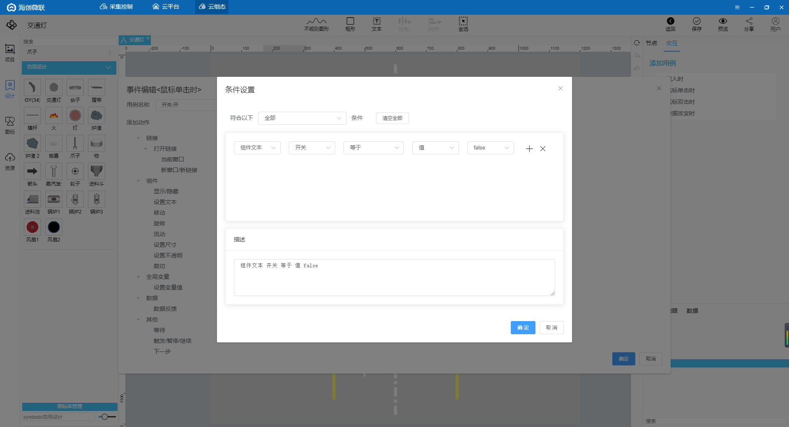

# IoT-Fast竟能同时满足西门子PLC的数采、上云和组态

不通过西门子的编程软件**博途**，就能对西门子PLC的点位进行读写，并且进行组态。使用IoT-Fast，低代码实现，IoT-Fast是一款集合了数据采集、上报云端、图形组态为一体的软件

文章以西门子S7-1200为例，包括梯形图，采集，上云，组态，共分为五个部分：

+ **博途**的使用

> 简单介绍编程软件博途的使用，并编写梯形图。
>

+ **IoT-Fast-**采集控制系统

> 对底层设备进行数据读取、写入的配置界面，还可以进行数据处理。
>

+ IoT-Fast-云平台

> 将采集控制系统收集的数据进行分类展示、告警阈值设置、历史数据查询等功能。
>

+ IoT-Fast-云组态

> 进行2D组态，组态元素绑定云平台上展示的数据，来进行动作的执行或是数据展示。
>

+ IoT-Fast-微信小程序/App

> 通过微信小程序或者手机app进行远程数据的查看，以及动作的执行。
>

### 一、博途的使用
打开西门子编程软件**博途**。

选择左上角的**创建新项目**，填写项目名称，以交通灯为例，选择保存路径，点击创建。

创建成功后点击**打开项目视图**，进入主界面。

双击项目树中**添加新设备**，选择对应的PLC型号，确定。

创建完成后选择项目树PLC中的**程序块**，双击**Main**主程序块开始编写程序。

从右边指令栏中选择需要的指令，编写交通灯的梯形图。

主程序**梯形图**如下，如何编写就不详细说明了。

  
  
  
  
  
  

完成后下载到PLC中。

点击左侧**PLC变量**，**查看变量表**，下面这些点位在后续的采集和控制有需要。

### 二、IoT-Fast-采集控制系统
打开IoT-Fast的**采集控制**系统，选择左边的节点，按住鼠标左键拖入到中间的配置栏。

根据前面的梯形图，这里我们要采集6个灯和开关状态，已经对开关进行控制，所以我们从左侧的采集引擎拉出**S7**采集控件。

双击控件进入配置界面，配置采集的点位，点位的**标识符**用于和云平台进行关联对应；**功能名称**是备注的作用，方便自己理解该点位的含义；**内存域**就是PLC中的Q、I、M、DB1等等；**地址**则是该内存域下的地址，具体配置如下。

点击配置界面上面的小铅笔进入通讯配置界面，填写西门子PLC的ip端口TSAP等。（默认端口为102，本地TSAP10.00，远程TSAP03.00）

接着从控制引擎中拉出**S7**控制控件，同样对控制点位进行配置。

在共通控件中拉出**定时器**和**调试**控件。

在两个控件中用线两接起来，数据是从左往右流的。触发定时器时，顺着连接线对PLC进行一次采集，采集后返回的结果再顺着连接线到右边的调试控件，调试控件则会将结果显示在最右边的调试窗口。

完成后点击右上角的**部署**按钮。

部署完成后通讯控件会显示**连接成功**，点击定时器前面的按钮，在右边的调试窗口中能看到采集的点位数据。

然后我们先去云平台创建一下产品和设备，再回过头来做数据处理。

### 三、IoT-Fast-云平台
点击云平台按钮进入**云平台**首页。

点击左侧**产品中心**-**产品开发**，新增一个产品，类别选择**自定义品类**。

查看创建好的产品，在**功能定义**-**自定义参数**中新增采集控制的数据点。

配置如下，注意**标识符**要和采集控制系统中的**标识符**一致。

在**功能定义**-**分组**中创建上报和下发分组。

创建一个上报分组，类型选择上报，将左边的点位全选，点击右箭头，加入到当前分组中。

创建一个下发分组，类型选择下发，一样将左边的点位加入到当前分组中。

接着点击**产品中心**-**设备管理**，在该产品下增加一个设备。

查看设备的**运行状态**，就能看到刚刚定义的点位已经创建出来了，后续采集控制系统上报的数据就会在这边展示。

回到采集控制系统，从左侧IoT-Fast中拉出**iotfast云上行**和**iotfast云下行**控件。上行用于将采集的数据上报，下发用于云端下发控制指令。

双击控件就可以选择刚刚在云平台创建的产品、设备和分组了。

在**微联云下行**后面接一个**调试**控件，方便排查问题，然后点击部署，完成后显示连接成功，点击定时器，调试窗口显示操作成功。

回到云平台，查看设备的**运行状态**，可以看到数据已经显示出来了。

查看设备的**设备调试**，模拟一个下发控制，开关选择开，点击发送。

回到采集控制系统，可以看到从云平台下发出来的报文格式。

我们对下发的格式做一下处理，从左侧拉出一个**F(X)** 控件，接在**微联云下行**和**S7**控制控件中间，双击写一句简单的代码，将M1_0提取到msg.payload对象下。

双击**定时器**设置周期性触发，周期0.5s，点击部署，采集控制系统就全部配置完成了。

接着在云组态中进行交通灯的组态，然后绑定云平台的数据。

### 四、IoT-Fast-云组态
点击云组态按钮进入**云组态**首页。

先新建一个项目，填写项目名称，保存，进入项目。

点击**应用**-**我的应用**，点击图示位置新增一张图纸，来构建组态。

填写图纸名称后就可以开始画组态图了。

可以在左侧项目树中选择**图标**使用现成的组件，也可以在**设计**中设计自己需要的组件。

点击图纸空白处，在右侧修改图纸大小和背景颜色。

从图标中拷贝一个指示灯，粘贴到设计中微调成需要的组件。

点击设计，创建一个新的文件夹，然后粘贴指示灯，双击进行调整，调整完成后保存。

绘图过程就不详细介绍了，画面成型后如下，接着将灯和开关绑定云平台的数据。

选中一个灯，点击箭头处的图标绑定数据。

**选择数据源**-设备，**来源**-我的，**产品**-云平台创建的产品，**设备**-云平台创建的设备，**属性**-选择东西方向绿灯，点击确定。剩下的灯和开关同理，依次进行绑定。

绑定完成后对于有控制的开关需要进行一下交互设置，选中开关，点击右上角的**交互**，双击**鼠标单击时**。

对这个控制进行命名，然后点击添加条件。

设置条件，当开关这个组件的值为false时触发。

点击左边的**数据反馈**设置交互动作，动作为：对开关写true，最后保存。

这条交互的含义是：当开关当前的值为false时，单击开关，开关会触发动作，给云端发送开关为true的指令。同样，设置一条对立的交互，开关为true时，单击开关触发false。

全部配置完成后点击**保存**，然后点击右上角的**预览**。

点击开关，交通灯开始运行！

### 五、IoT-Fast-微信小程序/APP
软件上的数据支持在**微信小程序**或者**APP**上查看，小程序和APP的二维码在**云平台**首页的右侧，目前只支持安卓APP，ios的用户可以直接用微信小程序查看。

扫码进入IoT-Fast小程序，输入PC端注册的账号密码。

进入首页，可以看到产品和设备数量，点击**设备**查看该账号下的所有设备。

选择交通灯，点击查看可以看到设备的详细信息。

点击**运行状态**右侧的箭头可以查看设备的实时数据。

点击**设备控制**右侧的箭头则是可以对设备进行指令下发。

回到首页，点击**组态**查看该账号下的所有组态，选择交通灯，点击查看。

和PC端一样，点击按钮就可以对组态进行控制。

> 更新: 2024-03-21 14:19:42  
> 原文: <https://www.yuque.com/iot-fast/ckyq/yei4bi>