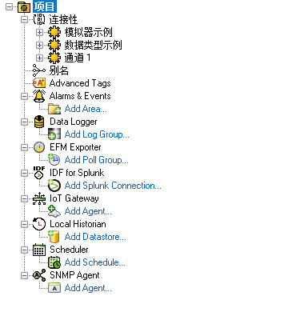
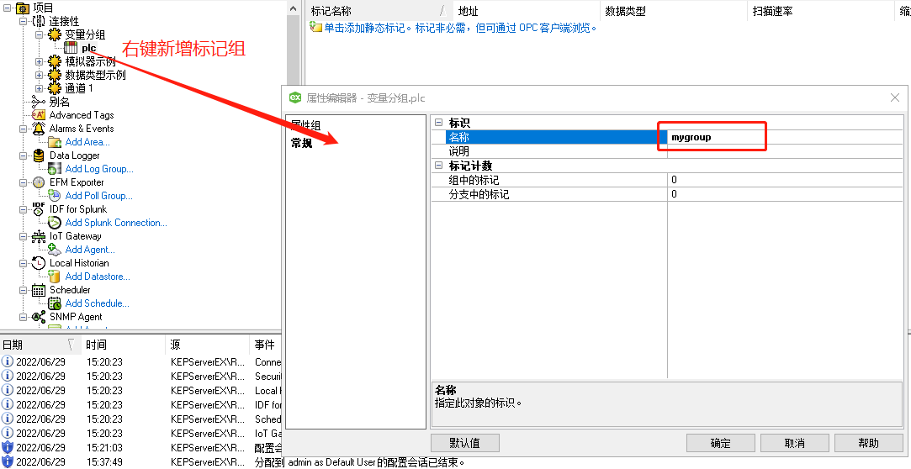
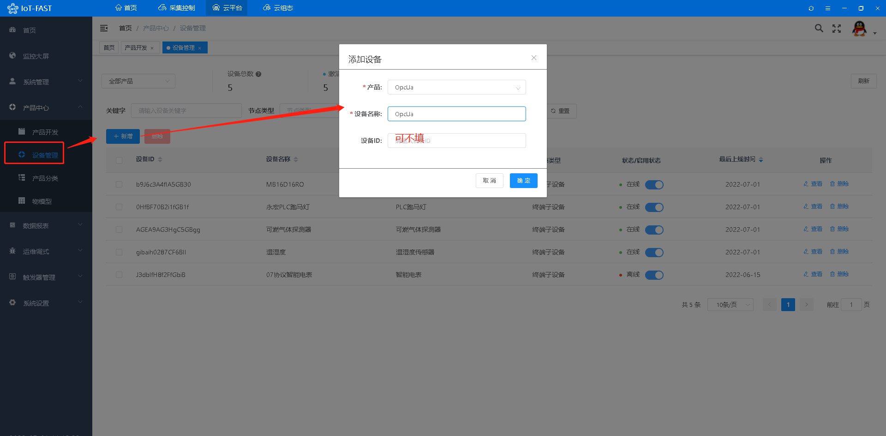
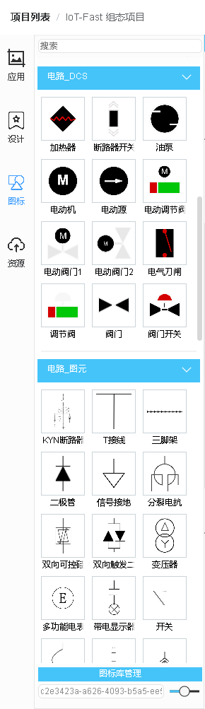
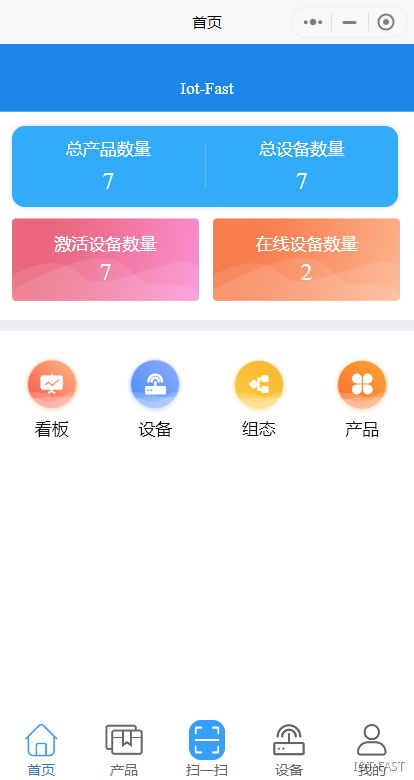

# OPC_UA设备数据采集

本次分享一篇通过使用IoT-Fast以及KEPServerv6模拟器，实现OpcUa协议设备的数据采集软文。IoT-Fast是一款集合了数据采集、上报云端、图形组态为一体的软件

文章主要共分为五个部分：

+ OpcUa服务器环境搭建

> 简单介绍使用KEPServerv6如何进行OPC_UA的服务器搭建。
>

+ **IoT-Fast**-采集控制系统

> 对底层设备进行数据读取、写入的配置界面，还可以进行数据处理。
>

+ **IoT-Fast**-云平台

> 将采集控制系统收集的数据进行分类展示、告警阈值设置、历史数据查询等功能。
>

+ **IoT-Fast**-云组态

> 进行2D组态，组态元素绑定云平台上展示的数据，来进行动作的执行或是数据展示。
>

+ **IoT-Fast**-微信小程序/App

> 通过微信小程序或者手机app进行远程数据的查看，以及动作的执行。
>

## 一 OpcUa服务器环境搭建
### 1.1 KEPServerv6软件的下载
链接：[https://pan.baidu.com/s/1ZZg2qCWEPQNcjAWN4d15fg](https://pan.baidu.com/s/1ZZg2qCWEPQNcjAWN4d15fg)  
       提取码：oo92

### 1.2 KEPServerv6配置
1.安装包下载完成后，解压单击安装，按提示安装完，中间记住所设置的密码即可。

2.安装完成后，出现下图(windows 10系统)，点击OPC UA Configuration 配置服务器用户.

3.弹出如下窗口，输入自己的用户名和密码即可.这里用户名是指定的或默认的Administrator，密码是指定的或123456

4.成功后进入配置界面如下

5.双击URL弹出如下窗口，按所示设置即可，如果自己要加密则可以选择加密

6.上述操作完成，如下点击设置

7.添加OPC_UA服务器用户，我的是my_opc_ua，设置密码后，点击确定和应用

8.选择KEPServerEX 6 Configuration进入配置界面

9.右击项目点击弹出的属性如下，按图示设置OPC_UA的匿名链接

10.按上面设置完毕，则允许匿名登陆和用户名密码登录的OPC_UA服务器搭建完毕，下面开始设置服务器通信变量。

### 1.3 KEPServerv6设置通信变量
(1)打开KEPServerEX 6 Configuration，新建通道,选择Simulator。

(2)给通道添加设备，设备名plc，一步一步直到完成。

(3)创建标记组

(4)新建标记，取名x1,地址输入x1,数据类型选择浮点型，客户端访问方式为写

(5)重复以上操作新建3个标记， 这里的地址需要根据数据类型计算占用的空间数，地址填错有可能影响数据正确性，比如说浮点型数据占两位，那么第二个浮点数据地址为x(n+2)。

随后，我们打开客户端，将地址复制过去，点击连接，即可看到显示连接成功。

## 二 IoT-Fast-采集控制系统
打开IoT-Fast的**采集控制**系统，在左侧采集引擎节点区找到**OpcUa**，按住鼠标左键拖入到中间的配置区。

再从从左侧通用节点区拉出**定时器**和**调试**控件，与**OpcUa**控件节点连起来，以完成网络中信息的发送接收和转发。（定时器用于定时或手动触发采集控件采集信息，调试是为了采集控件采集到的数据展示至右侧数据窗口。)

双击**OpcUa**控件配置OpcUa的连接地址以及采集的数据字典（点位）。

根据搭建的OpcUa服务环境地址配置，点击**OpcUa**组件地址配置项，按要求填入服务器配置信息。通讯模式选择**实时**。

按照搭建过程中设置的点位,将相关的点位进行采集。

双击**定时器**自定义设置定时器采集时间。

然后点击右上角的**部署**按钮，部署完成后**OpcUa**显示已连接，右侧的界面调到**调试窗口**显示x1、x2、x3共计3条数据。

如果需要对点位进行控制，同样的操作，在左侧**控制**引擎节点区找到**OpcUa**，按照下图进行连接。

此时地址会自动配置好，但是需要添加一下需要控制的点位，并写入需要设定的状态值。

点击**部署**按钮后，在写入控制**OpcUa**引擎前点击定时器触发，右方调试窗口提示写入操作成功后。我们再点击采集**OpcUa**引擎前的定时器，即可看到数据变为100、200、300。

这些数据读取控制没问题后，就可以将数据传到**云平台**显示，然后再进行**云组态**。

## 三 IoT-Fast-云平台
### 3.1 创建产品
点击云平台按钮进入**云平台**首页。

点击左侧**产品中心**-**产品开发**，新增一个产品。

查看创建的产品，在**功能定义**-**自定义参数**中新增属性。

创建配置如下，**标识符**与**采集控制**上的**key**值对应，同一个产品中不能有重复的**标识符**。

添加完成后如下：

然后在**功能定义**-**分组**中创建一个上报分组，类型选择上报，将左边的点位全选，点击右箭头，加入到当前分组中。

相同操作，再创建一个下发的分组。

如此下文中添加的设备是关联该产品的情况下，自动附带以上上报下发分组的属性，方便批量设备增加的过程。

### 3.2 添加设备
点击**产品中心**-**设备管理**，在该产品下增加一个设备。

然后就是云平台和采集控制中的属性进行绑定，我们需要回到**采集控制**系统，从左侧云平台中拉出**微联云上行**以及**微联云下行**两个控件，用于将采集的数据上报**云平台**并在云端进行状态控制下发。

双击控件选择将数据上报到**云平台**的OpcUa产品、设备和分组中。

流程中通过调试，需要增加一个function函数对云端下发的数据做解析，只取负载中的params字段传到OpcUa控制引擎组件中。

### 3.3 查看数据
回到**云平台**，查看设备的**运行状态**，可以看到数据已经上传上来了。

在**设备调试**中，选择**下发**方式，填下下发的状态值，点击**立即发送**。

返回**运行状态**，即可查看OpcUa最新采集上报的数据。

这样便配置好了**采集控制**和**云平台**的联动，接着可以去**云组态**进行2D组态，用图形展示数据。

## 四 IoT-Fast-云组态
### 4.1 添加应用图纸
点击云组态按钮进入**云组态**首页。

先新建一个项目，填写项目名称，保存，进入项目。

点击**应用**-**我的应用**，点击图示位置新增一张图纸，来构建组态。

填写图纸名称后就可以开始画组态图了。

### 4.2 组态绘制基础部分

由上面划分可知，我们可以在**设计**中设计自己需要的组件。设计完成的个性化组件可以直接拉到后面你所创建项目图纸中，重复使用，方便快捷

当然也可在左侧菜单栏中选择**图标**使用现成的组件

可以点击**资源**，上传截图的图片资源。

在**常用功能栏**进行所需组件的绘制，例如添加图形、添加文本、图形之间的对齐等。

在**编辑操作区**主要是对图形边框、背影、是否立体进行操作。

### 4.3 绑定云平台数据
点击**数据源**按钮，在弹出的标签页中**选择数据源**-设备，**来源**-我的，**产品**-云平台创建的产品，**设备**-云平台创建的设备，**属性**-选择燃气浓度，点击确定。图形下方的的电源指示灯以及其他的设备数据源同理，进行绑定。

全部完成后点击**保存**，然后点击右上角的**预览**，即可查看组态OpcUa的采集动态效果。

## 五 IoT-Fast-微信小程序/APP
软件上的数据支持在**微信小程序**或者**APP**上查看，小程序和APP的二维码在**云平台**首页的右侧，目前只支持安卓APP，ios的用户可以直接用微信小程序查看。

扫码进入**IoT-Fast**小程序，输入PC端注册的账号密码。

进入首页，可以看到产品和设备数量，点击**设备**查看该账号下的所有设备。

选择OpcUa，点击查看。

通过点击**运行状态设备控制**可以分别在对应的界面中查看OpcUa点位数据或者控制相关点位的数据。

回到首页，点击**组态**查看该账号下的所有组态，选择OpcUa，点击查看。

效果和PC端是一样的。

> 更新: 2024-03-21 14:20:14  
> 原文: <https://www.yuque.com/iot-fast/ckyq/dytctb>