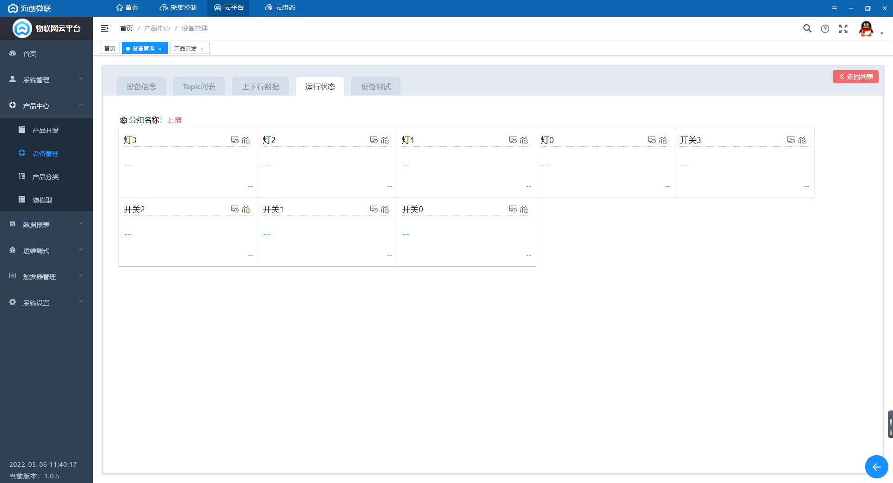
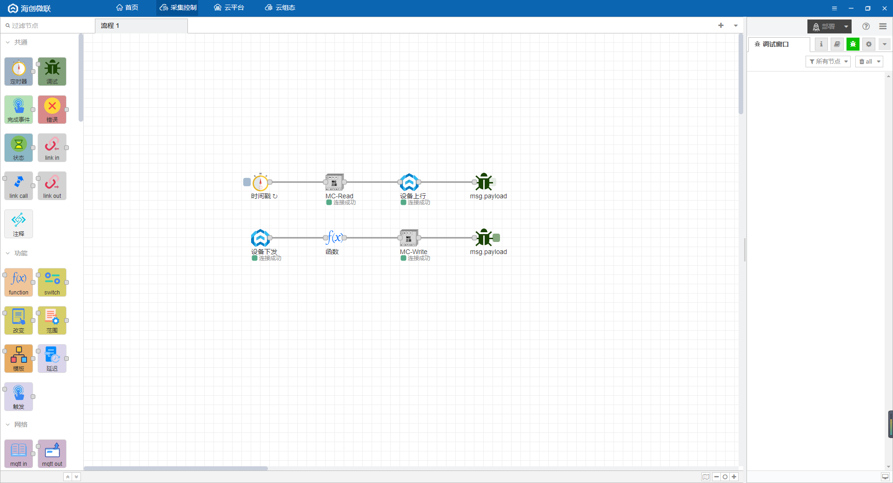

# 不需要GX Works3也能对三菱PLC进行读写！

如何不通过三菱的编程软件**GX Works3**，也能对三菱PLC的点位进行读写？使用**IoT-Fast**，超低代码就能实现，**IoT-Fast**是一款集合了数据采集、上报云端、图形组态为一体的软件

文章以三菱PLC-FX5U为例，包括梯形图，采集，上云，组态，共分为五个部分：

+ **GX Works3**的使用

> 简单介绍编程软件GX Works3的使用，并编写梯形图。
>

+ **IoT-Fast-**采集控制系统

> 对底层设备进行数据读取、写入的配置界面，还可以进行数据处理。
>

+ **IoT-Fast**-云平台

> 将采集控制系统收集的数据进行分类展示、告警阈值设置、历史数据查询等功能。
>

+ **IoT-Fast**-云组态

> 进行2D组态，组态元素绑定云平台上展示的数据，来进行动作的执行或是数据展示。
>

+ **IoT-Fast**-微信小程序/App

> 通过微信小程序或者手机app进行远程数据的查看，以及动作的执行。
>

### 一、**GX Works3**的使用
打开三菱编程软件**GX Works3**。

打开GX Works3，新建工程，选择型号FX5U。

创建成功进入主界面。

编写梯形图，**梯形图**如下，M0、M1、M2、M3分别控制4个输出Y0、Y1、Y2、Y3。

完成后点击上方的**在线**-**写入可编程控制器**，将程序写入PLC。

点击开始监视，选择监视读取，也可以在监看中添加需要监看的点位。

然后我们用**IoT-Fast**对点位进行读写。

### 二、IoT-Fast-采集控制系统
打开IoT-Fast的**采集控制**系统，选择左边的节点，按住鼠标左键拖入到中间的配置栏。

我们从左侧的采集引擎拉出**MC**采集控件（三菱通讯协议）。

双击控件进入配置界面，配置采集的点位，点位的**标识符**用于和云平台进行关联对应；**功能名称**是备注的作用，方便自己理解该点位的含义，可不填；**内存域**就是PLC中的M、D、X、Y等等；**地址**则是该内存域下的地址，具体配置如下。

点击配置界面上面的小铅笔进入通讯配置界面，填写三菱PLC的ip端口等。

PLC的IP和通讯模式在左侧的**参数**-**FX5UCPU**-**模块参数**-**以太网端口**中查看。

端口需要点击**对象设备连接配置设置**，点击**详细设置**查看，如果之前没有配置则需要从右侧拉出连接端口，配置一个端口，这里我配置了两个，一个9600一个9601，配置后记得保存下载到PLC中。

接着从控制引擎中拉出**MC**控制控件，同样对控制点位进行配置。

在共通控件中拉出**定时器**和**调试**控件。

在两个控件中用线两接起来，数据是从左往右流的。触发定时器时，顺着连接线对PLC进行一次采集，采集后返回的结果再顺着连接线到右边的调试控件，调试控件则会将结果显示在最右边的调试窗口。  

完成后点击右上角的**部署**按钮。

部署完成后通讯控件会显示**连接成功**，点击定时器前面的按钮，在右边的调试窗口中能看到采集的点位数据。

然后我们先去云平台创建一下产品和设备，再回过头来做数据处理。

### 三、IoT-Fast-云平台
点击云平台按钮进入**云平台**首页。

点击左侧**产品中心**-**产品开发**，新增一个产品，类别选择**自定义品类**。

查看创建好的产品，在**功能定义**-**自定义参数**中新增采集控制的数据点，我们将M点对应成开关，Y点对应灯。

配置如下，注意**标识符**要和采集控制系统中的**标识符**一致。

在**功能定义**-**分组**中创建上报和下发分组。

创建一个上报分组，类型选择上报，将左边的点位全选，点击右箭头，加入到当前分组中。

创建一个下发分组，类型选择下发，一样将左边的点位加入到当前分组中。

接着点击**产品中心**-**设备管理**，在该产品下增加一个设备。

查看设备的**运行状态**，就能看到刚刚定义的点位已经创建出来了，后续采集控制系统上报的数据就会在这边展示。

回到采集控制系统，从左侧云平台中拉出**iotfast云上行**和**iotfast云下行**控件。上行用于将采集的数据上报，下发用于云端下发控制指令。

双击控件就可以选择刚刚在云平台创建的产品、设备和分组了。

在**微联云下行**后面接一个**调试**控件，方便排查问题，然后点击部署，完成后显示连接成功，点击定时器，调试窗口显示操作成功。

回到云平台，查看设备的**运行状态**，可以看到数据已经显示出来了。

查看设备的**设备调试**，模拟一个下发控制，开关选择开，点击发送。

回到采集控制系统，可以看到从云平台下发出来的报文格式。

我们对下发的格式做一下处理，从左侧拉出一个**F(X)** 控件，接在**微联云下行**和**S7**控制控件中间，双击写一些简单的代码，将msg.payload.data.params下的值提取到msg.payload下。

双击**定时器**设置周期性触发，周期1s，点击部署，采集控制系统就全部配置完成了。

回到设备的**设备调试**，对M0和M2写入true。

查看设备的**运行状态**，可以看到M0和M2对应的开关和灯都是开的。

回到**GX Works3**，可以看到写入成功

接着在云组态中进行组态，绑定云平台的数据。

### 四、IoT-Fast-云组态
点击云组态按钮进入**云组态**首页。

先新建一个项目，填写项目名称，保存，进入项目。

点击**应用**-**我的应用**，点击图示位置新增一张图纸，来构建组态。

填写图纸名称后就可以开始画组态图了。

可以在左侧项目树中选择**图标**使用现成的组件，也可以在**设计**中设计自己需要的组件。

点击图纸空白处，在右侧修改图纸大小和背景颜色。

从图标中拷贝一个指示灯，粘贴到设计中微调成需要的组件。

点击设计，创建一个新的文件夹，然后粘贴指示灯，双击进行调整，调整完成后保存。

我们拉出刚刚设计的指示灯4个，然后为它们命名，全选，点击上方的分布和对齐调整位置。

接着从图标中拉出4个开关组件，命名调整位置。

下面一步要将组件绑定上数据，选中一个灯，点击箭头处的图标绑定数据。

**选择数据源**-设备，**来源**-我的，**产品**-云平台创建的产品，**设备**-云平台创建的设备，**属性**-选择灯0，点击确定。剩下的灯和开关同理，依次进行绑定。

绑定完成后对于有控制的开关需要进行一下交互设置，选中开关，点击右上角的**交互**，双击**鼠标单击时**。

对这个控制进行命名，然后点击添加条件。

设置条件，当开关这个组件的值为false时触发。

点击左边的**数据反馈**设置交互动作，动作为：对开关写true，最后保存。

这条交互的含义是：当开关当前的值为false时，单击开关，开关会触发动作，给云端发送开关为true的指令。同样，设置一条对立的交互，开关为true时，单击开关触发false。

全部的开关都配置完成后点击**保存**，然后点击右上角的**预览**。

点击开关，对应的灯会亮会启动。

### 五、IoT-Fast-微信小程序/APP
软件上的数据支持在**微信小程序**或者**APP**上查看，小程序和APP的二维码在**云平台**首页的右侧，目前只支持安卓APP，ios的用户可以直接用微信小程序查看。

扫码进入IoT-Fast小程序，输入PC端注册的账号密码。

进入首页，可以看到产品和设备数量，点击**设备**查看该账号下的所有设备。

选择在线设备，点击查看可以看到设备的详细信息。

点击**运行状态**右侧的箭头可以查看设备的实时数据。

点击**设备控制**右侧的箭头则是可以对设备进行指令下发。

回到首页，点击**组态**查看该账号下的所有组态，选择三菱FX5U点控，点击查看。

和PC端一样，点击按钮就可以对组态进行控制。

> 更新: 2024-03-21 14:18:56  
> 原文: <https://www.yuque.com/iot-fast/ckyq/qzgic6>