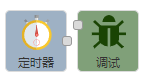
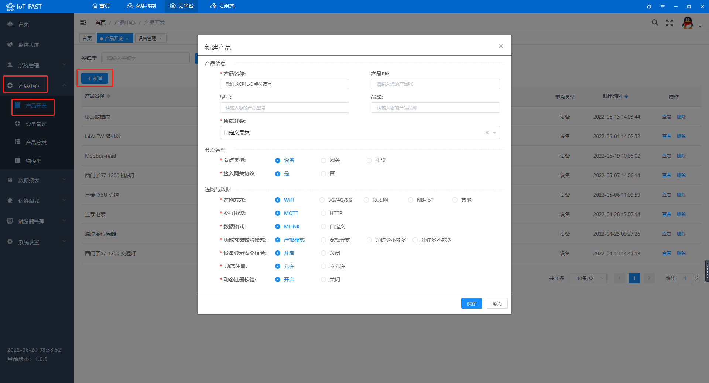
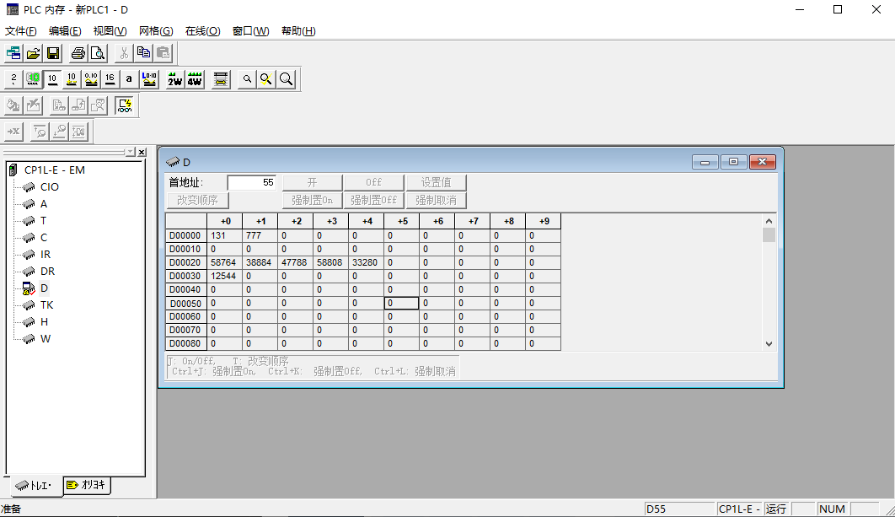
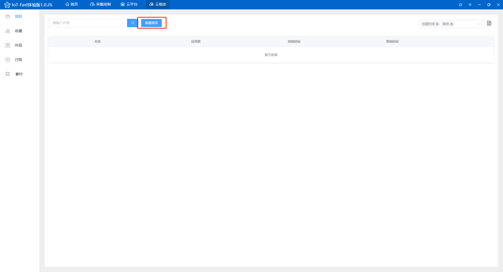
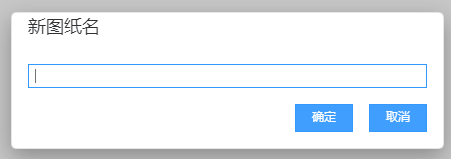
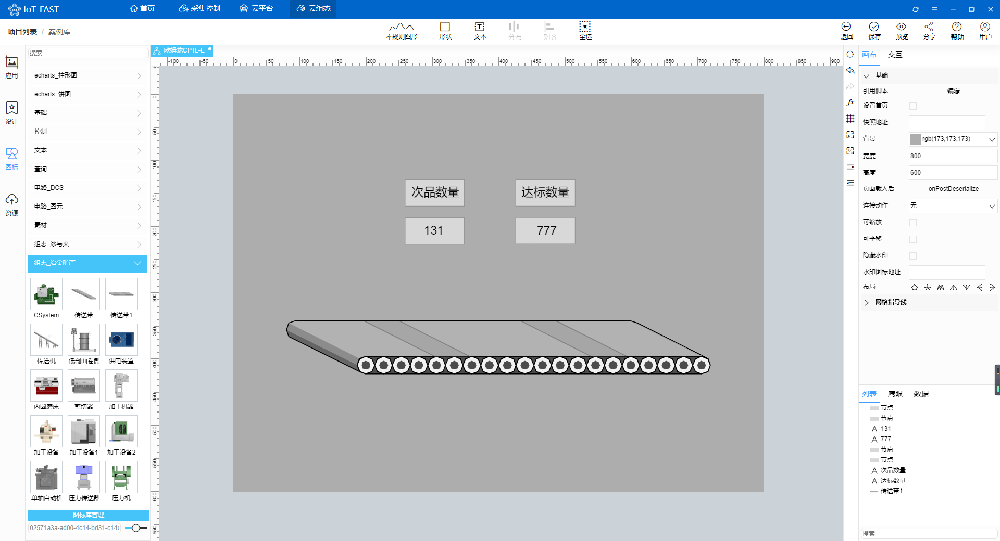

# 低代码实现对欧姆龙PLC的采集控制

使用IoT-Fast，低代码实现对欧姆龙PLC的采集控制。IoT-Fast是一款集合了数据采集、上报云端、图形组态为一体的软件

文章以欧姆龙CP1L-E为例，包括采集，上云，组态，共分为五个部分：

+ **CX-Programmer**的使用

> 简单介绍编程软件CX-Programmer的使用。
>

+ **IoT-Fast**-采集控制系统

> 对底层设备进行数据读取、写入的配置界面，还可以进行数据处理。
>

+ **IoT-Fast**-云平台

> 将采集控制系统收集的数据进行分类展示、告警阈值设置、历史数据查询等功能。
>

+ **IoT-Fast**-云组态

> 进行2D组态，组态元素绑定云平台上展示的数据，来进行动作的执行或是数据展示。
>

+ **IoT-Fast**-微信小程序/App

> 通过微信小程序或者手机app进行远程数据的查看，以及动作的执行。
>

### 一、CX-Programmer的使用
打开欧姆龙编程软件**CX-Programmer**。

打开CX-Programmer，点击左上角的文件，新建一个项目，选择型号CP1L-E。

创建成功进入主界面。

项目树中双击**内存**可以查看PLC的区域和点位地址。

然后我们用**IoT-Fast**对D区点位进行读写。

### 二、IoT-Fast-采集控制系统
打开IoT-Fast的**采集控制**系统，选择左边的节点，按住鼠标左键拖入到中间的配置栏。

我们从左侧的采集引擎拉出**Fins**采集控件（欧姆龙通讯协议）。

双击控件进入配置界面，配置采集的点位，点位的**标识符**用于和云平台进行关联对应；**功能名称**是备注的作用，方便自己理解该点位的含义，可不填；**内存域**就是PLC中的内存区，D、C、W这些；**地址**则是该内存域下的地址，具体配置如下，查询D0和D1的值。

点击配置界面上面的小铅笔进入通讯配置界面，填写欧姆龙PLC的ip端口等。

PLC的IP在左侧的**设置**-**内置以太网**中查看。

端口点击**FINS/TCP设置**查看，默认9600。

接着从控制引擎中拉出**Fins**写入控件，对点位进行写入。

在通用控件中拉出**定时器**和**调试**控件。

在两个控件中用线两接起来，数据是从左往右流的。触发定时器时，顺着连接线对PLC进行一次采集，采集后返回的结果再顺着连接线到右边的调试控件，调试控件则会将结果显示在最右边的调试窗口。

完成后点击右上角的**部署**按钮。

部署完成后通讯控件会显示**连接成功**，点击定时器前面的按钮，在右边的调试窗口中能看到采集的点位数据。

然后我们先去云平台创建一下产品和设备，再回过头来做数据处理。

### 三、IoT-Fast-云平台
点击云平台按钮进入**云平台**首页。

点击左侧**产品中心**-**产品开发**，新增一个产品，类别选择**自定义品类**。

查看创建好的产品，在**功能定义**-**自定义参数**中新增采集控制的数据点，添加两个点位D0和D1，注意**标识符**要和采集控制系统中的**标识符**一致。

在**功能定义**-**分组**中创建上报和下发分组。

创建一个上报分组，类型选择上报，将左边的点位全选，点击右箭头，加入到当前分组中。

创建一个下发分组，类型选择下发，一样将左边的点位加入到当前分组中。

接着点击**产品中心**-**设备管理**，在该产品下增加一个设备。

查看设备的**运行状态**，就能看到刚刚定义的点位已经创建出来了，后续采集控制系统上报的数据就会在这边展示。

回到采集控制系统，从左侧云平台中拉出**iot云上行**和**iot云下行**控件。上行用于将采集的数据上报，下发用于云端下发控制指令。

双击控件就可以选择刚刚在云平台创建的产品、设备和分组了。

在**微联云下行**后面接一个**调试**控件，方便排查问题，然后点击部署，完成后显示连接成功，点击定时器，调试窗口显示操作成功。

回到云平台，查看设备的**运行状态**，可以看到数据已经显示出来了。

查看设备的**设备调试**，模拟一个数据下发，写入两个值，点击发送。

回到采集控制系统，可以看到从云平台下发出来的报文格式。

我们对下发的格式做一下处理，从左侧拉出一个**F(X)** 控件，接在**微联云下行**和**S7**控制控件中间，双击写一些简单的代码，将msg.payload.data.params下的值提取到msg.payload下。

双击**定时器**设置周期性触发，周期1s。

点击部署，采集控制系统就全部配置完成了。

回到设备的**设备调试**，对D0和D1写入值。

回到**CX-Programmer**，监视内存区的D区，可以看到值已经写入了。

再写一次，查看**CX-Programmer**和云平台的运行状态，完全一致。

### 四、IoT-Fast-云组态
点击云组态按钮进入**云组态**首页。

先新建一个项目，填写项目名称，保存，进入项目。

点击**应用**-**我的应用**，点击图示位置新增一张图纸，来构建组态。

填写图纸名称后就可以开始画组态图了。

可以在左侧项目树中选择**图标**使用现成的组件，也可以在**设计**中设计自己需要的组件。

点击图纸空白处，在右侧修改图纸大小和背景颜色。

点击上方的文本，在图纸上拉出两个文本框，作为显示D0、D1的值。

将文本框绑定上数据，选中一个文本框，点击箭头处的图标绑定数据。

**选择数据源**-设备，**来源**-我的，**产品**-云平台创建的产品，**设备**-云平台创建的设备，**属性**-选择D0，点击确定，D1点同理进行绑定。

绑定完成后可以看到数值和云平台上的一致了。

剩下的就可以再拉一些文本框对这个数值做说明或者添加外框等处理，如下。

全部的开关都配置完成后点击**保存**，然后点击右上角的**预览**。

回到云平台的调试界面，选择下发，写入两个值。

查看预览界面，数值实时变动。

### 五、IoT-Fast-微信小程序/APP
软件上的数据支持在**微信小程序**或者**APP**上查看，小程序和APP的二维码在**云平台**首页的右侧，目前只支持安卓APP，ios的用户可以直接用微信小程序查看。

扫码进入**IoT-Fast**小程序，输入PC端注册的账号密码。

进入首页，可以看到产品和设备数量，点击**设备**查看该账号下的所有设备。

选择在线设备，点击查看可以看到设备的详细信息。

点击**运行状态**右侧的箭头可以查看设备的实时数据。

点击**设备控制**右侧的箭头则是可以对设备进行指令下发。

回到首页，点击**组态**查看该账号下的所有组态，选择欧姆龙CP1L-E，点击查看。

和PC端一样，可以对数据进行实时查看。

> 更新: 2024-03-21 14:20:13  
> 原文: <https://www.yuque.com/iot-fast/ckyq/lcxq6w>