# 使用IoT-Fast，轻松增删读写TDengine数据

使用IoT-Fast，轻松读写TDengine数据。IoT-Fast是一款集合了数据采集、上报云端、图形组态为一体的软件

文章以对接TDengine为例，包括TDengine的介绍，采集，上云，共分为四个部分：

+ **TDengine**介绍

> 简单介绍TDengine数据库，以下用taos简称，提供两种对接方式。
>

+ **IoT-Fast**-采集控制系统

> 对底层设备进行数据读取、写入的配置界面，还可以进行数据处理。
>

+ **IoT-Fast**-云平台

> 将采集控制系统收集的数据进行分类展示、告警阈值设置、历史数据查询等功能。
>

+ **IoT-Fast**-微信小程序/App

> 通过微信小程序或者手机app进行远程数据的查看，以及动作的执行。
>

### 一、TDengine
**TDengine**是一款开源、高性能、分布式、支持SQL的时序数据库，官网地址：

:::info
[https://www.taosdata.com/](https://www.taosdata.com/)

:::

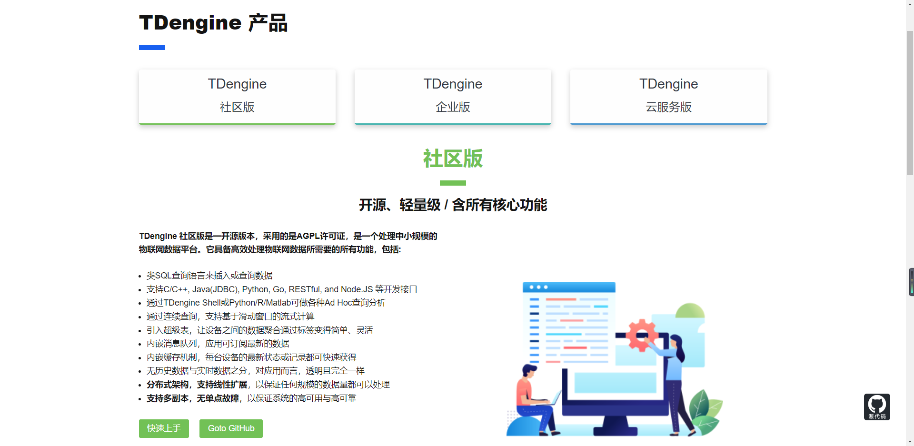

使用IoT-Fast对接taos，提供两种对接方式。一种为使用IoT-Fast已经封装好**TDengine**节点，实现简单对接；另外一种为调用taos的dll库，用户可以使用C++根据taos的API文档进行对接。下面我会分别介绍两种对接实例，用户需要先搭好taos的环境。

### 二、IoT-Fast-采集控制系统
打开IoT-Fast的**采集控制**系统，选择左边的节点，按住鼠标左键拖入到中间的配置栏。

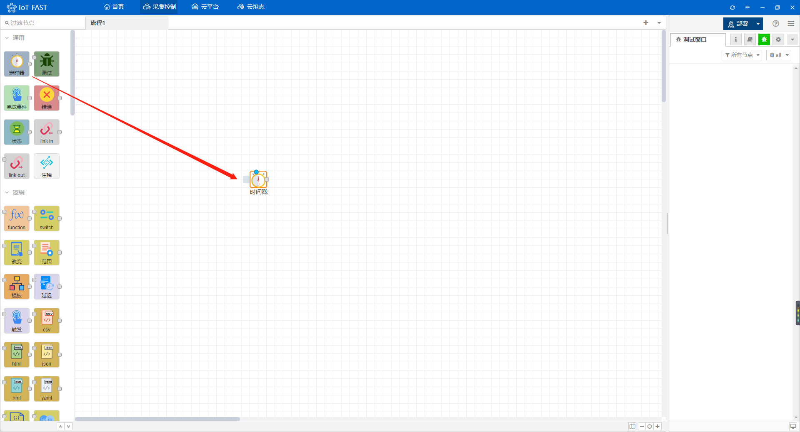

#### 方法一
先说第一种方式，从左侧的**存储**节点中拉出**TDengine**。

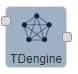

双击**TDengine**控件配置数据库的IP、端口、账号和密码。

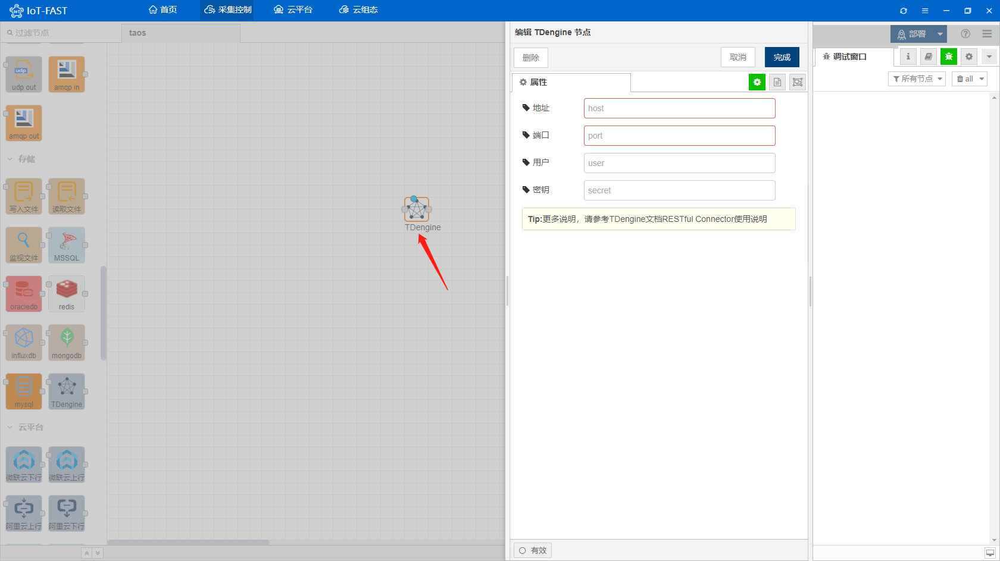

从左侧通用节点中拉出**定时器**和**调试**节点，再拉出一个**function**。

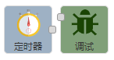							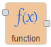

双击**function**进入配置界面，写上“查询当前数据库下的所有数据表信息”语句，代码如下。

```javascript
msg.payload="SHOW DATABASES" 
return msg;
```

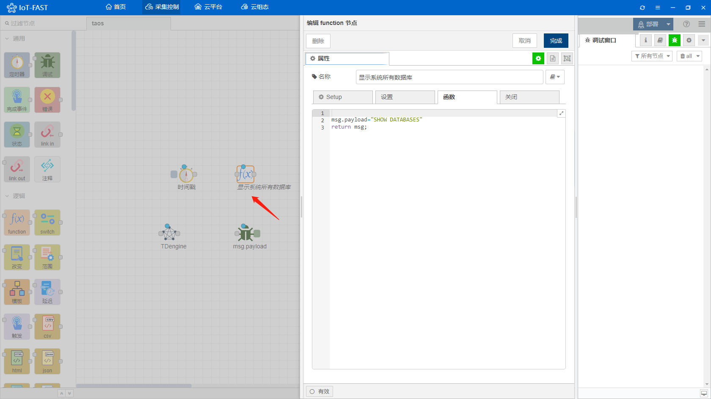

按住白色小框可以拉出一条线连接上另一个白色小框。这样就将两个控件用线连接起来，数据是**从左往右**流动的，最后流入调试控件就会在右侧的调试窗口显示。

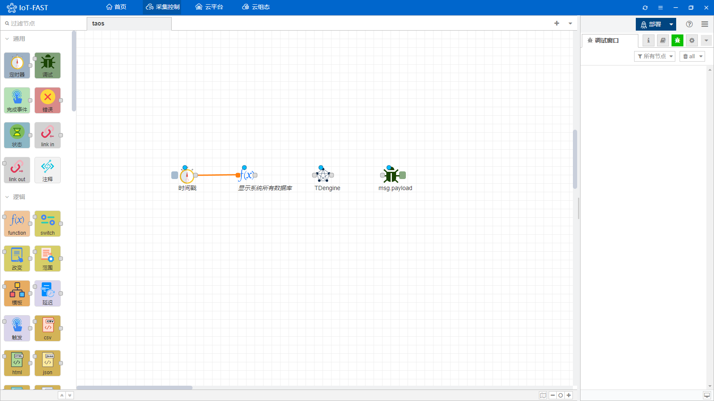

按下图连接后点击右上角的**部署**按钮，将右侧的界面调到**调试窗口**。

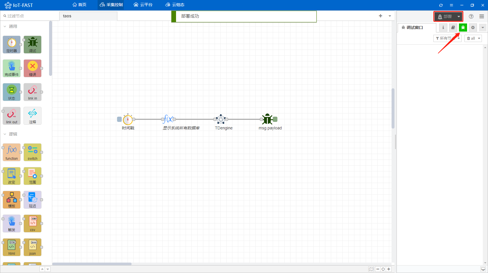

点击定时器前面的按钮，调试窗口显示查询到的系统所有数据库，点击箭头可以打开数组。

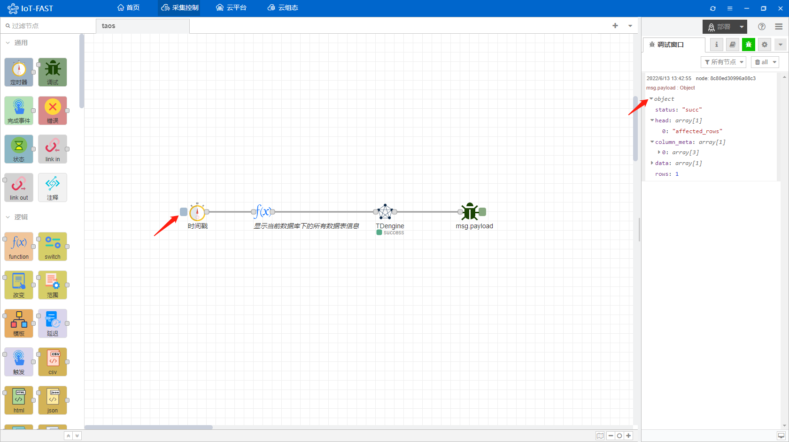

附上一些增删查写语句，只需要修改**function**中的内容就可以了。

```javascript
msg.payload="CREATE DATABASE IF NOT EXISTS fdauto "
return msg;
```

```javascript
msg.payload="DROP DATABASE IF EXISTS fdauto"
return msg;
```

```javascript
msg.payload="CREATE TABLE IF NOT EXISTS fdauto.data (t1 TIMESTAMP ,num INT)
return msg;
```

```javascript
msg.payload="DROP TABLE IF EXISTS fdauto.data"
return msg;
```

```javascript
msg.payload="CREATE TABLE IF NOT EXISTS fdauto.auto (t1 TIMESTAMP ,num INT) TAGS (t1_name INT, t2_name INT) "
return msg;
```

```javascript
msg.payload="DROP TABLE IF EXISTS fdauto.auto"
return msg;
```

```javascript
msg.payload="ALTER TABLE fdauto.auto ADD TAG t4 BOOL;"
return msg;
```

```javascript
msg.payload="ALTER TABLE fdauto.auto DROP TAG t4"
return msg;
```

```javascript
msg.payload="INSERT INTO fdauto.data VALUES (1601446732369,2)"
return msg;
```

```javascript
msg.payload="select * from fdauto.data"
return msg;
```

```javascript
msg.payload="use fdauto"
return msg;
```

#### 方法二
方法二对比方法一较为复杂，是通过调用taos的dll库获取到数据，taos的dll库是用C<font style="color:rgb(51, 51, 51);">++</font>语言编程的，<font style="color:rgb(51, 51, 51);">从左侧拉出一个C++的</font>**<font style="color:rgb(0, 0, 0);">dll链接库</font>**节点。


双击配置**dll链接库**，点击箭头处选择taos的dll文件；全局变量名是用于function等控件获取全局变量用，例如：global.get("taos")；下方的**方法名**、**返回类型**、**参数类型**需要查看taos的API文档配置。

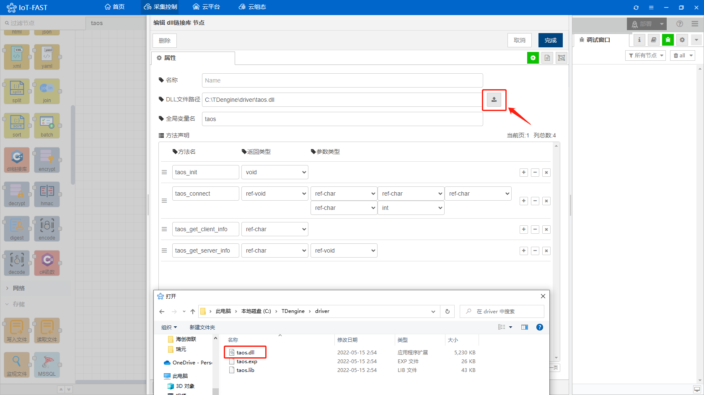

拉出**定时器**、**调试**和**function**节点，连接起来。

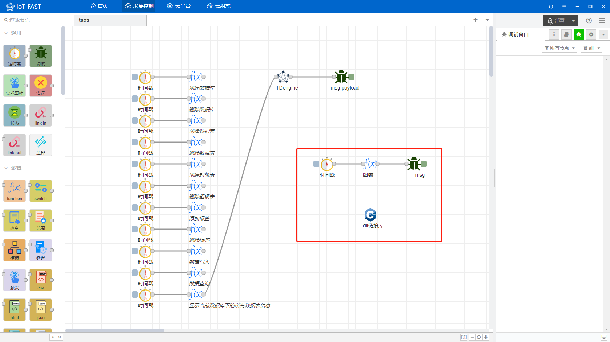

双击**function**节点编写一段查询客户端和服务端版本信息的语句。

```javascript
let ref = global.get("ref");
let libtaos = global.get("taos");//获取dll动态链接库设置的全局变量

libtaos.taos_init();//涛思数据库初始化函数

//涛思数据库连接（从前往后依次配置IP、账号、密码、数据库名、端口）
let connection = libtaos.taos_connect(ref.allocCString("192.168.18.139"), ref.allocCString("root"), ref.allocCString("taos"), ref.allocCString("mes_center"), ref.alloc(ref.types.int, 6030));

//涛思数据库客户端信息
msg.clientInfo= ref.readCString(libtaos.taos_get_client_info());

//涛思数据库服务器信息
msg.serverInfo= ref.readCString(libtaos.taos_get_server_info(connection));

return msg;
```

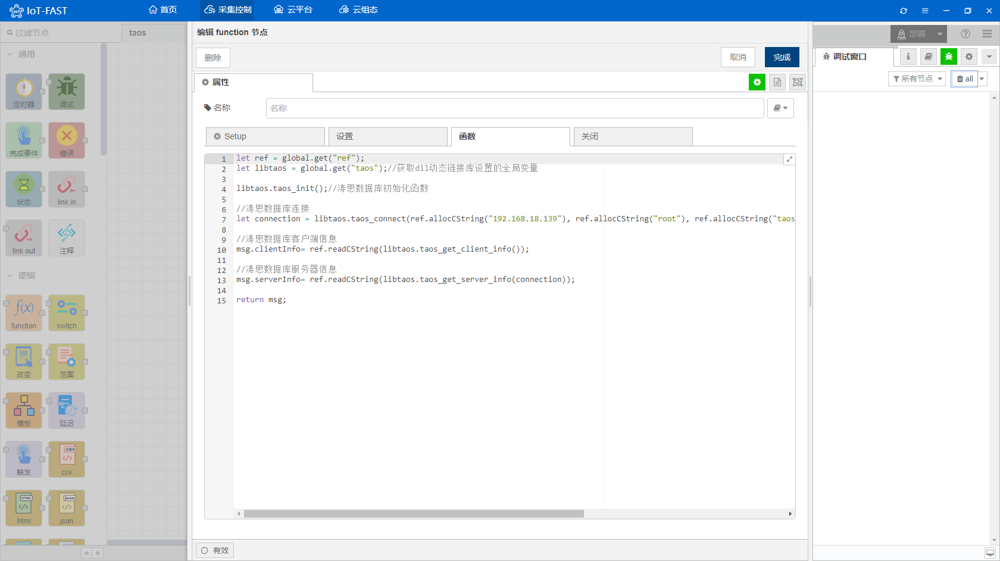

配置完成后点击部署，点击定时器按钮，调试窗口返回客户端和服务端的版本信息。

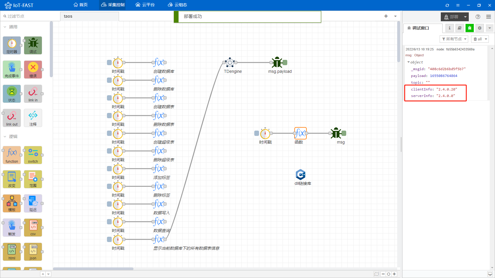

数据获取到之后，就可以上传到**云平台**展示了，这里就上传一下版本信息。

### 三、IoT-Fast-云平台
点击云平台按钮进入**云平台**首页。


点击左侧**产品中心**-**产品开发**，新增一个产品，类别选择**自定义品类**。

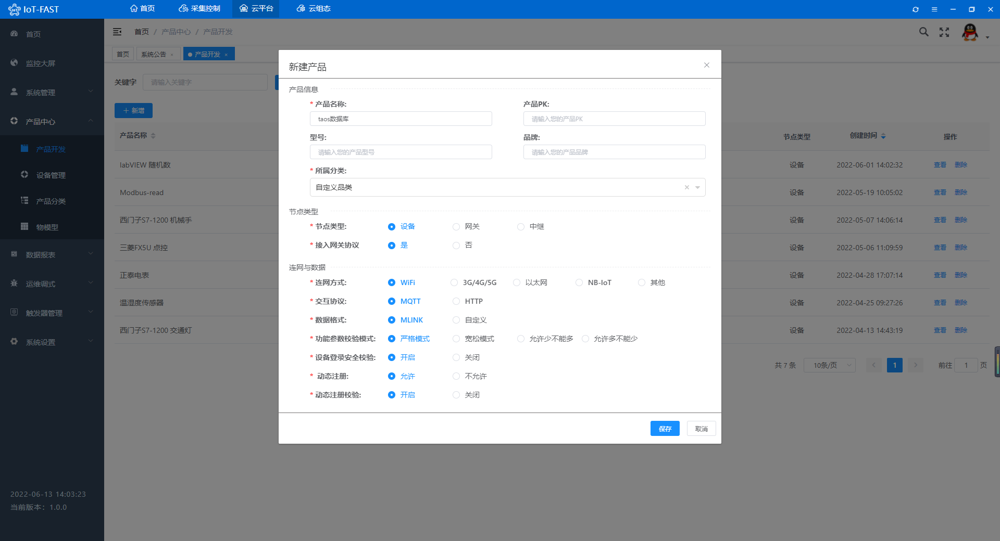

查看创建的产品，在**功能定义**-**自定义参数**中新增属性。


创建配置如下，**标识符**是采集控制和云平台能够对应上的关键字符，同一个产品中不能有重复的**标识符**。

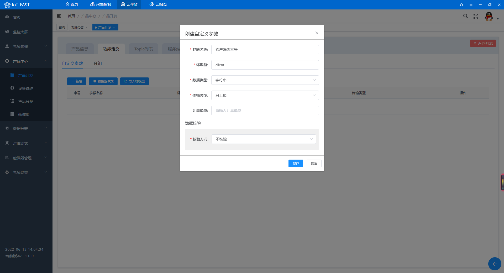

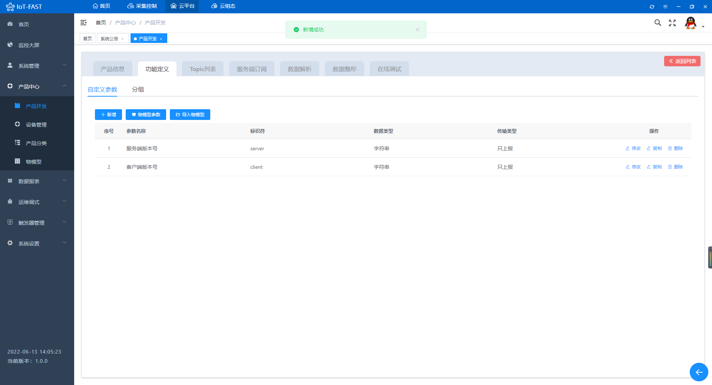

在**功能定义**-**分组**中创建一个上报分组，类型选择上报，将左边的点位全选，点击右箭头，加入到当前分组中。

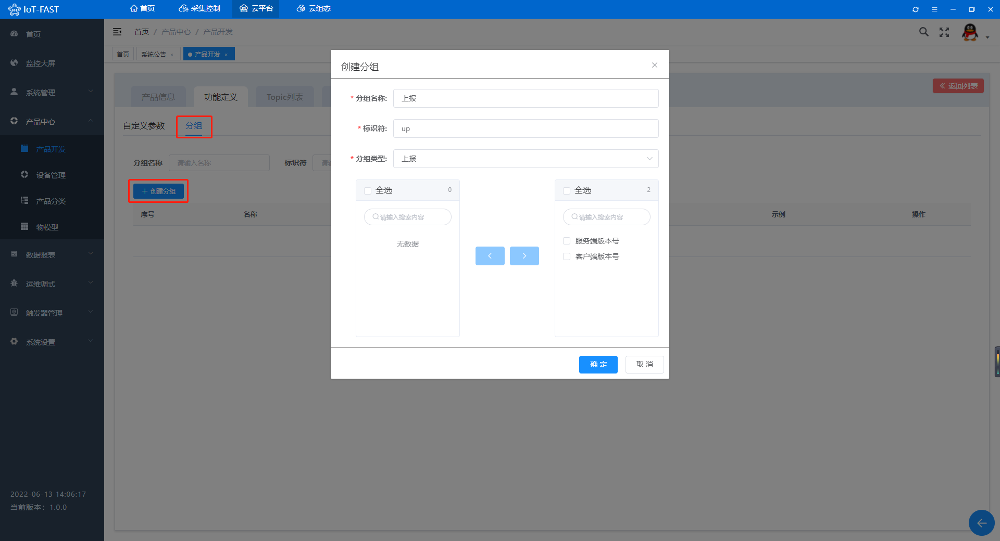

接着点击**产品中心**-**设备管理**，在该产品下增加一个设备。

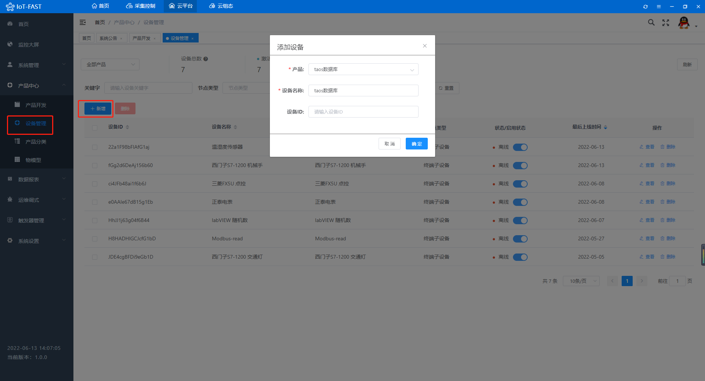

下一步将云平台和采集控制中的属性进行绑定，回到**采集控制**系统，从左侧云平台中拉出**iotfast云上行**控件，用于将采集的数据上报**云平台**。

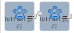

双击控件就可以选择刚刚在云平台创建的产品、设备和分组了。

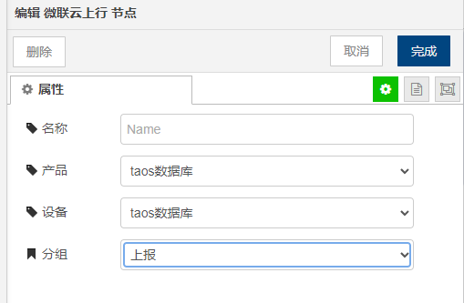

将它接在**function**后面，然后双击**function**，将获取到的值赋到标识符的对象下。

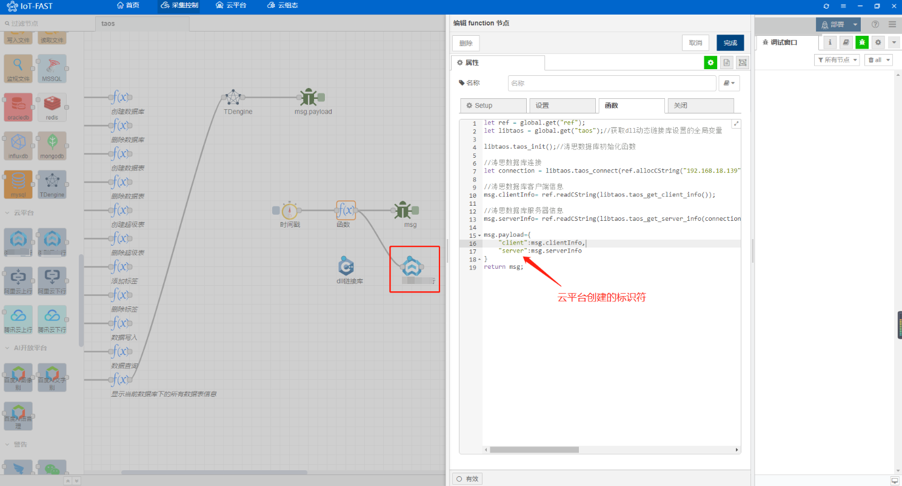

**function**中修改后的的代码如下，配置好后**点击部署，点击一下定时器的按钮**。

```javascript
//前面代码没有改动
let ref = global.get("ref");
let libtaos = global.get("taos");
libtaos.taos_init();
let connection = libtaos.taos_connect(ref.allocCString("192.168.18.139"), ref.allocCString("root"), ref.allocCString("taosdata"), ref.allocCString("mes_center"), ref.alloc(ref.types.int, 6030));
msg.clientInfo= ref.readCString(libtaos.taos_get_client_info());
msg.serverInfo= ref.readCString(libtaos.taos_get_server_info(connection));

//新增“将值赋值到标识符对象下”
msg.payload={
  "client":msg.clientInfo,
  "server":msg.serverInfo
}

return msg;
```

回到**云平台**，查看设备的**运行状态**，可以看到数据已经成功上传上来了。

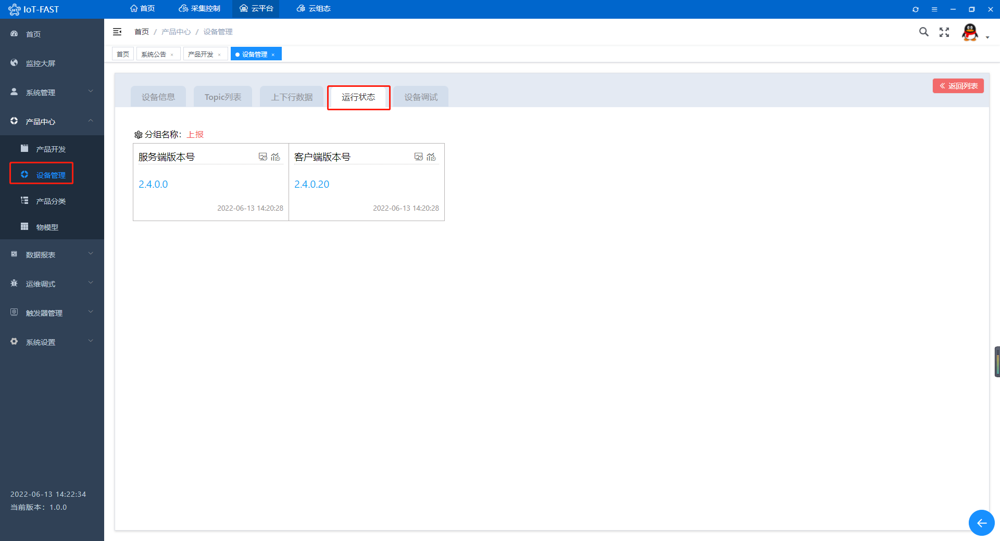

### 四、IoT-Fast-微信小程序/APP
软件上的数据支持在**微信小程序**或者**APP**上查看，小程序和APP的二维码在**云平台**首页的右侧，目前只支持安卓APP，ios的用户可以直接用微信小程序查看。


扫码进入**IoT-Fast**小程序，输入PC端注册的账号密码。


进入首页，可以看到产品和设备数量，点击**设备**查看该账号下的所有设备。

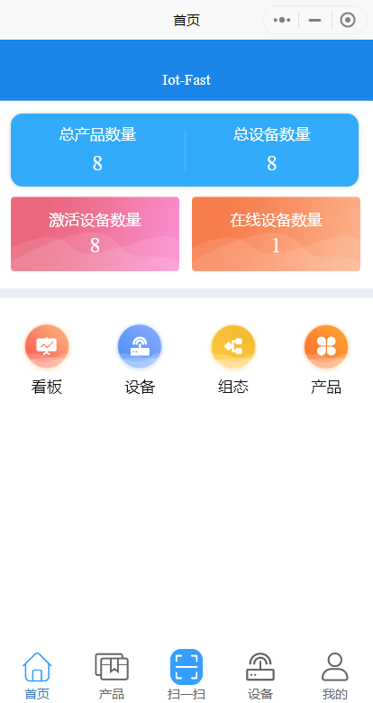

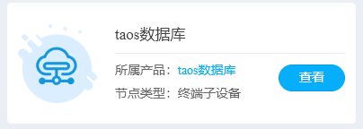

选择taos数据库，点击查看可以看到设备的详细信息。

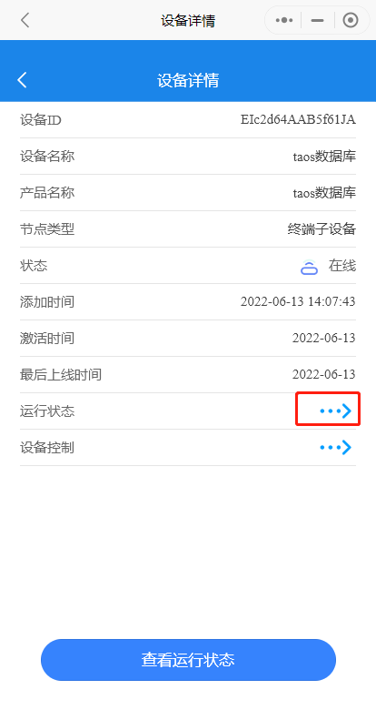

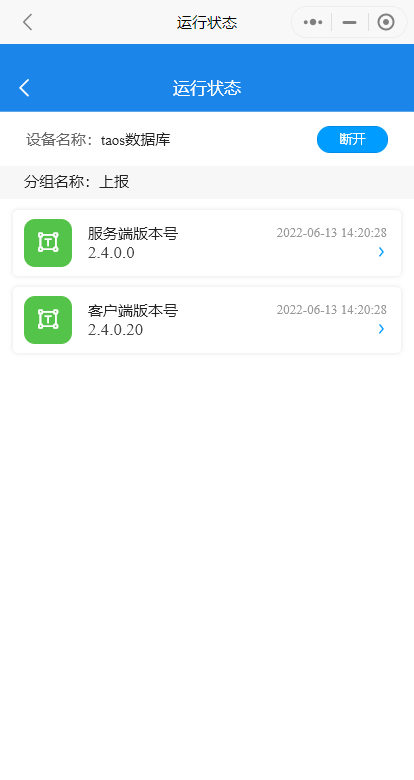


> 更新: 2024-03-21 14:20:03  
> 原文: <https://www.yuque.com/iot-fast/ckyq/bbz8gd>